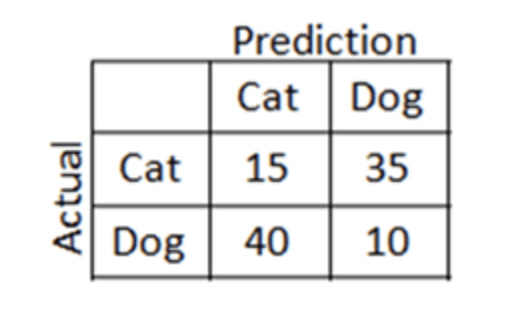
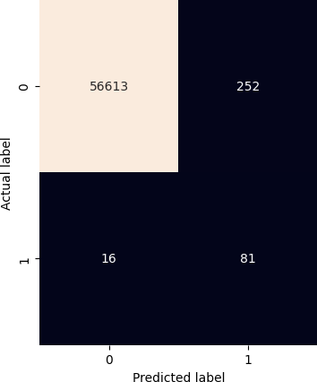

# SIMULADO DE PROVA

## APRENDIZADO DE MÁQUINA SUPERVISIONADO

### Conceitos Gerais

- **O que é o aprendizado de máquina supervisionado?**  
  O aprendizado de máquina supervisionado é uma técnica onde um modelo é treinado usando um conjunto de dados rotulados. Nesse contexto, os algoritmos aprendem a partir de exemplos onde os dados de entrada estão associados a saídas desejadas (rótulos ou classes), permitindo que o modelo preveja corretamente as saídas de novos dados não vistos.

- **O que significa a anotação dos dados?**  
  A anotação dos dados refere-se ao processo de rotular ou marcar dados de entrada com informações relevantes (classes ou valores). No contexto de aprendizado supervisionado, a anotação é essencial para fornecer aos modelos exemplos que relacionem entradas (atributos) com suas saídas corretas (classes), a fim de que o algoritmo aprenda essa relação.

- **O que são atributos e classes?**  
  Atributos (ou características) são as variáveis ou propriedades observáveis que descrevem uma instância de dados. Classes, por outro lado, são os rótulos ou categorias associadas às instâncias que o modelo deve aprender a prever. Em um problema de classificação, os atributos constituem os dados de entrada, e as classes são as saídas que o modelo tenta prever.

- **Dê um exemplo de uma instância (amostra) de um problema de classificação qualquer. Por exemplo, como você classificaria carros? E cães e gatos?**  
  Exemplo de classificação de carros: Um conjunto de atributos para um carro pode incluir `marca`, `modelo`, `ano`, `preço` e `quilometragem`, e a classe a ser prevista pode ser o `tipo do carro` (SUV, sedan, hatch, etc.).  
  Exemplo de classificação de cães e gatos: Para diferenciar entre cães e gatos, os atributos podem ser `tamanho`, `formato das orelhas`, `comprimento do pelo`, e `peso`. A classe a ser prevista seria `cão` ou `gato`.

- **O que significa representatividade em termos de características?**  
  Representatividade em termos de características significa que os atributos escolhidos para descrever as instâncias de dados devem ser suficientes e adequados para capturar as informações necessárias para que o modelo consiga realizar previsões precisas. Um conjunto de dados é representativo se as características selecionadas refletirem de maneira adequada as variações e padrões relevantes no problema que está sendo modelado.

- **Dado os datasets abaixo, determine o que são atributos e o que são classes (target):**

1. **Dataset de Cães e Gatos**:

| Tamanho (cm) | Peso (kg) | Comprimento do Pelo (cm) | Animal  |
|--------------|-----------|--------------------------|---------|
| 40           | 15        | 4                        | Cão     |
| 50           | 20        | 6                        | Cão     |
| 35           | 10        | 3                        | Gato    |
| 25           | 8         | 2                        | Gato    |
| 45           | 18        | 5                        | Cão     |

   - **Atributos**: Tamanho (cm), Peso (kg), Comprimento do Pelo (cm)
   - **Classe (target)**: Classe (Cão ou Gato)

2. **Dataset de Veículos**:

| Marca  | Ano  | Preço (R$) | Quilometragem (km) | Tipo   |
|--------|------|------------|--------------------|--------|
| Ford   | 2018 | 45000      | 50000              | Sedan  |
| Honda  | 2020 | 60000      | 30000              | SUV    |
| Toyota | 2019 | 55000      | 40000              | Hatch  |
| Fiat   | 2021 | 40000      | 25000              | Sedan  |
| BMW    | 2017 | 75000      | 60000              | SUV    |

   - **Atributos**: Marca, Ano, Preço (R$), Quilometragem (km)
   - **Classe (target)**: Classe (Sedan, SUV, Hatch)

- **Quais etapas possui um fluxo (pipeline) de aprendizado de máquina?**
  1. **Coleta de Dados**: Obter os dados relevantes para o problema.
  2. **Pré-processamento de Dados**: Limpeza dos dados, tratamento de valores ausentes, normalização ou padronização e transformação dos dados.
  3. **Divisão dos Dados**: Separar o conjunto de dados em dados de treino e teste (e, opcionalmente, dados de validação).
  4. **Seleção de Atributos**: Escolher as características (atributos) mais importantes para o modelo.
  5. **Treinamento do Modelo**: Aplicar um algoritmo de aprendizado sobre os dados de treino para construir o modelo.
  6. **Avaliação do Modelo**: Testar o modelo com dados de teste para avaliar sua performance usando métricas adequadas (acurácia, recall, F1, etc.).
  7. **Ajuste de Hiperparâmetros**: Ajustar os parâmetros do modelo (como número de vizinhos no KNN, profundidade da árvore, etc.) para otimizar a performance.
  8. **Predição e Implantação**: Aplicar o modelo final para realizar previsões em novos dados e colocar o modelo em produção.

  ou conforme na figura abaixo:

  
  

- **O que é classificação binária e multi-classes?**
  - **Classificação binária**: É o problema onde existem apenas duas classes possíveis para a predição. Exemplo: classificar se um e-mail é "spam" ou "não spam".
  - **Classificação multi-classes**: É o problema em que existem mais de duas classes possíveis. Exemplo: classificar um tipo de fruta como "maçã", "banana" ou "laranja".
     
  

- **Como abordar classificação multi-classes a partir de modelos binários?**
  Uma maneira comum de lidar com classificação multi-classes em modelos que originalmente lidam apenas com classificação binária é dividir o problema multi-classes em vários problemas binários. Isso pode ser feito com as técnicas **One vs One** ou **One vs All**.

- **Diferencie a técnica One vs One e One vs All**
  - **One vs One (OvO)**: Para cada par de classes, um classificador binário é treinado. Se existem 3 classes, serão treinados 3 classificadores binários (A vs B, B vs C, e A vs C). Durante a predição, o modelo que obtiver mais "vitórias" será escolhido.

  - **One vs All (OvA)**: Para cada classe, um classificador binário é treinado para diferenciá-la de todas as outras classes. Se existem 3 classes, serão treinados 3 classificadores: um para distinguir A de {B, C}, outro para B de {A, C}, e assim por diante. A classe com a maior pontuação é escolhida como a predição final.

### Análise Inicial

- Porque é interessante visualizar a distribuição dos dados? O que desejamos verificar com isso?
  Ao plotar distribuições, podemos verificar como os dados estão espalhados, se estão balanceados entre as classes e como as variáveis se comportam, permitindo ajustes ou tratamentos antes da modelagem.
  
- Analisando as distribuições abaixo (A e B), qual apresenta as fronteiras de decisão mais definidas? Justifique sua resposta.

A Distribuição A mostra fronteiras de decisão mais definidas, pois as amostras de cada classe estão mais separadas. Já a Distribuição B tem uma maior sobreposição entre as classes, o que resulta em fronteiras de decisão menos definidas.

A Distribuição A tende a ser mais fácil para um modelo de classificação, enquanto a Distribuição B representa um cenário mais complexo, onde as classes são mais difíceis de separar.

- **O que é a normalização de atributos? Por que isso é importante?**  
  A normalização de atributos é o processo de ajustar os valores das variáveis em um conjunto de dados para que eles fiquem dentro de uma mesma escala (geralmente entre 0 e 1). Isso é importante para algoritmos como o KNN, pois ele se baseia em cálculos de distância. Se os atributos tiverem escalas muito diferentes, um atributo com valores maiores pode dominar o cálculo da distância e, consequentemente, influenciar a decisão final de forma desproporcional.

 ### Algoritmo KNN

 - **Defina o algoritmo KNN. Forneça um exemplo lúdico**
   
    O K-Nearest Neighbors (KNN) é um algoritmo de aprendizado supervisionado que classifica uma nova instância com base na classe mais comum entre seus "K" vizinhos mais próximos, usando uma     métrica de distância, como a distância Euclidiana. Em outras palavras, a classe da nova amostra será a classe predominante entre os K vizinhos mais próximos.
   
    

    Imagine que você está em uma festa e não conhece ninguém. Você quer descobrir se deve ficar no grupo de pessoas que estão discutindo tecnologia ou se deve se juntar ao grupo que está         conversando sobre esportes. Você decide usar o "algoritmo KNN" para tomar essa decisão.

    O **KNN** pede para você observar os **K** vizinhos mais próximos. Se escolher **K = 3**, você vai ouvir as três pessoas mais próximas e perceber que duas delas estão falando sobre           tecnologia e uma sobre esportes. Como a maioria está falando sobre tecnologia, você decide se juntar ao grupo tecnológico.
    
    Agora, se escolher **K = 7**, você vai observar sete pessoas e descobrir que quatro estão discutindo esportes e três estão falando sobre tecnologia. Neste caso, você provavelmente vai         decidir se juntar ao grupo esportivo.

- **O KNN funciona somente para 2 classes (binário)?**  
  Não, o KNN pode ser aplicado tanto para classificação binária quanto para multi-classes. O algoritmo simplesmente observa os K vizinhos mais próximos e atribui à amostra a classe que é mais comum entre eles, independentemente de quantas classes existam.
  
- **Qual a desvantagem do KNN em datasets grandes? Por exemplo, com 100 mil amostras e 2000 atributos?**  
  Uma grande desvantagem do KNN em datasets grandes é que ele é computacionalmente custoso. Como o algoritmo precisa calcular as distâncias entre a amostra de teste e todas as outras amostras do conjunto de dados, a complexidade computacional aumenta significativamente com o número de amostras e de atributos. Isso pode resultar em tempos de processamento lentos, especialmente para grandes datasets.
  
- **O KNN reduz o espaço de características? E o espaço de busca? Justifique.**  
  Não, o KNN não reduz o espaço de características ou de busca. Ele utiliza todas as características do conjunto de dados original para calcular as distâncias. O espaço de busca (quantidade de instâncias a serem comparadas) e o número de características permanecem os mesmos, o que aumenta a complexidade conforme o tamanho do dataset cresce.

- **O que é o parâmetro K do KNN? Como ele impacta na classificação? Justifique.**  
  O parâmetro "K" representa o número de vizinhos mais próximos que o algoritmo considera ao classificar uma nova amostra. Um valor menor de K (como 1) pode tornar o modelo mais sensível a ruídos, enquanto valores maiores de K podem tornar a classificação mais estável, pois ela será baseada em um maior número de vizinhos. No entanto, um valor de K muito alto pode incluir amostras de outras classes e reduzir a precisão do modelo. O valor de K ideal é geralmente encontrado por meio de experimentação.

- Analisando as seguintes distribuições, em qual o algoritmo KNN deve performar melhor? Por quê? 
  
  - Qual o impacto de um K maior e menor em cada uma das distribuições?

Classes bem definidas (esquerda):
Em um dataset onde as classes estão bem separadas, um valor de K pequeno, como K = 1, tende a funcionar bem, pois a distância até o vizinho mais próximo já será suficiente para classificar corretamente a nova instância.
Se K for aumentado, o algoritmo ainda tende a classificar corretamente, pois a maioria dos vizinhos próximos pertencerá à mesma classe, e as classes são claramente distintas.
Dataset com overlap (sobreposição entre as classes):

Classes com sobreposição (direita):
Em um dataset com sobreposição entre as distribuições, um valor pequeno de K (como K = 1) pode tornar o modelo mais suscetível a ruídos. Isso porque um único vizinho pode pertencer à classe errada devido à sobreposição das classes, resultando em classificações incorretas.
Aumentar o valor de K pode ajudar a suavizar esse efeito, pois o algoritmo considerará um número maior de vizinhos, o que pode permitir que a classe majoritária dos vizinhos mais próximos "corrija" o impacto do ruído ou da sobreposição. No entanto, se K for muito grande, o modelo pode incluir muitos vizinhos distantes de outras classes, prejudicando a precisão.

- Considerando o dataset abaixo:

| Característica 1 | Característica 2 | Característica 3 | Target           |
|------------------|------------------|------------------|------------------|
| 0                | 0                | 3                | B                |
| 1                | 1                | 0                | B                |
| 3                | 0                | 0                | A                |
| 2                | 2                | 2                | B                |
| 1                | 3                | 3                | B                |
| 2                | 1                | 1                | A                |
| 3                | 1                | 2                | A                |
|------------------|------------------|------------------|------------------|
|------------------|------------------|------------------|------------------|
| **2**            | **1**            | **1**            | **Amostra de Teste** |
|------------------|------------------|------------------|------------------|

e utilizando a distância euclidiana: qual o resultado da amostra para K=3 e K=5?

Exemplo: Cálculo da Distância Euclidiana entre a Amostra de Teste e a Primeira Amostra

Vamos sumarizar para todas as amostras: 

Por fim, vamos fazer a votação dos K Vizinhos:

### Tabela de Distâncias Ordenada

| Amostra    | Distância | Classe |
|------------|-----------|--------|
| Amostra 2  | 1.41      | B      |
| Amostra 4  | 1.41      | B      |
| Amostra 6  | 1.41      | A      |
| Amostra 3  | 1.73      | A      |
| Amostra 1  | 3.00      | B      |
| Amostra 5  | 3.00      | B      |

#### Votação para K = 3
- **Classe B**: 2 votos
- **Classe A**: 1 voto

Resultado: A amostra de teste seria classificada como pertencente à **Classe B**.

#### Votação para K = 5
- **Classe B**: 3 votos
- **Classe A**: 2 votos

Resultado: A amostra de teste seria classificada como pertencente à **Classe B**.

#### Algoritmo Naive Bayes

- **Explique de maneira sucinta como funciona o Naive Bayes:**  
  O Naive Bayes é um algoritmo de classificação baseado no Teorema de Bayes, que assume que todas as características (atributos) são independentes umas das outras. Ele calcula a probabilidade de uma amostra pertencer a cada classe e escolhe a classe com a maior probabilidade. A "ingenuidade" (naive) vem da suposição de independência entre as características, o que nem sempre é realista, mas o modelo ainda pode fornecer boas classificações.

- **O que é uma probabilidade a posteriori e a priori? Como isso é aplicado no Naive Bayes?**  
  - **Probabilidade a priori**: é a probabilidade inicial de um evento ocorrer antes de observar qualquer dado, como a probabilidade de uma pessoa pertencer à classe "A" ou "B" sem considerar as características.  
  - **Probabilidade a posteriori**: é a probabilidade revisada de um evento ocorrer após a observação de novos dados (as características).  
  No Naive Bayes, a probabilidade a priori é ajustada pela probabilidade dos atributos observados para calcular a probabilidade a posteriori, que é usada para classificar a amostra.

#### Algoritmo Decision Tree

- **Explique com suas palavras o algoritmo de árvore de decisão. Ilustre um exemplo.**

  O algoritmo de árvore de decisão é um modelo de aprendizado supervisionado que faz divisões repetidas no espaço de atributos dos dados até atingir uma decisão final. A árvore é composta por "nós", onde cada nó faz uma pergunta sobre um atributo, e "ramos", que são os caminhos que seguem dependendo das respostas. No final, as folhas da árvore representam as classes ou valores preditos. Por exemplo, em um problema de classificação de pessoas em "Atletas" ou "Não Atletas", a árvore poderia fazer perguntas como "A altura é maior que 1.80m?" e "O peso é maior que 80kg?" para classificar corretamente.

Aqui está a imagem visual ilustrando o exemplo (jogar tennis?) de uma árvore de decisão, onde cada nó representa uma pergunta sobre um atributo até chegar à decisão final nas folhas. A árvore mostra como a informação é filtrada em etapas para tomar uma decisão ou classificação.

- **O que é a entropia, probabilidade e ganho de informação? Como isso influência na construção da árvore?**  
  - **Entropia**: Mede a desordem ou incerteza dos dados em relação às classes. Se todas as instâncias de um conjunto de dados pertencerem à mesma classe, a entropia será 0 (máxima ordem). Se houver uma distribuição equilibrada entre as classes, a entropia será alta (máxima desordem).
  - **Probabilidade**: É a chance de um evento ocorrer, sendo usada para calcular a entropia. Ela indica a frequência relativa de cada classe no conjunto de dados.
  - **Ganho de informação**: É a redução da entropia após dividir os dados com base em um atributo. Quanto maior o ganho de informação, mais eficaz é a divisão em reduzir a incerteza nas classes.

  Esses conceitos influenciam a construção da árvore, pois o algoritmo escolhe, em cada nó, o atributo que maximiza o ganho de informação, ou seja, que melhor separa as classes.

- **O que o ganho de informação impacta para este algoritmo?**  
  O ganho de informação é fundamental na construção de uma árvore de decisão, pois define quais atributos serão usados para dividir os dados em cada nó. O algoritmo seleciona o atributo com o maior ganho de informação, garantindo que a árvore se torne mais eficaz em separar as classes à medida que cresce. Isso ajuda a minimizar a complexidade da árvore e evitar overfitting, garantindo decisões mais precisas.

#### Análise Crítica

- Analisando as fronteiras de decisão, o que se pode inferir quanto à generalização do modelo? Quais classes devem sofrer perdas de acurácia e por quê?

        **Modelo A**

    **Modelo B**

    **Modelo C**

- O que determinam as métricas de acurácia e recall?
- Por que a acurácia geral não é uma boa métrica? Dê um exemplo.
- Calcule a acurácia a partir da matriz de confusão abaixo:

- Dadas as matrizes de confusão abaixo, analise os casos individualmente quanto a:

  - Qual é a acurácia global?
  - O modelo está bem ajustado ou existe overfitting?
  - O dataset pode ser considerado balanceado?
    
    **Caso A:** 
    
    
    
    **Caso B:**

    

    **Caso C:**

   

    **Caso D:**

