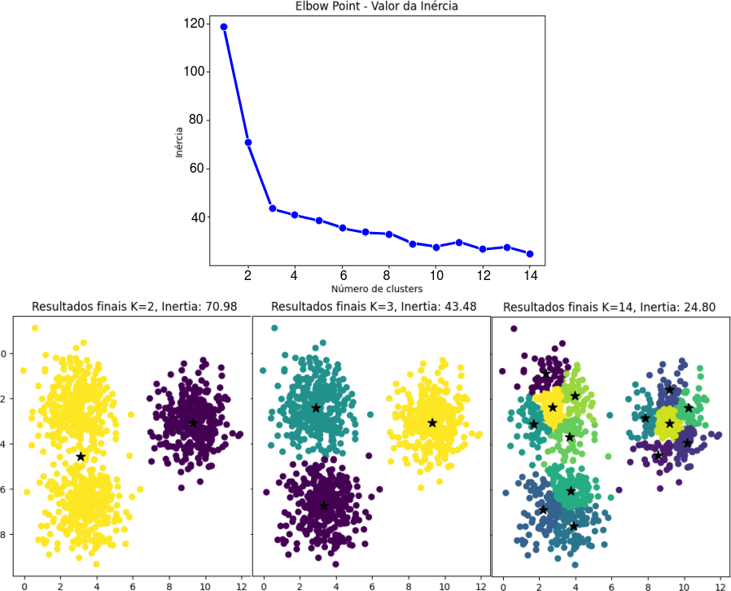
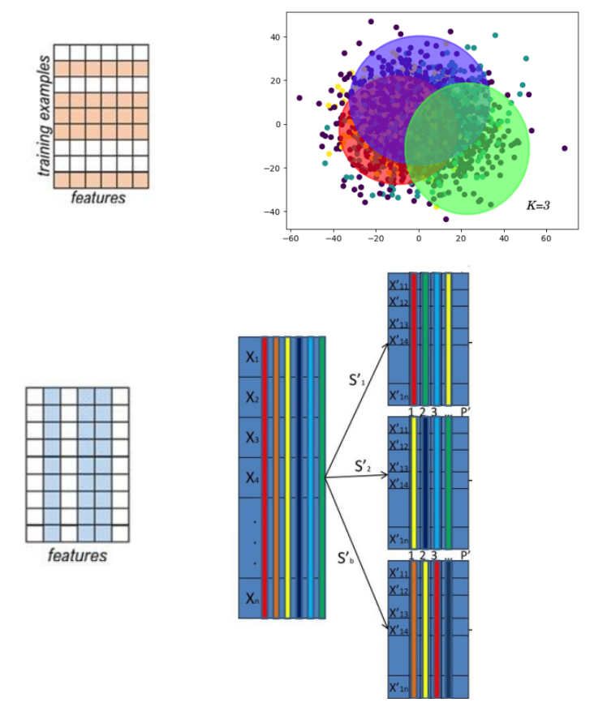
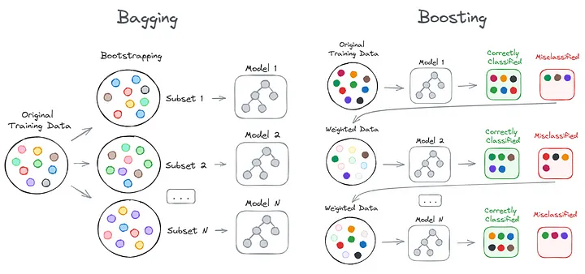
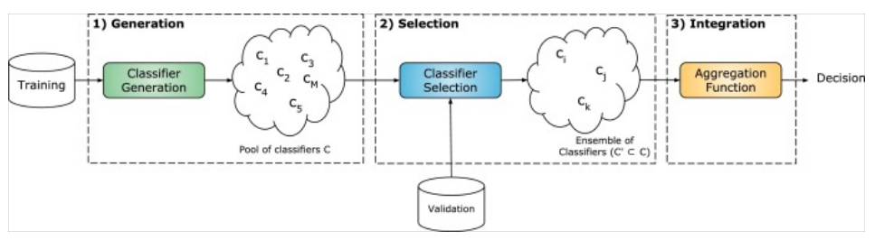
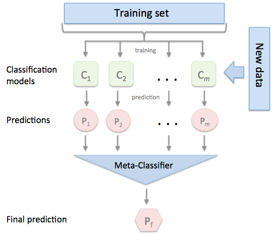
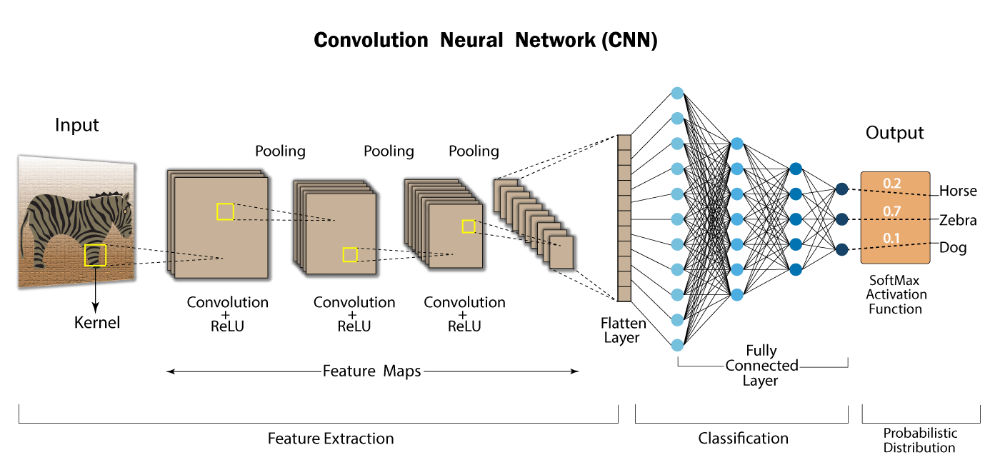
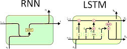

# SIMULADO DE PROVA

A seguir é apresentado uma série de questões para nortear o estudo. 

No caso de algumas figuras não aparecerem, opte pela opção em *pdf*

## APRENDIZADO DE MÁQUINA NÃO-SUPERVISIONADO

1. **Quais são as principais diferenças entre aprendizado supervisionado e não supervisionado?**  
   O aprendizado supervisionado utiliza dados rotulados, onde a resposta correta é conhecida para cada amostra de entrada, permitindo que o modelo aprenda a mapear entradas para saídas. Seu objetivo é prever rótulos em novos dados. No aprendizado não supervisionado, os dados não possuem rótulos, e o modelo busca identificar padrões ou estruturas inerentes, como agrupamentos, sem informações explícitas de classes.

2. **O que é clustering e qual é o objetivo principal dessa técnica de aprendizado de máquina não supervisionado?**  
   Clustering é uma técnica de aprendizado não supervisionado usada para dividir um conjunto de dados em grupos (clusters) onde os itens em cada grupo são mais semelhantes entre si do que com os itens de outros grupos. O objetivo principal é descobrir e interpretar a estrutura subjacente dos dados.

3. **Descreva o algoritmo k-means e explique como ele funciona para realizar o clustering.**  
   O k-means é um algoritmo de clustering que divide os dados em \( k \) clusters pré-definidos. O processo começa com a escolha de \( k \) centróides aleatórios. Em seguida, cada ponto de dado é associado ao centróide mais próximo, formando clusters. O centróide de cada cluster é recalculado como a média dos pontos nele contidos, e o processo de reatribuição e recalculação continua até que os centróides não mudem mais significativamente, indicando convergência.

4. **Como o K-Means inicializa e atualiza os centróides?**  
   O K-means inicializa os centróides aleatoriamente ou com alguma técnica de inicialização (como o K-means++). Em cada iteração, ele atualiza os centróides calculando a média dos pontos atribuídos a cada cluster, o que permite que os centróides "migram" para posições que minimizam a variabilidade dentro dos clusters.

5. **Em que momento o K-means determina o fim do ajuste dos centróides?**  
   O K-means termina quando os centróides não mudam significativamente de uma iteração para outra ou quando um número máximo de iterações é atingido. Outro critério de parada comum é quando as mudanças na soma das distâncias entre pontos e seus centróides são mínimas.

6. **Como determinar o valor de K?**  
   O valor de \( k \) pode ser determinado usando métodos como a análise do cotovelo (Elbow Method), onde o valor de \( k \) é escolhido ao observar a redução na inércia ou na variação dentro dos clusters. Outra abordagem é o Índice Silhueta, que mede a coesão e separação dos clusters para sugerir o número ótimo de clusters.

7. **Apresente um pseudo-código do K-Means**  
   ```
   1. Inicializar k centróides aleatórios
   2. Repetir até convergência:
       a. Atribuir cada ponto de dado ao centróide mais próximo
       b. Recalcular os centróides como a média dos pontos em cada cluster
   3. Fim
   ```
    ```python
    def k_means(data, k, max_iterations=100, tol=1e-4):
        # 1. Inicializar k centróides aleatórios a partir dos dados
        centroids = random.sample(data, k)
        
        for _ in range(max_iterations):
            # 2a. Atribuir cada ponto ao centróide mais próximo
            clusters = [[] for _ in range(k)]
            for point in data:
                # Calcular a distância entre o ponto e cada centróide
                distances = [np.linalg.norm(np.array(point) - np.array(centroid)) for centroid in centroids]
                # Atribuir o ponto ao cluster do centróide mais próximo
                nearest_centroid = distances.index(min(distances))
                clusters[nearest_centroid].append(point)
            
            # 2b. Recalcular os centróides como a média dos pontos em cada cluster
            new_centroids = []
            for cluster in clusters:
                # Calcular o novo centróide como a média dos pontos
                if cluster:  # Evitar clusters vazios
                    new_centroids.append(np.mean(cluster, axis=0).tolist())
                else:
                    # Re-inicializa um centróide vazio para evitar clusters vazios
                    new_centroids.append(random.choice(data))
            
            # 3. Critério de parada: verificar se os centróides mudaram pouco
            centroid_shifts = [np.linalg.norm(np.array(old) - np.array(new)) for old, new in zip(centroids, new_centroids)]
            if max(centroid_shifts) < tol:
                break  # Convergência alcançada
            
            centroids = new_centroids  # Atualizar os centróides para a próxima iteração

        return clusters, centroids  # Retornar clusters finais e centróides
    ```

8. **O que é Inértia?**  
   Inércia é a soma das distâncias quadráticas entre cada ponto e o centróide do seu respectivo cluster. Ela mede o quão compactos estão os clusters; quanto menor a inércia, mais próximos estão os pontos dentro dos clusters.

9. **O que é coesão e separação? Como calcular eles?**  
   Coesão mede o quão próximos os pontos de um cluster estão entre si, sendo calculada pela soma das distâncias entre cada ponto e o centróide do cluster. Separação mede a distância entre os centróides dos clusters, indicando o quão distintos são os clusters entre si.

10. **O que é a análise Elbow?**  
    A análise Elbow é uma técnica para selecionar o número ótimo de clusters (valor de \( k \)). Ela envolve a plotagem da inércia para diferentes valores de \( k \); o ponto onde a diminuição da inércia se torna menos acentuada (formando um "cotovelo") sugere o valor ideal de \( k \).

11. **Um valor de K muito alto, terá qual impacto no K-Means?**  
    Um valor de \( k \) muito alto pode resultar em overfitting, onde cada ponto é associado a um cluster próprio, gerando clusters pequenos e pouco significativos, diminuindo a generalização do modelo e aumentando o custo computacional.

12. **O que é o Índice Silhueta e como utilizá-lo?**  
    O Índice Silhueta é uma métrica que avalia a qualidade de clusters medindo a coesão e separação. Um valor próximo de 1 indica que os pontos estão bem agrupados dentro de seus clusters e separados de outros clusters. É utilizado para comparar diferentes valores de \( k \) e escolher aquele com o melhor índice médio de silhueta.

13. **O que significa um índice silhueta -1, 0 e 1?**  
    - Um índice de silhueta próximo de -1 indica que um ponto está mais próximo de pontos em outro cluster do que de seu próprio cluster (mau ajuste).
    - Um índice de 0 indica que o ponto está na borda entre clusters (ajuste moderado).
    - Um índice próximo de 1 indica que o ponto está bem dentro do seu cluster e distante de outros clusters (bom ajuste).

14. **Quais são as métricas de avaliação comumente utilizadas para medir a qualidade dos clusters gerados por um algoritmo de clustering?**  
    - **Inércia**: mede a compacidade dos clusters.
    - **Índice Silhueta**: avalia coesão e separação.
    --- 
    
    O que você pode discutir sobre os resultados abaixo?
    
    

    A análise de Elbow sugere a existência de 3 clusters. Análisando qualitativamente um K < 3 apresenta uma sub-segmentação, enquanto que valores de K > 3, podem representar uma sobre-segmentação.
    No entanto, por se tratar de aprendizado não-supervisionado, sugere-se a validação humana (especilista) com informações contextuais do problema. 
    
## Agrupamentos ou Conjuntos (Ensembles)

1. O que é Bagging e como ele funciona? Descreva as etapas principais envolvidas no algoritmo de Bagging.

    Bagging, ou "Bootstrap Aggregating," é uma técnica de ensemble que reduz a variância ao combinar previsões de vários modelos treinados em diferentes amostras do mesmo conjunto de dados. Suas etapas principais são:

    - Gerar várias amostras de bootstrap do conjunto de treinamento.
    - Treinar um modelo em cada amostra.
    - Combinar as previsões dos modelos por votação (para classificação) ou média (para regressão).

2. Em nível de instâncias e atributos, como gerar diversidade a partir de um mesmo dataset?

    A nível de instâncias, a diversidade é gerada através de amostragem de bootstrap, onde várias amostras aleatórias são selecionadas com reposição do conjunto de dados original.
    
    A nível de atributos, a diversidade pode ser introduzida selecionando subconjuntos aleatórios de atributos (Random Subspaces) para treinar cada modelo, como é feito no Random Forest.

3. Qual é o objetivo do uso da amostragem de bootstrap no Bagging? Como isso ajuda a melhorar o desempenho do conjunto?

    A amostragem de bootstrap permite que cada modelo de base seja treinado em uma versão ligeiramente diferente dos dados, aumentando a diversidade entre os modelos. Isso reduz a variância do modelo final e o torna mais robusto, pois as previsões combinadas tendem a neutralizar os erros individuais dos modelos.

4. Qual a técnica de re-amostragem ilustradas pela figuras abaixo:
   
      
   
   **Bagging (Superior)**: Utiliza a amostragem de bootstrap para gerar várias amostras com reposição a partir do conjunto de dados original. Cada modelo recebe uma amostra de instâncias do conjunto original, com algumas instâncias repetidas e outras excluídas, promovendo diversidade.
   
   **Random Subspaces (Inferior)**: Foca na seleção aleatória de atributos (ou subespaços) em vez das instâncias. Em cada iteração, o modelo é treinado em um subconjunto aleatório de atributos do conjunto de dados, preservando todas as instâncias, mas restringindo os atributos usados em cada modelo. Isso ajuda a criar modelos diversificados com diferentes conjuntos de características, útil para modelos como árvores de decisão.

6. O que é Boosting e como ele funciona? Explique a ideia de adicionar iterativamente aprendizes fracos para criar um aprendiz forte no Boosting.

    Boosting é uma técnica de ensemble que reduz o viés ao treinar uma sequência de aprendizes fracos de forma iterativa. Cada novo modelo tenta corrigir os erros do anterior, dando mais peso às instâncias classificadas incorretamente. Com o tempo, esses modelos são combinados para formar um modelo forte, que possui um desempenho melhor do que cada modelo fraco individualmente.

7. Qual é a principal diferença entre Bagging e Boosting em termos de como os aprendizes base são treinados e combinados?

    - Bagging: Treina cada modelo de forma independente, utilizando amostras de bootstrap do conjunto de dados, e combina os resultados pela média ou votação.
    
    - Boosting: Treina os modelos de forma sequencial, onde cada modelo subsequente foca nas instâncias que os anteriores classificaram incorretamente, combinando os resultados através de uma média ponderada.

    


13. O que é a seleção dinâmica de classificadores? 

    A seleção dinâmica de classificadores envolve escolher o melhor classificador ou subconjunto de classificadores para cada nova instância de teste com base em sua proximidade a instâncias de treinamento. Isso permite maior precisão ao usar os classificadores mais apropriados para diferentes partes do espaço de entrada.


    

14. O que é um meta-classifier? Como ele se comporta nas técnicas de seleção dinâmica e stacking?

    Um meta-classifier é um modelo que combina as previsões de vários classificadores base. Na seleção dinâmica, o meta-classifier seleciona os melhores classificadores para cada instância. No stacking (abaixo ), o meta-classifier aprende a combinar as previsões dos modelos base para fazer uma previsão final mais precisa.

    

15. Quais são os atributos e classes do meta classifier em ambas abordagens?
    - Seleção Dinâmica: Atributos são as características da instância a ser classificada, e as classes representam os classificadores base selecionados.
    
    - Stacking: Atributos são as previsões dos classificadores base para uma instância, e as classes são as previsões finais, combinando as saídas dos classificadores.

## Deep Learning



1. **O que é o Deep Learning e qual é a diferença em relação a outros métodos de aprendizado de máquina?**  
   Deep Learning é uma subárea do aprendizado de máquina que utiliza redes neurais profundas, com várias camadas, para modelar dados complexos. A principal diferença é a capacidade do Deep Learning de extrair e representar automaticamente características em diferentes níveis de abstração, enquanto métodos tradicionais frequentemente requerem a extração manual de características.

2. **Quais são os principais desafios enfrentados pelo Deep Learning? (Base, Custo Computacional, Ajuste dos Dados)**  
   - **Base**: Necessidade de grandes quantidades de dados rotulados para treinamento eficaz.
   - **Custo Computacional**: Requer alto poder computacional, especialmente para redes complexas.
   - **Ajuste dos Dados**: As redes precisam de dados bem ajustados e normalizados, além de técnicas para prevenir overfitting, como regularização e validação cruzada.

3. **O que é uma rede neural convolucional (CNN) e em que tipo de problema ela é comumente aplicada?**  
   CNNs são redes neurais projetadas para processar dados de alta dimensionalidade, como imagens, aplicando operações de convolução para detectar padrões locais. São amplamente utilizadas em problemas de visão computacional, como reconhecimento de imagem, detecção de objetos e segmentação de imagem.

4. **Cite as duas principais etapas de uma CNN.**  
   - **Convolução**: Extrai características locais por meio de filtros aplicados nas regiões da entrada.
   - **Pooling**: Reduz a dimensionalidade das características extraídas, mantendo informações relevantes e reduzindo a complexidade computacional.

5. **Explique o conceito de transferência de aprendizado (transfer learning) e como ele é usado em redes neurais profundas.**  
   Transfer Learning é o uso de um modelo previamente treinado em uma tarefa como ponto de partida para outra tarefa semelhante. Em redes neurais profundas, é comum usar redes pré-treinadas em grandes conjuntos de dados (como ImageNet) para tarefas de visão computacional, ajustando-as para novos problemas com menos dados e menor custo computacional.

6. **Quais são os principais métodos para evitar overfitting em redes neurais profundas?**  
   - **Regularização** Dropout.
   - **Aumento de Dados** (Data Augmentation) para aumentar a diversidade dos dados de treinamento.
   - **Early Stopping** para parar o treinamento quando a precisão em um conjunto de validação começa a diminuir.
   - **Batch Normalization** para estabilizar e acelerar o treinamento.

7. **O que significa camadas convolucionais?**  
   Camadas convolucionais são camadas em uma CNN que aplicam operações de convolução para extrair características locais da entrada, detectando padrões como bordas e texturas em imagens.

8. **O que é uma camada de pooling?**  
   Uma camada de pooling reduz a resolução espacial das características, simplificando o processamento e tornando o modelo menos sensível a pequenas variações nos dados. Operações comuns de pooling incluem max pooling e average pooling.

9. **O que significa congelar os pesos?**  
   Congelar os pesos significa bloquear a atualização dos pesos de certas camadas durante o treinamento, o que é comum em transferência de aprendizado para preservar características aprendidas de tarefas anteriores e reduzir o custo de treinamento.

10. **Podemos usar uma CNN para extrair características? Por que as características são chamadas de profundas?**  
    Sim, as CNNs podem ser usadas para extrair características. Elas são chamadas de "profundas" porque são extraídas em várias camadas, onde as camadas iniciais capturam características básicas (como bordas) e camadas mais profundas capturam características de nível mais alto e abstratas (como formas e texturas complexas).

11. **Descreva técnicas para minimizar o overffiting em redes neurais convolucionais**  
   Explique as técnicas de transfer-learning, data augmentation e dropout, e como elas ajudam a melhorar a generalização de modelos de deep learning em conjuntos de dados de imagens. Também discuta se elas devem ser utilizadas separadamente ou em conjunto.

    **Transfer Learning**: Utiliza modelos pré-treinados em grandes conjuntos de dados para transferir o conhecimento para uma nova tarefa com menos dados. Isso ajuda a reduzir o overfitting, pois o modelo aproveita características já aprendidas em domínios semelhantes, melhorando a generalização.
    
    **Data Augmentation**: Aumenta artificialmente o tamanho do conjunto de treinamento aplicando transformações aleatórias às imagens, como rotações, cortes, espelhamentos e alterações de brilho. Essas variações ajudam o modelo a aprender a generalizar para novas instâncias, em vez de memorizar o conjunto de treinamento.
    
    **Dropout**: Durante o treinamento, "desativa" aleatoriamente uma fração de neurônios em uma camada, forçando a rede a aprender representações redundantes e mais robustas. Isso reduz a dependência excessiva de qualquer neurônio específico e, portanto, minimiza o overfitting.
    
    Essas técnicas podem ser usadas em conjunto para maximizar a robustez do modelo. Transfer learning fornece uma base sólida, data augmentation enriquece o treinamento e dropout regula o ajuste fino da rede.

12. **Cite algumas restrições do uso de data augmentation.**
    Discuta se é possível usar irrestritamente em qualquer cenário. Cite cenários e técnicas nos quais você sugere o uso de aumento de dados e cenários nos quais pode ser prejudicial.

    Data augmentation não deve ser usada de forma irrestrita em todos os cenários. 
    
    Em tarefas de classificação de objetos naturais, como reconhecimento de animais, veículos e cenários urbanos, onde pequenas variações de perspectiva ou iluminação não afetam a semântica da imagem.
    
    Em imagens onde a precisão dos detalhes é crítica (como em imagens médicas ou documentos), data augmentation pode distorcer informações importantes e levar a erros, pois transformações como rotações e distorções podem comprometer a integridade da imagem. Em suma, em situações na qual o padrão não pode sofre alteração (cor, forma, etc), o uso de data augmentation deve ser avaliado para evitar distorção do padrão.

13. **Implemente uma rede para classificar carros: HATCH, SEDAN e SUV**  
   Elabore um pseudo-código utilizando funções da tensorflow para definir uma arquitetura, data augmentation, treino e teste. Ilustre também o uso de dropout. 

    ```python
        import tensorflow as tf
        from tensorflow.keras import layers, models

        # Definir a arquitetura do modelo
        def create_model():
            model = models.Sequential()
            
            # Camada de Data Augmentation
            data_augmentation = tf.keras.Sequential([
                layers.RandomFlip('horizontal'),
                layers.RandomRotation(0.1),
                layers.RandomZoom(0.1),
            ])
            model.add(data_augmentation)
            
            # Camadas convolucionais
            model.add(layers.Conv2D(32, (3, 3), activation='relu', input_shape=(128, 128, 3)))
            model.add(layers.MaxPooling2D((2, 2)))
            model.add(layers.Conv2D(64, (3, 3), activation='relu'))
            model.add(layers.MaxPooling2D((2, 2)))
            model.add(layers.Conv2D(128, (3, 3), activation='relu'))
            model.add(layers.MaxPooling2D((2, 2)))
            
            # Camada de Dropout para regularização
            model.add(layers.Dropout(0.5))
            
            # Camada densa
            model.add(layers.Flatten())
            model.add(layers.Dense(64, activation='relu'))
            model.add(layers.Dense(3, activation='softmax'))  # 3 classes: HATCH, SEDAN, SUV
            
            return model

        # Compilar o modelo
        model = create_model()
        model.compile(optimizer='adam', loss='sparse_categorical_crossentropy', metrics=['accuracy'])

        # Treinamento e teste
        history = model.fit(train_data, epochs=10, validation_data=val_data)
        test_loss, test_acc = model.evaluate(test_data)
    ```

14. **Aplique a técnica de transfer-learning ilustrando um pseudo-código**  
   Elabore uma abordagem de transfer-learning a partir da rede MobileNet. Insira uma camada de data augmentation e dropout. Discuta quando e porque deve-se utilizar essas técnicas.

   ```python
    import tensorflow as tf
    from tensorflow.keras import layers, models
    from tensorflow.keras.applications import MobileNetV2

    # Carregar o modelo MobileNetV2 pré-treinado
    base_model = MobileNetV2(input_shape=(128, 128, 3), include_top=False, weights='imagenet')
    base_model.trainable = False  # Congela os pesos da base

    # Construir o modelo de Transfer Learning
    def create_transfer_learning_model():
        model = models.Sequential()

        # Data Augmentation
        model.add(tf.keras.Sequential([
            layers.RandomFlip('horizontal'),
            layers.RandomRotation(0.1),
            layers.RandomZoom(0.1),
        ]))

        # Adicionar o modelo pré-treinado
        model.add(base_model)

        # Camadas adicionais
        model.add(layers.GlobalAveragePooling2D())
        model.add(layers.Dense(64, activation='relu'))
        model.add(layers.Dropout(0.5))  # Dropout para regularização
        model.add(layers.Dense(3, activation='softmax'))  # 3 classes: HATCH, SEDAN, SUV
        
        return model

    # Compilar o modelo
    model = create_transfer_learning_model()
    model.compile(optimizer='adam', loss='sparse_categorical_crossentropy', metrics=['accuracy'])

    # Treinamento e teste
    history = model.fit(train_data, epochs=10, validation_data=val_data)
    test_loss, test_acc = model.evaluate(test_data)
```

## Questões de implementação: Pseudo-Código

1. O que está sendo realizado no código abaixo:
   ```python
   base_model = tf.keras.applications.ResNet50(weights='imagenet', include_top=False, input_shape=input_shape)

   # Congela as camadas do modelo base para preservar os pesos pré-treinados
   for layer in base_model.layers:
      layer.trainable = False

   # Adiciona novas camadas de classificação ao modelo
   x = base_model.output
   x = GlobalAveragePooling2D()(x)               # Camada de pooling global para reduzir a dimensão
   x = Dense(1024, activation='relu')(x)         # Camada totalmente conectada
   predictions = Dense(num_classes, activation='softmax')(x)  # Camada de saída para classificação

   # Define o modelo completo
   model = Model(inputs=base_model.input, outputs=predictions)
   ```

    O código acima representa uma implementação de uma CNN utilizando a técnica transfer-learning. As camadas convolucionais, responsáveis por extrair caracteristicas, são inicializadas com os pesos da imagenet e então congeladas no treino. Uma camada de classificação densa, composta por 1024 neurônios e uma ativação 'softmax', determinar uma classe para o problema.

2. Implemente uma rede convolucional de 4 camadas convolucionais de filtros (16,32,64,128), e duas camada densa (fully-connected) de 512 e 128 neurônios respectivamente. Essa rede deve classificar maças, laranjas e peras. Assim, determine qual seu output (classes).

    ```python

        model = models.Sequential()
        
        # Camadas convolucionais
        model.add(layers.Conv2D(16, (3, 3), activation='relu', input_shape=(128, 128, 3)))
        model.add(layers.MaxPooling2D((2, 2)))
        model.add(layers.Conv2D(32, (3, 3), activation='relu'))
        model.add(layers.MaxPooling2D((2, 2)))
        model.add(layers.Conv2D(64, (3, 3), activation='relu'))
        model.add(layers.MaxPooling2D((2, 2)))
        model.add(layers.Conv2D(128, (3, 3), activation='relu'))
        model.add(layers.MaxPooling2D((2, 2)))
        
        # Camada de Flatten para converter a saída em uma forma 1D
        model.add(layers.Flatten())
        
        # Camadas densas (fully connected)
        model.add(layers.Dense(512, activation='relu'))
        model.add(layers.Dense(128, activation='relu'))
        
        # Camada de saída com 3 neurônios para as classes: Maçãs, Laranjas e Peras
        model.add(layers.Dense(3, activation='softmax'))        
    ```

3. Reescreva o seguinte código para que reflita a implementação de uma rede neural convolucional
   ```python
      model = Sequential([
    
      RandomRotation(0.2),
      Conv2D(32, (3, 3), activation='relu'),
      Dense(num_classes, activation='softmax'),      
      MaxPooling2D((2, 2)),
      RandomFlip("horizontal", input_shape=input_shape),
      Conv2D(64, (3, 3), activation='relu'),
      MaxPooling2D((2, 2)),
      Rescaling(1./255),
      Conv2D(128, (3, 3), activation='relu'),    
      Dropout(0.25),
      Flatten(),
      MaxPooling2D((2, 2)),
      RandomZoom(0.2),
      Dense(128, activation='relu')
   ])
   ```

    Resposta: Uma CNN deve conter nas primeiras camadas funções de pré-processamento, como re-escaling e data augmentation (quando houverem), seguidas de camadas convolucionais. As funções de pooling (quando houverem), estão conectadas com camadas convolucionais. Técnicas de dropout podem ser inseridas a qualquer momento, mas via de regra, são inseridas antes da camada densa (classificação). Ao fim, uma ou mais camadas densas realização a classificação, finalizando com a última camada igual ao número de classes e ativação softmax para determinar probabilidades a posteriori. 
   ```python
    model = Sequential([
        # Camada de pré-processamento (data augmentation)
        RandomFlip("horizontal", input_shape=(128, 128, 3)),  # Ajuste input_shape conforme necessário
        RandomRotation(0.2),
        RandomZoom(0.2),
        Rescaling(1./255),  # Normalização dos valores de pixel

        # Primeira camada convolucional
        Conv2D(32, (3, 3), activation='relu'),
        MaxPooling2D((2, 2)),

        # Segunda camada convolucional
        Conv2D(64, (3, 3), activation='relu'),
        MaxPooling2D((2, 2)),

        # Terceira camada convolucional
        Conv2D(128, (3, 3), activation='relu'),
        MaxPooling2D((2, 2)),

        # Dropout para regularização
        Dropout(0.25),

        # Flatten para converter a saída das camadas convolucionais em um vetor 1D
        Flatten(),

        # Camada densa totalmente conectada
        Dense(128, activation='relu'),

        # Camada de saída com softmax para classificação
        Dense(num_classes, activation='softmax')  # num_classes deve ser definido de acordo com o número de classes
        ])

   ```

## Redes Neurais Recorrentes


1. O que significa o termo recorrente nesse tipo de rede? 
2. O que é recorrente, o dado ou o modelo?
3. Como que tipo de dado essas redes comumente trabalham, e como ele é representado?
4. A classificação é estática ou dependente dos estados anteriores?
5. Qual a diferença básica dos modelos recorrentes para os modelos 'estáticos'?
6. Explique o conceito de memória de curto prazo (short-term memory) em uma Rede Neural Recorrente (RNN) e por que isso é importante para o processamento de sequências.
7. Quais são os principais desafios enfrentados pelas RNNs em relação ao desvanecimento do gradiente (vanishing gradient) e como eles podem ser mitigados?
8. Descreva o funcionamento básico de uma célula de memória Long Short-Term Memory (LSTM) 


1. **O que significa o termo recorrente nesse tipo de rede?**  
   O termo "recorrente" em Redes Neurais Recorrentes (RNNs) se refere à capacidade da rede de manter e utilizar informações de entradas anteriores ao longo do tempo. Isso permite que as RNNs processem sequências de dados, onde o estado atual da rede depende não apenas da entrada atual, mas também do estado anterior.

2. **O que é recorrente, o dado ou o modelo?**  
   O modelo é recorrente. A estrutura das RNNs é projetada para que o estado da rede seja atualizado de forma recorrente, permitindo que as saídas dependam de uma sequência de entradas passadas.

3. **Como e que tipo de dado essas redes comumente trabalham, e como ele é representado?**  
   As RNNs comumente trabalham com dados sequenciais, como séries temporais, texto, áudio e vídeo. Esses dados são representados como sequências de vetores ou matrizes, onde cada elemento da sequência é processado iterativamente para capturar dependências temporais.

4. **A classificação é estática ou dependente dos estados anteriores?**  
   A classificação em RNNs é **dependente dos estados anteriores**, pois a rede armazena informações de entradas passadas em seu estado interno, o que influencia as saídas futuras.

5. **Qual a diferença básica dos modelos recorrentes para os modelos 'estáticos'?**  
   A principal diferença é que os modelos recorrentes têm um estado interno que evolui conforme novas entradas são processadas, permitindo que eles capturem dependências temporais. Modelos 'estáticos', como redes neurais feedforward, tratam cada entrada de forma independente e não têm memória de estados passados.

6. **Explique o conceito de memória de curto prazo (short-term memory) em uma Rede Neural Recorrente (RNN) e por que isso é importante para o processamento de sequências.**  
   A memória de curto prazo em uma RNN se refere à capacidade da rede de reter informações de eventos recentes. Isso é importante para capturar dependências em uma sequência, como prever a próxima palavra em uma frase com base nas palavras anteriores. No entanto, RNNs comuns têm limitações em armazenar informações de longo prazo devido ao problema do desvanecimento do gradiente.

7. **Quais são os principais desafios enfrentados pelas RNNs em relação ao desvanecimento do gradiente (vanishing gradient) e como eles podem ser mitigados?**  
   O desvanecimento do gradiente é um problema onde os gradientes se tornam extremamente pequenos durante o treinamento de RNNs, dificultando a atualização de pesos em camadas anteriores. Isso afeta a capacidade da rede de aprender dependências de longo prazo. Esse problema pode ser mitigado com arquiteturas como **Long Short-Term Memory (LSTM)** e **Gated Recurrent Unit (GRU)**, que possuem mecanismos específicos para manter e controlar o fluxo de informações através do tempo.

8. **Descreva o funcionamento básico de uma célula de memória Long Short-Term Memory (LSTM)**  
   Uma célula LSTM é projetada para capturar dependências de longo prazo em dados sequenciais. Ela possui três principais portas:
   - **Porta de entrada**: controla o fluxo de novas informações na célula.
   - **Porta de esquecimento**: decide o que manter ou descartar da memória anterior.
   - **Porta de saída**: decide o que será passado para a próxima etapa da rede.

   A combinação dessas portas permite que a LSTM mantenha informações relevantes por longos períodos e ajuste o estado da célula de forma dinâmica.

    

9. **O que é o problema da dependência de longo prazo (long-term dependency problem) e como as RNNs podem ajudar a lidar com ele?**  
   O problema da dependência de longo prazo ocorre quando uma rede tem dificuldades em aprender e lembrar informações que estão distantes na sequência de entrada. RNNs padrão enfrentam desafios com esse tipo de dependência devido ao desvanecimento do gradiente. Arquiteturas como LSTM e GRU foram desenvolvidas para lidar melhor com esse problema, mantendo informações importantes por longos períodos através de mecanismos de memória especializados.

10. **Como as RNNs podem ser aplicadas em tarefas de previsão de séries temporais?**  
    RNNs podem ser usadas em previsão de séries temporais ao processar sequências de dados históricos para prever valores futuros. A rede é treinada para entender padrões e dependências temporais, o que permite prever pontos subsequentes em uma série temporal, como preços de ações, demanda de energia e outros eventos temporais.

11. **As RNNs podem ser aplicadas na geração de texto ou sequências, como em modelos de linguagem.**  
    Sim, RNNs podem ser aplicadas na geração de texto, onde são treinadas em grandes volumes de dados textuais e aprendem a prever a próxima palavra ou caractere em uma sequência. Esse processo pode ser repetido iterativamente para gerar frases e parágrafos inteiros, o que é a base para modelos de geração de texto, tradução automática e chatbots.


## Casos de Uso

Nos casos a seguir, apresente uma solução para o problema, detalhando brevemente quais dados devem ser coletados, como eles podem ser representados e qual modelo de machine learning é mais adequado.

1. **Um engenheiro agrônomo precisa prever a quantidade de chuvas nas próximas semanas para garantir que sua plantação recém-estabelecida não fique sem água por mais de 20 dias. Considerando que ele não tem conhecimentos em Machine Learning, que tipo de dado ele pode coletar e qual modelo/abordagem é mais indicado?**

    **Dados a serem coletados**: Histórico de dados meteorológicos, como precipitação diária, temperatura, umidade, velocidade do vento, pressão atmosférica e dados sazonais de chuvas.
    
    **Representação dos dados**: Série temporal multivariada.
    
    **Modelo indicado**: RNN/LSTM.

2. **Um engenheiro civil precisa realizar a classificação de imagens para identificar fissuras estruturais em edificações. Ele já dispõe de uma base contendo alguns tipos de rachaduras. Proponha uma solução de machine learning.**

    **Dados a serem coletados**: Imagens de diferentes tipos de fissuras e rachaduras em edificações, rotuladas com suas respectivas classificações (por exemplo, fissura de tração, fissura de compressão, etc.).
    
    **Representação dos dados**: Imagens
    
    **Modelo indicado**: CNN.

3. **Uma empresa de ônibus percebeu que algumas rotas aumentaram o número de atrasos devido ao aumento do tráfego. Como ela pode prever melhor o tempo de viagem?**

    **Dados a serem coletados**: Histórico de horários de partida e chegada, volume de tráfego (dados de congestionamento), eventos sazonais, condições meteorológicas e dados de incidentes de trânsito.
    
    **Representação dos dados**: Série temporal multivariada.
    
    **Modelo indicado**: RNN/LSTM.

4. **Uma empresa do ramo da aviação possui uma base de ordens de serviço de manutenções em aeronaves. No entanto, ela precisa saber quais os problemas mais comuns, uma vez que não tem nenhum detalhamento sobre isso. Como você abordaria esse problema com machine learning?**

    **Dados a serem coletados**: Registros históricos das ordens de serviço, incluindo descrições de problemas, data, tipo de manutenção e qualquer outro detalhe relevante.
    
    **Representação dos dados**: Dados estruturados/Tabulados 
    
    **Modelo indicado**: Algoritmos de clustering (K-Means).

5. **Uma empresa aduaneira precisa controlar a entrada e saída de caminhões no porto. Basicamente, ela precisa registrar quando um caminhão transporta mais de um contêiner. Um funcionário sugeriu usar a câmera de segurança para fazer isso. Como você abordaria esse problema?**

    **Dados a serem coletados**: Imagens ou vídeos de câmeras de segurança capturando caminhões transportando contêineres.
    
    **Representação dos dados**: Imagens.
    
    **Modelo indicado**: CNN.

6. **Uma empresa de telemarketing precisa encontrar potenciais clientes através de uma base de dados com diversas características de gostos e compras. O que você recomenda?**

    **Dados a serem coletados**: Informações sobre histórico de compras, interesses, dados demográficos e comportamentais dos clientes.
    
    **Representação dos dados**: Dados estruturados/Tabulados
    
    **Modelo indicado**: K-Means.

7. **Uma empresa automobilística produz carros com vários sensores que geram diversos dados ao longo do tempo. Ela deseja implementar inteligência artificial no computador de bordo para antecipar possíveis falhas utilizando os dados destes sensores. O que você recomendaria?**

    **Dados a serem coletados**: Leituras de sensores em tempo real (temperatura do motor, pressão de óleo, consumo de combustível, vibrações, etc.), registros de manutenção anteriores e eventos de falha.
    
    **Representação dos dados**: Série temporal multivariada.
    
    **Modelo indicado**: RNN ou LSTM.