# Computer Vision Mock Exam - 1BI

# Lecture 01 to Lecture 05

This mock exam is intended to **guide your studies on the topics that may be covered in the exam**. Questions may be presented in different formats, including **open-ended questions, multiple-choice questions, true/false statements, algorithm analysis and validation, and code interpretation**, among others.

**This mock exam should not be used as your only study resource.** Its primary purpose is to familiarize you with the **question formats and expected level of reasoning**, rather than to cover all topics and content that may be assessed in the exam.

# Basic Concepts (Lecture 01)

This section reviews the fundamental concepts of digital images and basic image processing. The questions assess your understanding of **image representation, resolution and scale, color spaces, color conversion, and basic pixel-level operations**, as well as your ability to analyze their effects in a Computer Vision pipeline.

## Question 1

Regarding digital image representation, resolution, and resizing, analyze the statements below.
**01.** A digital grayscale image can be represented as a two-dimensional matrix, where each element corresponds to a pixel intensity.
**02.** In an 8-bit grayscale image, pixel values range from 0 to 255, with 0 representing black and 255 representing white.
**04.** Increasing the dimensions of an image through upscaling necessarily increases the amount of original visual information contained in the image.
**08.** Downscaling an image may cause loss of spatial information that cannot necessarily be recovered by resizing the image back to its original dimensions.
**16.** Interpolation can be used during image resizing to estimate pixel values at new spatial positions.
**The sum of the CORRECT statements is:**

- a) **19**
- b) **23**
- c) **25**
- d) **27**
- e) **31**

<details>
<summary><strong>▶ Show answer</strong></summary>
<div>
<p><strong>Correct answer: d) 27</strong></p>
<p>Correct statements: **01, 02, 08, and 16**, therefore `1 + 2 + 8 + 16 = 27`.</p>
<ul><li>**01 — Correct:** a grayscale image is naturally represented by a 2-D intensity matrix.</li><li>**02 — Correct:** an unsigned 8-bit grayscale image has 256 possible values, from 0 to 255.</li><li>**04 — Incorrect:** upscaling creates additional samples by interpolation; it does not recover new original scene information.</li><li>**08 — Correct:** downscaling can discard spatial detail, and this lost information is generally not recoverable by later upscaling.</li><li>**16 — Correct:** interpolation estimates values at newly sampled spatial positions.</li></ul>
<p>Thus, **alternative d** is correct; the other sums include an incorrect statement or omit a correct one.</p>
</div>
</details>

## Question 2

Regarding color spaces and image representation, analyze the statements below.
**01.** Both binary and grayscale images can be represented using a single channel, although their possible pixel values are different.
**02.** An RGB image is represented using three channels corresponding to the Red, Green, and Blue components.
**04.** When an RGB image is converted to grayscale, each different RGB color is guaranteed to produce a different grayscale intensity.
**08.** A grayscale image can be represented as a three-channel image by replicating its intensity values such that **R = G = B**.
**16.** Replicating a grayscale channel into R, G, and B restores the original color information that existed before an RGB-to-grayscale conversion.
**The sum of the CORRECT statements is:**

- a) **7**
- b) **11**
- c) **15**
- d) **27**
- e) **31**

<details>
<summary><strong>▶ Show answer</strong></summary>
<div>
<p><strong>Correct answer: b) 11</strong></p>
<p>Correct statements: **01, 02, and 08**, therefore `1 + 2 + 8 = 11`.</p>
<ul><li>**01 — Correct:** binary and grayscale images may both use one channel, although their value domains differ.</li><li>**02 — Correct:** RGB represents color through Red, Green, and Blue components.</li><li>**04 — Incorrect:** RGB-to-grayscale is a many-to-one transformation; different colors can map to the same gray intensity.</li><li>**08 — Correct:** a gray image can be represented in RGB form by setting `R = G = B`.</li><li>**16 — Incorrect:** replicating a gray value cannot reconstruct color information discarded during grayscale conversion.</li></ul>
<p>Therefore, **alternative b** is correct.</p>
</div>
</details>

## Question 3

Regarding image representation and conversions between **binary, grayscale, RGB, and HSV**, analyze the statements below.

**01.** Converting an RGB image to grayscale reduces the representation from three color channels to a single intensity channel, resulting in loss of color information.

**02.** A grayscale image can be converted into a binary image by applying a threshold, assigning pixels to two possible classes according to their intensity values.

**04.** Converting an RGB image to HSV produces a single-channel image because the RGB channels are combined into the Hue component.

**08.** In the HSV color space, **Hue** represents the dominant color, while **Saturation** and **Value** represent properties related to color intensity/purity and brightness, respectively.

**16.** An RGB image can be converted to grayscale and then converted back to RGB while preserving the original R, G, and B values of every pixel.

**The sum of the CORRECT statements is:**

- a) **7**
- b) **10**
- c) **11**
- d) **15**
- e) **27**

<details>
<summary><strong>▶ Show answer</strong></summary>
<div>
<p><strong>Correct answer: c) 11</strong></p>
<p>Correct statements: **01, 02, and 08**, so `1 + 2 + 8 = 11`.</p>
<ul><li>**01 — Correct:** RGB-to-grayscale reduces three color components to one intensity representation and loses chromatic information.</li><li>**02 — Correct:** thresholding can map grayscale intensities into two classes.</li><li>**04 — Incorrect:** HSV also has **three channels**: Hue, Saturation, and Value.</li><li>**08 — Correct:** Hue describes color type, Saturation its purity, and Value its brightness.</li><li>**16 — Incorrect:** converting RGB → Gray → RGB cannot restore the original independent R, G, and B values.</li></ul>
<p>Thus, **alternative c** is correct.</p>
</div>
</details>

## Question 4

Consider the standard RGB-to-grayscale conversion presented in the lecture. Analyze the following statements:

**01.** RGB `(100, 100, 100)` → Gray `100`.

**02.** RGB `(100, 150, 200)` → Gray `150`.

**04.** RGB `(100, 150, 200)` → Gray `141`.

**08.** RGB `(200, 100, 50)` → Gray `200`.

**16.** RGB `(50, 100, 200)` → Gray `96`.

**The sum of the CORRECT statements is:**

- a) **5**
- b) **17**
- c) **20**
- d) **21**
- e) **29**

<details>
<summary><strong>▶ Show answer</strong></summary>
<div>
<p><strong>Correct answer: d) 21</strong></p>
<p>Using the standard luminance approximation `Gray = 0.299R + 0.587G + 0.114B`:</p>
<ul><li>**01 — Correct:** `(100,100,100) → 100`.</li><li>**02 — Incorrect:** `(100,150,200)` gives approximately `141`, not `150`.</li><li>**04 — Correct:** `(100,150,200) → 140.75 ≈ 141`.</li><li>**08 — Incorrect:** `(200,100,50)` gives approximately `124`, not `200`.</li><li>**16 — Correct:** `(50,100,200) → 96.45 ≈ 96`.</li></ul>
<p>Hence `1 + 4 + 16 = 21`, so **alternative d** is correct.</p>
</div>
</details>

## Question 5

Regarding color-based image segmentation using RGB and HSV color spaces, analyze the following statements:

**01.** A light-red object can always be easily segmented using only high values from the **R channel**, since brighter shades of red remain predominantly represented by R.

**02.** A light-red or pink object may present high values in multiple RGB channels, making segmentation based only on the **R channel** less discriminative.

**04.** In HSV, **Hue** can help distinguish colors even when objects have different brightness levels.

**08.** Color segmentation in HSV can combine ranges of **Hue, Saturation, and Value** to define the desired pixels.

**16.** If two objects have similar values in the **R channel**, they cannot be distinguished using the G and B channels.

**The sum of the CORRECT statements is:**

- a) **6**
- b) **10**
- c) **12**
- d) **14**
- e) **30**

<details>
<summary><strong>▶ Show answer</strong></summary>
<div>
<p><strong>Correct answer: d) 14</strong></p>
<p>Correct statements: **02, 04, and 08**, therefore `2 + 4 + 8 = 14`.</p>
<ul><li>**01 — Incorrect:** light red/pink may also have high G and B values; a high R value alone is not always discriminative.</li><li>**02 — Correct:** multiple RGB channels can be high for light/pastel colors.</li><li>**04 — Correct:** Hue is often more stable than raw RGB components for separating chromatic categories under brightness changes.</li><li>**08 — Correct:** HSV segmentation commonly constrains H, S, and V simultaneously.</li><li>**16 — Incorrect:** equal R values do not imply equal colors; G and B can still distinguish the pixels.</li></ul>
<p>Therefore, **alternative d** is correct.</p>
</div>
</details>

#### Question 6

Consider the image-processing pipeline illustrated in the figure. The objective is to isolate a predominantly **yellow object** from an image.

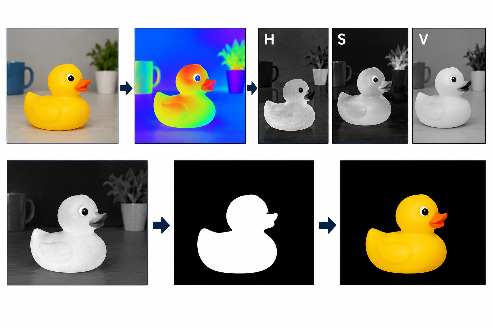

Which code correctly implements the illustrated pipeline using OpenCV?

### a)

```python
img = cv2.imread("image.jpg")
gray = cv2.cvtColor(img, cv2.COLOR_BGR2GRAY)
_, mask = cv2.threshold(gray, 100, 255, cv2.THRESH_BINARY)
result = cv2.bitwise_and(img, img, mask=mask)
```

### b)

```python
img = cv2.imread("image.jpg")
hsv = cv2.cvtColor(img, cv2.COLOR_BGR2HSV)
h = hsv[:, :, 0]
_, mask = cv2.threshold(h, 35, 255, cv2.THRESH_BINARY)
result = cv2.bitwise_and(img, img, mask=mask)
```

### c)

```python
img = cv2.imread("image.jpg")
hsv = cv2.cvtColor(img, cv2.COLOR_BGR2HSV)
s = hsv[:, :, 1]
_, mask = cv2.threshold(s, 100, 255, cv2.THRESH_BINARY)
result = cv2.bitwise_and(img, img, mask=mask)
```

### d)

```python
img = cv2.imread("image.jpg")
hsv = cv2.cvtColor(img, cv2.COLOR_BGR2HSV)
h = hsv[:, :, 0]
_, mask = cv2.threshold(h, 35, 255, cv2.THRESH_BINARY_INV)
result = cv2.bitwise_and(img, img, mask=mask)
```

### e)

```python
img = cv2.imread("image.jpg")
hsv = cv2.cvtColor(img, cv2.COLOR_BGR2HSV)
v = hsv[:, :, 2]
_, mask = cv2.threshold(v, 35, 255, cv2.THRESH_BINARY_INV)
result = cv2.bitwise_and(img, img, mask=mask)
```

---

<details>
<summary><strong>▶ Show answer</strong></summary>
<div>
<p><strong>Correct answer: d)</strong></p>
<p>The intended pipeline isolates the yellow region by converting the image to HSV, selecting the **Hue** channel, and using an **inverse threshold** around the yellow hue range shown in the example.</p>
<ul><li>**a)** thresholds grayscale intensity, so it does not explicitly use color.</li><li>**b)** uses Hue but keeps values **above** 35; this does not match the illustrated yellow-selection logic.</li><li>**c)** thresholds Saturation, which measures color purity rather than yellow hue.</li><li>**d) — Correct:** converts to HSV, extracts Hue, applies the inverse threshold, and masks the original image.</li><li>**e)** thresholds Value, which represents brightness rather than color.</li></ul>
<p>Thus, **alternative d** implements the illustrated color-based pipeline.</p>
</div>
</details>

# Image Processing (Lecture 02)

This section covers fundamental **image processing and enhancement techniques** used in Computer Vision. The questions assess your understanding of **convolution, spatial filtering, smoothing, sharpening, edge detection, and image binarization**, including the selection and interpretation of appropriate OpenCV operations.

## Question 1

Analyze the following statements and classify each one as **True (T)** or **False (F)**.

**a)** Convolution applies a kernel over an image, computing new pixel values from the values in a local neighborhood.

**b)** Smooth and homogeneous image regions are predominantly associated with high spatial frequencies.

**c)** Edges, fine details, textures, and noise are generally associated with rapid intensity variations and high spatial frequencies.

**d)** A low-pass filter attenuates high-frequency components and can therefore produce a smoother image.

**e)** Increasing the size of a smoothing kernel generally reduces the smoothing effect because fewer neighboring pixels influence the output.

**f)** A mean filter replaces the center pixel with the average intensity of its neighborhood.

<details>
<summary><strong>▶ Show answer</strong></summary>
<div>
<p><strong>Correct answer: a) T, b) F, c) T, d) T, e) F, f) T</strong></p>
<ul><li>**a — True:** convolution computes each output from a local neighborhood weighted by a kernel.</li><li>**b — False:** homogeneous regions correspond predominantly to **low** spatial frequencies.</li><li>**c — True:** edges, fine details, texture, and noise involve rapid spatial changes and therefore high-frequency content.</li><li>**d — True:** low-pass filtering attenuates high frequencies and smooths the image.</li><li>**e — False:** a larger smoothing neighborhood generally produces **more**, not less, smoothing.</li><li>**f — True:** the mean filter replaces a pixel by the arithmetic mean of its neighborhood.</li></ul>
</div>
</details>

## Question 2

Analyze the following statements and classify each one as **True (T)** or **False (F)**.

**a)** The mean filter assigns equal contribution to the pixels in its neighborhood when computing the average.

**b)** The median filter replaces the center pixel with the median value of its neighborhood and can preserve more details than the mean filter.

**c)** A Gaussian filter computes a weighted mean, and its standard deviation influences the degree of smoothing.

**d)** A bilateral filter considers only the spatial distance between pixels and therefore behaves identically to a Gaussian filter.

**e)** Sharpening emphasizes high-frequency information, which is associated with edges and fine details.

**f)** Edge-detection filters are designed primarily to suppress significant intensity transitions and preserve homogeneous regions.

<details>
<summary><strong>▶ Show answer</strong></summary>
<div>
<p><strong>Correct answer: a) T, b) T, c) T, d) F, e) T, f) F</strong></p>
<ul><li>**a — True:** the mean kernel gives equal weight to all samples in the neighborhood.</li><li>**b — True:** the median is robust to extreme values and often preserves edges better than averaging.</li><li>**c — True:** Gaussian filtering is a weighted average; `σ` controls the spatial spread of the weights.</li><li>**d — False:** bilateral filtering considers both spatial proximity **and intensity/range similarity**.</li><li>**e — True:** sharpening enhances high-frequency components such as edges and fine detail.</li><li>**f — False:** edge detectors emphasize, rather than suppress, significant spatial intensity transitions.</li></ul>
</div>
</details>

## Question 3

Consider the **original image** and its corresponding **filtered image** shown in the figure.

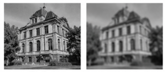

Which filter was most likely applied to obtain the filtered image?

- a) Mean Filter
- b) Gaussian Filter
- c) Median Filter
- d) Sobel Filter
- e) Laplacian Filter

<details>
<summary><strong>▶ Show answer</strong></summary>
<div>
<p><strong>Correct answer: b) Gaussian Filter</strong></p>
<p>The filtered result is characterized by **smooth attenuation of high-frequency content**, which is consistent with Gaussian smoothing.</p>
<ul><li>**Mean filter:** also smooths, but uses uniform weights and generally produces a less natural blur.</li><li>**Gaussian filter — Correct:** gives greater weight to nearby pixels and produces smooth low-pass filtering.</li><li>**Median filter:** is nonlinear and is particularly appropriate for impulse/salt-and-pepper noise.</li><li>**Sobel/Laplacian:** emphasize intensity transitions and edges rather than producing a conventional smoothed image.</li></ul>
</div>
</details>

## Question 4

## Question — Spatial Filtering

Consider the following **9×9 grayscale image**, where each value represents the intensity of a pixel.

### Input Image

| 0   | 0   | 0   | 0   | 0   | 0   | 0   | 0   | 0   |
| --- | --- | --- | --- | --- | --- | --- | --- | --- |
| 0   | 0   | 0   | 0   | 0   | 0   | 0   | 0   | 0   |
| 0   | 0   | 16  | 16  | 16  | 16  | 16  | 0   | 0   |
| 0   | 0   | 16  | 32  | 32  | 32  | 16  | 0   | 0   |
| 0   | 0   | 16  | 32  | 64  | 32  | 16  | 0   | 0   |
| 0   | 0   | 16  | 32  | 32  | 32  | 16  | 0   | 0   |
| 0   | 0   | 16  | 16  | 16  | 16  | 16  | 0   | 0   |
| 0   | 0   | 0   | 0   | 0   | 0   | 0   | 0   | 0   |
| 0   | 0   | 0   | 0   | 0   | 0   | 0   | 0   | 0   |

After applying a **3×3 spatial filter**, the following image is obtained.

### Filtered Image

| 0   | 0   | 0   | 0   | 0   | 0   | 0   | 0   | 0   |
| --- | --- | --- | --- | --- | --- | --- | --- | --- |
| 0   | 1   | 3   | 4   | 4   | 4   | 3   | 1   | 0   |
| 0   | 3   | 10  | 15  | 16  | 15  | 10  | 3   | 0   |
| 0   | 4   | 15  | 27  | 32  | 27  | 15  | 4   | 0   |
| 0   | 4   | 16  | 32  | 40  | 32  | 16  | 4   | 0   |
| 0   | 4   | 15  | 27  | 32  | 27  | 15  | 4   | 0   |
| 0   | 3   | 10  | 15  | 16  | 15  | 10  | 3   | 0   |
| 0   | 1   | 3   | 4   | 4   | 4   | 3   | 1   | 0   |
| 0   | 0   | 0   | 0   | 0   | 0   | 0   | 0   | 0   |

**Which of the following kernels was applied?**

### a) Mean Filter — normalization: 1/9

| 1   | 1   | 1   |
| --- | --- | --- |
| 1   | 1   | 1   |
| 1   | 1   | 1   |

### b) Gaussian Filter — normalization: 1/16

| 1   | 2   | 1   |
| --- | --- | --- |
| 2   | 4   | 2   |
| 1   | 2   | 1   |

### c) Neighbor Average — normalization: 1/8

| 1   | 1   | 1   |
| --- | --- | --- |
| 1   | 0   | 1   |
| 1   | 1   | 1   |

### d) Sharpening Filter

| 0   | -1  | 0   |
| --- | --- | --- |
| -1  | 5   | -1  |
| 0   | -1  | 0   |

### e) Laplacian Filter

| -1  | -1  | -1  |
| --- | --- | --- |
| -1  | 8   | -1  |
| -1  | -1  | -1  |

<details>
<summary><b>Show Answer and Explanation</b></summary>
<br>

<b>Correct answer: b) Gaussian Filter</b>

<p>
The Gaussian kernel assigns the highest weight to the central pixel,
intermediate weights to the horizontal and vertical neighbors, and
lower weights to the diagonal neighbors.
</p>

<pre>
Gaussian kernel (1/16):

1   2   1
2   4   2
1   2   1
</pre>

<p>
Consider the neighborhood around the central pixel:
</p>

<pre>
32   32   32
32   64   32
32   32   32
</pre>

<p>
Applying the Gaussian kernel:
</p>

<pre>
(1/16) × (
    32×1 + 32×2 + 32×1 +
    32×2 + 64×4 + 32×2 +
    32×1 + 32×2 + 32×1
)

= 640 / 16
= 40
</pre>

<p>
Therefore, the central pixel becomes <b>40</b>, exactly as shown
in the filtered image.
</p>

<p>
<b>Why are the other alternatives incorrect?</b>
</p>

<ul>
<li><b>(a)</b> Mean filter — assigns equal weight to all pixels.</li>
<li><b>(b)</b> Gaussian filter — produces the given output.</li>
<li><b>(c)</b> Neighbor average — ignores the central pixel.</li>
<li><b>(d)</b> Sharpening filter — enhances local intensity differences.</li>
<li><b>(e)</b> Laplacian filter — emphasizes high-frequency components and edges.</li>
</ul>

</details>


</details>

</details>

## Question 5

Consider the noisy image shown in the figure.

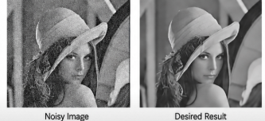

The objective is to **reduce image noise while preserving object boundaries and fine structures as much as possible**.

Which filter is the most appropriate for this objective?

- a) Mean Filter
- b) Gaussian Filter
- c) Median Filter
- d) Bilateral Filter
- e) Laplacian Filter

---

<details>
<summary><strong>▶ Show answer</strong></summary>
<div>
<p><strong>Correct answer: d) Bilateral Filter</strong></p>
<p>**Bilateral filtering** is specifically designed to smooth within regions while reducing averaging across strong intensity boundaries.</p>
<ul><li>**Mean:** smooths noise but blurs edges strongly.</li><li>**Gaussian:** improves smoothing but still averages across edges.</li><li>**Median:** excellent for impulse noise, but the stated objective emphasizes general denoising with boundary preservation.</li><li>**Bilateral — Correct:** combines spatial distance and intensity similarity.</li><li>**Laplacian:** is a high-pass/edge operator and tends to amplify noise rather than suppress it.</li></ul>
</div>
</details>

## Question 6

Consider the **original image** and its corresponding **filtered image** shown in the figure.

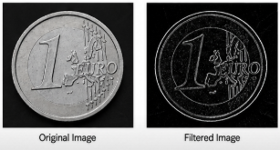

The filtered image emphasizes regions containing significant spatial intensity variations while suppressing homogeneous regions.

Which filter was most likely applied?

- a) Mean Filter
- b) Gaussian Filter
- c) Median Filter
- d) Sobel Filter
- e) Bilateral Filter

<details>
<summary><strong>▶ Show answer</strong></summary>
<div>
<p><strong>Correct answer: d) Sobel Filter</strong></p>
<p>The output emphasizes **spatial intensity gradients** and suppresses homogeneous areas, which is the expected behavior of Sobel filtering.</p>
<p>Mean, Gaussian, and median filters are primarily smoothing operators. Bilateral filtering is edge-preserving smoothing. **Sobel** estimates directional derivatives and therefore responds strongly at object boundaries.</p>
</div>
</details>

## Question 7

You want to **reduce rapid intensity variations by replacing each pixel with the average value of its local neighborhood**.

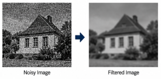

Which pseudocode correctly implements this operation?

### a)

```text
for each pixel (x, y):
    neighborhood = getNeighborhood(image, x, y, 3x3)
    output[x,y] = mean(neighborhood)
```

### b)

```text
for each pixel (x, y):
    neighborhood = getNeighborhood(image, x, y, 3x3)
    output[x,y] = median(neighborhood)
```

### c)

```text
for each pixel (x, y):
    output[x,y] = image[x,y] * 9
```

### d)

```text
for each pixel (x, y):
    neighborhood = getNeighborhood(image, x, y, 3x3)
    output[x,y] = max(neighborhood)
```

### e)

```text
for each pixel (x, y):
    output[x,y] = image[x,y] - mean(image)
```

---

<details>
<summary><strong>▶ Show answer</strong></summary>
<div>
<p><strong>Correct answer: a)</strong></p>
<p>The requested operation is exactly a **mean filter**: obtain a local neighborhood and replace the center pixel with its average.</p>
<ul><li>**a — Correct:** computes `mean(neighborhood)`.</li><li>**b:** computes a median filter.</li><li>**c:** simply scales the original intensity.</li><li>**d:** computes a maximum filter/dilation-like operation.</li><li>**e:** subtracts a global image statistic rather than performing local averaging.</li></ul>
</div>
</details>

## Question 8

An image contains **isolated extreme pixel values (outliers)**. You want to reduce their influence while preserving more image details.

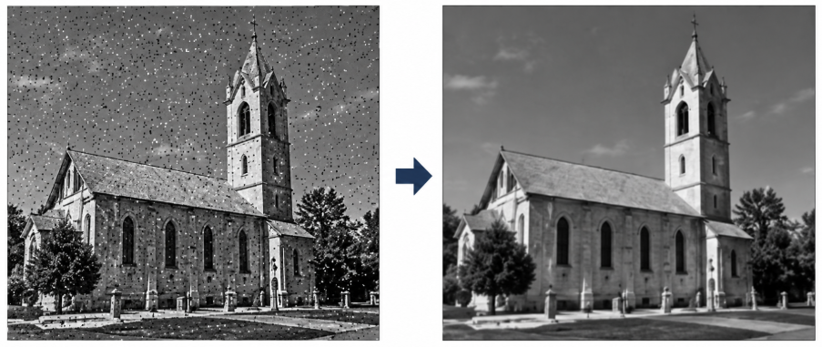

Which pseudocode is the most appropriate?

### a)

```text
for each pixel (x, y):
    neighborhood = getNeighborhood(image, x, y, 3x3)
    output[x,y] = sum(neighborhood)
```

### b)

```text
for each pixel (x, y):
    neighborhood = getNeighborhood(image, x, y, 3x3)
    output[x,y] = mean(neighborhood)
```

### c)

```text
for each pixel (x, y):
    neighborhood = getNeighborhood(image, x, y, 3x3)
    values = sort(neighborhood)
    output[x,y] = middleValue(values)
```

### d)

```text
for each pixel (x, y):
    output[x,y] = image[x,y]
```

### e)

```text
for each pixel (x, y):
    neighborhood = getNeighborhood(image, x, y, 3x3)
    output[x,y] = maximum(neighborhood)
```

---

<details>
<summary><strong>▶ Show answer</strong></summary>
<div>
<p><strong>Correct answer: c)</strong></p>
<p>Isolated extreme values are characteristic of **impulse (salt-and-pepper) noise**. The median is robust to these outliers.</p>
<ul><li>**a:** an unnormalized sum is not a proper denoising operator.</li><li>**b:** the mean is strongly influenced by extreme values.</li><li>**c — Correct:** sorting and selecting the middle value implements the median filter.</li><li>**d:** performs no filtering.</li><li>**e:** a maximum filter tends to propagate bright outliers.</li></ul>
</div>
</details>

## Question 9

You want to **smooth an image**, but neighboring pixels should not contribute equally. Pixels closer to the center of the neighborhood should have a larger contribution.

Which pseudocode best describes the desired operation?

### a)

```text
kernel = [
    [1, 1, 1],
    [1, 1, 1],
    [1, 1, 1]
] / 9

output = convolution(image, kernel)
```

### b)

```text
kernel = [
    [1, 2, 1],
    [2, 4, 2],
    [1, 2, 1]
] / 16

output = convolution(image, kernel)
```

### c)

```text
kernel = [
    [-1, 0, 1],
    [-2, 0, 2],
    [-1, 0, 1]
]

output = convolution(image, kernel)
```

### d)

```text
kernel = [
    [0, -1, 0],
    [-1, 5, -1],
    [0, -1, 0]
]

output = convolution(image, kernel)
```

### e)

```text
for each pixel (x, y):
    output[x,y] = median(neighborhood)
```

---

<details>
<summary><strong>▶ Show answer</strong></summary>
<div>
<p><strong>Correct answer: b)</strong></p>
<p>A Gaussian-like smoothing kernel assigns larger weights near the center.</p>
<ul><li>**a:** uniform weights implement a mean/box filter.</li><li>**b — Correct:** the center has the largest weight and the weights decrease with distance; normalization by 16 preserves the DC level.</li><li>**c:** is a Sobel derivative kernel.</li><li>**d:** is a sharpening kernel.</li><li>**e:** is a nonlinear median operation rather than weighted averaging.</li></ul>
</div>
</details>

## Question 10

You want to **enhance local intensity variations and make edges and fine details more prominent**, while maintaining the general appearance of the original image.

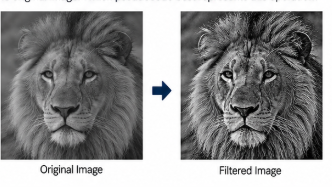

Which pseudocode best represents this operation?

### a)

```text
blurred = GaussianFilter(image)

details = image - blurred

output = image + details
```

### b)

```text
blurred = GaussianFilter(image)

output = blurred
```

### c)

```text
blurred = GaussianFilter(image)

output = image - image
```

### d)

```text
output = MeanFilter(image)
output = MeanFilter(output)
```

### e)

```text
output = MedianFilter(image)
```

---

<details>
<summary><strong>▶ Show answer</strong></summary>
<div>
<p><strong>Correct answer: a)</strong></p>
<p>This is the classical **unsharp masking/high-boost** idea.</p>
<p>`details = image - blurred` isolates high-frequency information; adding these details back to the original enhances edges while preserving the overall scene.</p>
<p>Options **b**, **d**, and **e** smooth rather than sharpen. Option **c** produces a zero image.</p>
</div>
</details>

## Question 11

You want to produce an image that **emphasizes locations containing significant spatial intensity changes**, such as object boundaries.

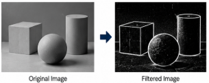

Which pseudocode is the most appropriate?

### a)

```text
kernel = [
    [1, 1, 1],
    [1, 1, 1],
    [1, 1, 1]
] / 9

output = convolution(image, kernel)
```

### b)

```text
kernel = [
    [-1, 0, 1],
    [-2, 0, 2],
    [-1, 0, 1]
]

output = convolution(image, kernel)
```

### c)

```text
for each pixel:
    output[x,y] = mean(neighborhood)
```

### d)

```text
for each pixel:
    output[x,y] = median(neighborhood)
```

### e)

```text
output = GaussianFilter(image)
```

<details>
<summary><strong>▶ Show answer</strong></summary>
<div>
<p><strong>Correct answer: b)</strong></p>
<p>The kernel in **b** is the Sobel-x derivative operator. It responds to spatial intensity changes and therefore emphasizes edges.</p>
<p>Options **a**, **c**, and **e** perform smoothing; **d** is a median filter. None of those explicitly estimates an image derivative.</p>
</div>
</details>

## Question 12

Consider a grayscale image `img`. You want to generate a binary image in which pixels with intensity **greater than 120 become white (255)** and the remaining pixels become **black (0)**.

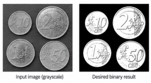

Which OpenCV code correctly implements this operation?

### a)

```python
_, binary = cv2.threshold(
    img, 120, 255, cv2.THRESH_BINARY
)
```

### b)

```python
_, binary = cv2.threshold(
    img, 120, 255, cv2.THRESH_BINARY_INV
)
```

### c)

```python
_, binary = cv2.threshold(
    img, 255, 120, cv2.THRESH_BINARY
)
```

### d)

```python
binary = cv2.GaussianBlur(
    img, (120, 120), 255
)
```

### e)

```python
_, binary = cv2.threshold(
    img, 120, 255, cv2.THRESH_OTSU
)
```

---

<details>
<summary><strong>▶ Show answer</strong></summary>
<div>
<p><strong>Correct answer: a)</strong></p>
<p>`cv2.THRESH_BINARY` implements exactly the requested mapping: values **greater than 120 → 255**, otherwise `0`.</p>
<ul><li>**b:** reverses the mapping.</li><li>**c:** swaps the threshold and maximum-value arguments.</li><li>**d:** performs Gaussian smoothing, not binarization.</li><li>**e:** requests Otsu threshold estimation instead of explicitly using 120 as the decision threshold.</li></ul>
</div>
</details>

## Question 13

Regarding image binarization and thresholding methods, analyze the following statements:

**01.** `cv2.THRESH_BINARY` assigns the maximum value to pixels above the defined threshold and zero to the remaining pixels.

**02.** `cv2.THRESH_BINARY_INV` produces the inverse assignment compared with `cv2.THRESH_BINARY`.

**04.** Otsu's method automatically estimates a threshold from the image intensity distribution.

**08.** Otsu's method requires the user to manually define the optimal threshold before applying the algorithm.

**16.** A global binary threshold applies the same threshold value to all pixels in the image.

**The sum of the CORRECT statements is:**

- a) **7**
- b) **19**
- c) **21**
- d) **23**
- e) **31**

---

<details>
<summary><strong>▶ Show answer</strong></summary>
<div>
<p><strong>Correct answer: d) 23</strong></p>
<p>Correct statements: **01, 02, 04, and 16**, so `1 + 2 + 4 + 16 = 23`.</p>
<ul><li>**01 — Correct:** this is the definition of `THRESH_BINARY`.</li><li>**02 — Correct:** `THRESH_BINARY_INV` reverses the output assignment.</li><li>**04 — Correct:** Otsu estimates a global threshold from the intensity distribution.</li><li>**08 — Incorrect:** Otsu does not require manually selecting the optimal threshold.</li><li>**16 — Correct:** a global threshold uses the same decision value over the entire image.</li></ul>
<p>Therefore, **alternative d** is correct.</p>
</div>
</details>

## Question 14

Consider the grayscale intensity histogram shown below:

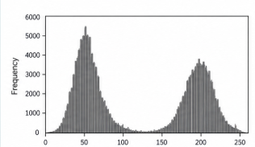

The objective is to separate the two predominant groups of pixels using a **single global threshold**.

Which threshold is the most appropriate?

- a) **T = 40**
- b) **T = 60**
- c) **T = 120**
- d) **T = 190**
- e) **T = 230**

---

<details>
<summary><strong>▶ Show answer</strong></summary>
<div>
<p><strong>Correct answer: c) T = 120</strong></p>
<p>The histogram contains two predominant intensity groups. A useful global threshold should lie in the **valley between the two modes**, minimizing assignment ambiguity.</p>
<p>`T = 120` lies between the dark and bright populations shown in the histogram. Values such as 40/60 or 190/230 fall inside or beyond one of the dominant groups and therefore produce poorer separation.</p>
</div>
</details>

# Morphology (Lecture 03)

This section covers **mathematical morphology and binary image processing**. The questions assess your understanding of **structuring elements, erosion, dilation, opening, closing, and morphological gradients**, including their effects on object shape, noise removal, hole filling, and segmentation refinement.

## Question 01

Consider the following binary image, where `1` represents the **foreground** and `0` represents the **background**:

```text
0 0 0 0 0 0 0
0 0 0 1 0 0 0
0 0 1 1 1 0 0
0 1 1 1 1 1 0
0 0 1 1 1 0 0
0 0 0 1 0 0 0
0 0 0 0 0 0 0
```

Consider the following structuring element, with its origin at the center:

```text
0 1 0
1 1 1
0 1 0
```

What is the result after applying **one iteration of erosion**?

### a)

```text
0 0 0 0 0 0 0
0 0 0 0 0 0 0
0 0 0 0 0 0 0
0 0 0 1 0 0 0
0 0 0 0 0 0 0
0 0 0 0 0 0 0
0 0 0 0 0 0 0
```

### b)

```text
0 0 0 0 0 0 0
0 0 0 0 0 0 0
0 0 0 1 0 0 0
0 0 1 1 1 0 0
0 0 0 1 0 0 0
0 0 0 0 0 0 0
0 0 0 0 0 0 0
```

### c)

```text
0 0 0 0 0 0 0
0 0 0 1 0 0 0
0 0 1 1 1 0 0
0 1 1 1 1 1 0
0 0 1 1 1 0 0
0 0 0 1 0 0 0
0 0 0 0 0 0 0
```

### d)

```text
0 0 0 0 0 0 0
0 0 1 1 1 0 0
0 1 1 1 1 1 0
1 1 1 1 1 1 1
0 1 1 1 1 1 0
0 0 1 1 1 0 0
0 0 0 1 0 0 0
```

### e)

```text
0 0 0 0 0 0 0
0 0 0 0 0 0 0
0 0 1 0 1 0 0
0 0 0 1 0 0 0
0 0 1 0 1 0 0
0 0 0 0 0 0 0
0 0 0 0 0 0 0
```

---

<details>
<summary><strong>▶ Show answer</strong></summary>
<div>
<p><strong>Correct answer: b)</strong></p>
<p>Erosion keeps a foreground pixel only when the translated structuring element fits completely inside the foreground. With the cross-shaped element, only pixels having foreground neighbors at **up, down, left, and right** survive.</p>
<p>Applying that rule to the diamond produces the smaller central cross shown in **alternative b**. Option **c** is essentially unchanged, **d** corresponds to growth rather than erosion, and **a/e** remove pixels that should survive.</p>
</div>
</details>

## Question 02

A binary segmentation contains a **large foreground object** surrounded by several **small isolated foreground pixels**.

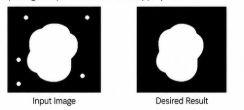

The objective is to remove these small objects while preserving the shape and size of the main object as much as possible.

Which morphological operation is the most appropriate?

- a) Dilation
- b) Erosion
- c) Opening
- d) Closing
- e) Morphological Gradient

---

<details>
<summary><strong>▶ Show answer</strong></summary>
<div>
<p><strong>Correct answer: c) Opening</strong></p>
<p>**Opening = erosion followed by dilation.** It removes foreground structures smaller than the structuring element while approximately restoring the shape of larger surviving objects.</p>
<p>Dilation enlarges the noise; erosion alone also shrinks the main object; closing is aimed primarily at small holes/gaps; the morphological gradient extracts boundaries.</p>
</div>
</details>

## Question 03

Consider a binary image containing foreground objects with **small holes inside them**.

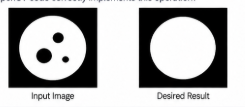

The objective is to fill these small holes while approximately preserving the original size and shape of the objects.

Which OpenCV code is the most appropriate?

### a)

```python
kernel = np.ones((5, 5), np.uint8)

result = cv2.morphologyEx(
    binary,
    cv2.MORPH_OPEN,
    kernel
)
```

### b)

```python
kernel = np.ones((5, 5), np.uint8)

result = cv2.morphologyEx(
    binary,
    cv2.MORPH_CLOSE,
    kernel
)
```

### c)

```python
kernel = np.ones((5, 5), np.uint8)

result = cv2.erode(
    binary,
    kernel,
    iterations=2
)
```

### d)

```python
kernel = np.ones((5, 5), np.uint8)

result = cv2.dilate(
    binary,
    kernel,
    iterations=2
)
```

### e)

```python
kernel = np.ones((5, 5), np.uint8)

result = cv2.morphologyEx(
    binary,
    cv2.MORPH_GRADIENT,
    kernel
)
```

---

<details>
<summary><strong>▶ Show answer</strong></summary>
<div>
<p><strong>Correct answer: b)</strong></p>
<p>Small background holes inside foreground objects are a standard use case for **closing**.</p>
<ul><li>**a:** opening removes small foreground objects.</li><li>**b — Correct:** `MORPH_CLOSE` performs dilation followed by erosion and can fill small holes/gaps.</li><li>**c:** erosion enlarges holes and shrinks foreground.</li><li>**d:** dilation may fill holes but also permanently enlarges the object.</li><li>**e:** the gradient extracts boundaries.</li></ul>
</div>
</details>

## Question 04

Consider an original binary image and its processed result.

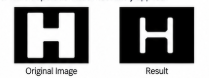

After processing:

- foreground objects become smaller;
- external boundaries move inward;
- thin foreground structures may disappear;
- small foreground regions may be completely removed.

Which morphological operation was most likely applied?

- a) Dilation
- b) Erosion
- c) Opening
- d) Closing
- e) Morphological Gradient

---

<details>
<summary><strong>▶ Show answer</strong></summary>
<div>
<p><strong>Correct answer: b) Erosion</strong></p>
<p>All listed effects—foreground shrinkage, inward boundary motion, disappearance of thin structures, and removal of small foreground regions—are characteristic of **erosion**.</p>
<p>Dilation has the opposite geometric effect. Opening includes erosion but then partially restores surviving regions by dilation. Closing tends to fill holes/gaps, and the gradient extracts object boundaries.</p>
</div>
</details>

## Question 05 — Morphological Operations

Regarding mathematical morphology, analyze the following statements:

**01.** Erosion generally reduces the size of foreground objects.

**02.** Dilation can increase foreground regions and connect nearby contours.

**04.** Opening consists of **dilation followed by erosion**.

**08.** Closing consists of **dilation followed by erosion** and can fill small holes.

**16.** The morphological gradient can be obtained from the difference between dilation and erosion.

**32.** The structuring element defines the shape of the neighborhood considered by the morphological operation.

**The sum of the CORRECT statements is:**

- a) **27**
- b) **43**
- c) **51**
- d) **57**
- e) **59**

<details>
<summary><strong>▶ Show answer</strong></summary>
<div>
<p><strong>Correct answer: e) 59</strong></p>
<p>Correct statements: **01, 02, 08, 16, and 32**, so `1 + 2 + 8 + 16 + 32 = 59`.</p>
<ul><li>**01 — Correct:** erosion generally shrinks foreground.</li><li>**02 — Correct:** dilation expands foreground and can bridge nearby regions.</li><li>**04 — Incorrect:** opening is **erosion followed by dilation**.</li><li>**08 — Correct:** closing is dilation followed by erosion.</li><li>**16 — Correct:** a common morphological gradient is `dilation − erosion`.</li><li>**32 — Correct:** the structuring element specifies the neighborhood geometry.</li></ul>
<p>Thus, **alternative e** is correct.</p>
</div>
</details>

# Connected Component Labeling (Lecture 04)

This section covers **Connected Component Labeling (CCL)** and component-based segmentation. The questions assess your understanding of **4- and 8-connectivity, row-by-row labeling, label equivalence and Union-Find, component extraction, and filtering based on geometric properties**.

## Question 01

Regarding Connected Component Labeling (CCL), analyze the following statements:

**01.** Connected Component Labeling analyzes foreground pixels and assigns labels to spatially connected regions.

**02.** Under **4-connectivity**, diagonal pixels are considered directly connected.

**04.** Under **8-connectivity**, horizontal, vertical, and diagonal neighbors may belong to the same component.

**08.** Two disconnected foreground regions must always receive the same final label if they have the same area.

**16.** The number of detected components may change depending on whether 4-connectivity or 8-connectivity is used.

**32.** Connected Component Labeling requires all foreground pixels to receive different labels.

**The sum of the CORRECT statements is:**

- a) **5**
- b) **17**
- c) **21**
- d) **23**
- e) **53**

---

<details>
<summary><strong>▶ Show answer</strong></summary>
<div>
<p><strong>Correct answer: c) 21</strong></p>
<p>Correct statements: **01, 04, and 16**, giving `1 + 4 + 16 = 21`.</p>
<ul><li>**01 — Correct:** CCL assigns labels to connected foreground regions.</li><li>**02 — Incorrect:** diagonal adjacency is excluded from 4-connectivity.</li><li>**04 — Correct:** 8-connectivity includes horizontal, vertical, and diagonal neighbors.</li><li>**08 — Incorrect:** equal area does not imply connectivity or equal labels.</li><li>**16 — Correct:** connectivity choice can change the number of components.</li><li>**32 — Incorrect:** pixels in the same component share a component label.</li></ul>
<p>Therefore, **alternative c** is correct.</p>
</div>
</details>

## Question 02

Consider the following binary image:

```text
0 0 0 0 0
0 1 0 1 0
0 0 1 0 0
0 1 0 1 0
0 0 0 0 0
```

Assume that `1` represents foreground pixels.

How many connected foreground components are present using **4-connectivity** and **8-connectivity**, respectively?

- a) **1 and 1**
- b) **5 and 1**
- c) **5 and 5**
- d) **4 and 2**
- e) **1 and 5**

---

<details>
<summary><strong>▶ Show answer</strong></summary>
<div>
<p><strong>Correct answer: b) 5 and 1</strong></p>
<p>With **4-connectivity**, none of the five foreground pixels shares a horizontal or vertical edge with another, so there are **5 components**. With **8-connectivity**, the center pixel is diagonally adjacent to all four surrounding pixels, connecting them into **1 component**.</p>
<p>Therefore, **alternative b** is correct.</p>
</div>
</details>

## Question 03

Consider the following binary image:

```text
0 1 1 0 1 0
0 1 0 0 1 0
0 1 1 1 1 0
0 0 0 0 0 0
1 1 0 1 1 0
1 1 0 1 1 0
```

Apply the **row-by-row Connected Component Labeling algorithm** using **4-connectivity**.

During the first pass:

- assign a new label when no previously processed connected neighbor has a label;
- otherwise, use the label of a connected neighbor;
- when different labels are found to be connected, record their equivalence;
- resolve equivalent labels in the second pass.

Which matrix represents the **final labeled image after resolving label equivalences**?

### a)

```text
0 1 1 0 2 0
0 1 0 0 2 0
0 1 1 1 1 0
0 0 0 0 0 0
3 3 0 4 4 0
3 3 0 4 4 0
```

### b)

```text
0 1 1 0 1 0
0 1 0 0 1 0
0 1 1 1 1 0
0 0 0 0 0 0
2 2 0 3 3 0
2 2 0 3 3 0
```

### c)

```text
0 1 1 0 2 0
0 1 0 0 2 0
0 1 1 1 2 0
0 0 0 0 0 0
3 3 0 3 3 0
3 3 0 3 3 0
```

### d)

```text
0 1 1 0 2 0
0 1 0 0 2 0
0 1 1 1 2 0
0 0 0 0 0 0
1 1 0 2 2 0
1 1 0 2 2 0
```

### e)

```text
0 1 1 0 2 0
0 1 0 0 2 0
0 1 1 1 2 0
0 0 0 0 0 0
3 3 0 4 4 0
3 3 0 4 4 0
```

---

<details>
<summary><strong>▶ Show answer</strong></summary>
<div>
<p><strong>Correct answer: b)</strong></p>
<p>In the upper region, provisional labels introduced on the left and right become connected on the third row, so their equivalence must be resolved into a **single final label**. The two lower 2×2 blocks remain disconnected from each other and from the upper object.</p>
<p>Thus the final image contains **three connected components**, represented correctly by **alternative b**. Options retaining two labels inside the upper connected object have failed to resolve equivalence.</p>
</div>
</details>

## Question 04

During the **first pass** of a row-by-row Connected Component Labeling algorithm, a foreground pixel is reached and two previously processed connected neighbors contain different labels:

```text
Previous labels:

      2
      |
  1 - X
```

`X` represents the current foreground pixel.

What should the algorithm do?

- a) Assign a completely new label to `X` because the neighboring labels are different.
- b) Change `X` to background because its neighbors have conflicting labels.
- c) Assign one of the neighboring labels to `X` and record that labels **1 and 2 are equivalent**.
- d) Immediately relabel every pixel in the image as label `1`.
- e) Keep both labels simultaneously in `X` without recording any relationship between them.

---

<details>
<summary><strong>▶ Show answer</strong></summary>
<div>
<p><strong>Correct answer: c)</strong></p>
<p>When two already processed neighbors have different provisional labels, the current pixel demonstrates that those label sets are connected.</p>
<p>Therefore the algorithm assigns one of the existing labels to `X` and records an equivalence such as `1 ≡ 2`. A second pass (often using Union-Find equivalence resolution) maps both provisional labels to the same final component. This is exactly **alternative c**.</p>
</div>
</details>

## Question 05

Consider the following binary image stored in `binary`. The objective is to identify each connected foreground region with a different integer label.

Which OpenCV code correctly performs this operation?

### a)

```python
num_labels, labels = cv2.connectedComponents(
    binary,
    connectivity=8
)
```

### b)

```python
num_labels, labels = cv2.threshold(
    binary,
    127,
    255,
    cv2.THRESH_BINARY
)
```

### c)

```python
labels = cv2.morphologyEx(
    binary,
    cv2.MORPH_OPEN,
    np.ones((3, 3), np.uint8)
)
```

### d)

```python
labels = cv2.erode(
    binary,
    np.ones((3, 3), np.uint8)
)
```

### e)

```python
num_labels, labels = cv2.findContours(
    binary,
    cv2.RETR_EXTERNAL,
    cv2.CHAIN_APPROX_SIMPLE
)
```

---

<details>
<summary><strong>▶ Show answer</strong></summary>
<div>
<p><strong>Correct answer: a)</strong></p>
<p>`cv2.connectedComponents(binary, connectivity=8)` performs Connected Component Labeling and returns the number of labels and the label matrix.</p>
<p>Thresholding only binarizes; morphology changes binary geometry; erosion is not labeling; `findContours()` extracts contours and does not have the shown `connectedComponents` return semantics. Therefore **a** is correct.</p>
</div>
</details>

## Question 06

Consider the following pipeline designed to extract objects from an RGB image:


```python
img = cv2.imread("objects.jpg")

gray = cv2.cvtColor(img, cv2.COLOR_BGR2GRAY)

blur = cv2.GaussianBlur(gray, (5, 5), 0)

_, binary = cv2.threshold(
    blur, 120, 255, cv2.THRESH_BINARY
)

num_labels, labels = cv2.connectedComponents(
    binary,
    connectivity=8
)
```

Which statement best describes the role of each stage?

- a) `cvtColor()` segments the objects, `GaussianBlur()` labels them, `threshold()` removes components, and `connectedComponents()` restores their colors.
- b) `cvtColor()` reduces the image representation to intensity, `GaussianBlur()` reduces local variations/noise, `threshold()` separates foreground from background, and `connectedComponents()` assigns labels to connected foreground regions.
- c) `GaussianBlur()` converts the image to binary, while `threshold()` identifies connected regions.
- d) `threshold()` detects the objects independently of their connectivity, making `connectedComponents()` unnecessary.
- e) `connectedComponents()` performs the grayscale conversion, binarization, and component extraction simultaneously.

---

<details>
<summary><strong>▶ Show answer</strong></summary>
<div>
<p><strong>Correct answer: b)</strong></p>
<p>The pipeline roles are:</p>
<p>`BGR/RGB → grayscale intensity → Gaussian denoising → binary foreground/background segmentation → connected-region labeling`.</p>
<p>That description is exactly **alternative b**. The other alternatives assign segmentation, labeling, or color-restoration functions to operations that do not perform them.</p>
</div>
</details>

## Question 07

Consider the following processing sequence:

`RGB → Grayscale → Threshold → Connected Components`

After thresholding, one physical object appears as **several disconnected white regions**. Consequently, `connectedComponents()` returns several labels for what should be a single object.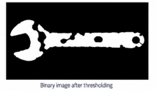Which modification is the most appropriate **before component labeling**?

- a) Apply erosion to increase the size of each fragmented region.
- b) Apply closing to connect small gaps between foreground regions.
- c) Apply opening to increase the connectivity between separated regions.
- d) Convert the binary image back to RGB before labeling.
- e) Increase the number of labels returned by `connectedComponents()`.

---

<details>
<summary><strong>▶ Show answer</strong></summary>
<div>
<p><strong>Correct answer: b) Closing</strong></p>
<p>The object is fragmented by **small internal gaps**. Before CCL, these gaps should be bridged so that the physical object becomes one connected foreground region.</p>
<p>**Closing** (dilation followed by erosion) is appropriate for connecting small gaps. Erosion generally increases fragmentation; opening removes small foreground structures; RGB conversion does not alter connectivity; requesting more labels worsens rather than solves the semantic problem.</p>
</div>
</details>

## Question 08

Consider the following segmentation pipeline:

```python
gray = cv2.cvtColor(img, cv2.COLOR_BGR2GRAY)

_, binary = cv2.threshold(
    gray, 130, 255, cv2.THRESH_BINARY
)

num_labels, labels = cv2.connectedComponents(
    binary,
    connectivity=8
)
```

The binary image contains the desired objects, but also **many small isolated white pixels**. As a result, a large number of very small connected components are detected.


Which pipeline is more appropriate?

### a)

```text
RGB
 ↓
Grayscale
 ↓
Threshold
 ↓
Opening
 ↓
Connected Components
```

### b)

```text
RGB
 ↓
Grayscale
 ↓
Threshold
 ↓
Dilation
 ↓
Connected Components
```

### c)

```text
RGB
 ↓
Connected Components
 ↓
Grayscale
 ↓
Threshold
```

### d)

```text
RGB
 ↓
Erosion
 ↓
Grayscale
 ↓
Connected Components
```

### e)

```text
RGB
 ↓
Connected Components
 ↓
Opening
 ↓
Threshold
```

---

<details>
<summary><strong>▶ Show answer</strong></summary>
<div>
<p><strong>Correct answer: a)</strong></p>
<p>The undesired structures are **small isolated foreground pixels**. An opening before CCL removes small foreground artifacts while retaining larger objects.</p>
<p>Dilation enlarges the noise; applying CCL before binarization/morphological cleanup is conceptually incorrect; erosion before grayscale conversion is misplaced. Thus **pipeline a** is the appropriate sequence.</p>
</div>
</details>

## Question 09

Suppose the previous stages produce the following connected components:

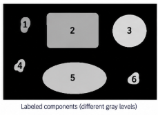

| Label | Area (px) | Width | Height |
| -----:| ---------:|:-----:| ------:|
| 1     | 18        | 3     | 6      |
| 2     | 940       | 31    | 32     |
| 3     | 870       | 29    | 30     |
| 4     | 12        | 4     | 3      |
| 5     | 1020      | 34    | 31     |
| 6     | 21        | 3     | 7      |

The expected objects have approximately **800–1100 foreground pixels**.

Which labels should be retained?

- a) `1, 4, 6`
- b) `2, 3, 5`
- c) `1, 2, 3, 5`
- d) `2, 4, 5`
- e) All components, because Connected Component Labeling already removes irrelevant regions.

---

<details>
<summary><strong>▶ Show answer</strong></summary>
<div>
<p><strong>Correct answer: b) 2, 3, 5</strong></p>
<p>The accepted area interval is approximately **800–1100 px**:</p>
<ul><li>Label 1: 18 → reject.</li><li>Label 2: 940 → retain.</li><li>Label 3: 870 → retain.</li><li>Label 4: 12 → reject.</li><li>Label 5: 1020 → retain.</li><li>Label 6: 21 → reject.</li></ul>
<p>Therefore the retained labels are **2, 3, and 5**, i.e. **alternative b**.</p>
</div>
</details>

## Question 10

A system is designed to segment dark characters from a license plate.

The following pipeline is used:

```text
Input Image
    ↓
Grayscale
    ↓
Gaussian Blur
    ↓
Threshold
    ↓
Morphological Processing
    ↓
Connected Components
    ↓
Filter Components
```

The final system fails to detect the character **"1"**.

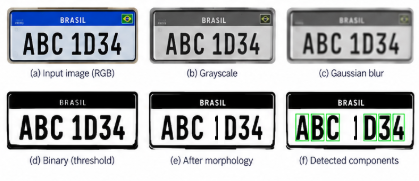

Which conclusion is best supported by these observations?

- a) The grayscale conversion is responsible for the failure.
- b) The threshold value necessarily needs to be changed.
- c) The connected-component algorithm incorrectly removed the character.
- d) The morphological stage should be investigated because the character is lost at this stage.
- e) The original RGB image does not contain sufficient information to identify the character.

<details>
<summary><strong>▶ Show answer</strong></summary>
<div>
<p><strong>Correct answer: d)</strong></p>
<p>The diagnostic evidence indicates that the character is present before morphology but is lost during the **morphological processing stage**. The first stage at which the expected object disappears is therefore the primary point to investigate.</p>
<p>Changing grayscale or thresholding is not supported by that stage-by-stage evidence; CCL cannot label a component that morphology has already removed; the original image demonstrably contains the character. Hence **alternative d** is correct.</p>
</div>
</details>

# Feature Descriptors — Lecture 05

This section covers **feature extraction and image descriptors**. The questions assess your understanding of **feature vectors, feature spaces, feature engineering, and discriminative representations**, as well as **shape-, edge-, and texture-based descriptors**, including **projections, moments, HOG, Gabor filters, and LBP**

## Question 01

Regarding feature extraction, analyze the following statements:

**01.** A feature descriptor transforms information from the input into a feature representation.

**02.** Two visually different classes can become difficult to distinguish if their feature vectors occupy overlapping regions in the feature space.

**04.** A larger feature vector is necessarily more discriminative than a smaller feature vector.

**08.** Width and height alone may be insufficient to distinguish objects with similar dimensions but different shapes.

**16.** Feature engineering aims to obtain characteristics that better represent relevant differences among classes.

**32.** A good feature representation should force samples from different classes to have identical feature vectors.

**The sum of the CORRECT statements is:**

- a) **11**
- b) **19**
- c) **25**
- d) **27**
- e) **59**

---

<details>
<summary><strong>▶ Show answer</strong></summary>
<div>
<p><strong>Correct answer: d) 27</strong></p>
<p>Correct statements: **01, 02, 08, and 16**, giving `1 + 2 + 8 + 16 = 27`.</p>
<ul><li>**01 — Correct:** descriptors map input information to a feature representation.</li><li>**02 — Correct:** overlapping class distributions reduce separability.</li><li>**04 — Incorrect:** dimensionality alone does not guarantee discriminative information.</li><li>**08 — Correct:** objects can have similar dimensions but different geometry.</li><li>**16 — Correct:** feature engineering seeks representations useful for distinguishing relevant classes.</li><li>**32 — Incorrect:** forcing different classes to identical vectors destroys discriminability.</li></ul>
<p>Thus, **alternative d** is correct.</p>
</div>
</details>

## Question 02

Consider the feature spaces shown in the figure:

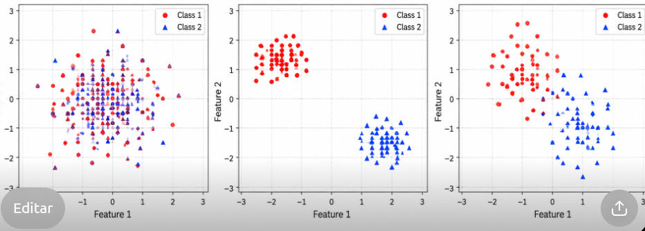

- In **A**, samples from different classes strongly overlap.
- In **B**, samples form compact and well-separated groups.
- In **C**, samples form dispersed and partially overlapping groups.

Assuming that the objective is to distinguish the classes using a subsequent classifier, which statement is correct?

- a) Feature Space A is preferable because samples from different classes occupy similar regions.
- b) Feature Space B provides a more discriminative representation of the classes.
- c) Feature Space C is necessarily better because its samples occupy a larger area.
- d) All feature spaces are equivalent because they contain the same number of samples.
- e) Feature extraction cannot influence the separability of the classes.

---

<details>
<summary><strong>▶ Show answer</strong></summary>
<div>
<p><strong>Correct answer: b)</strong></p>
<p>A discriminative feature space should exhibit **small intra-class variation** and **large inter-class separation**. Feature Space **B** best satisfies this criterion because its class clusters are compact and separated.</p>
<p>A has strong overlap; C retains partial overlap; equal sample count does not imply equivalent representations; feature extraction directly affects separability. Therefore **b** is correct.</p>
</div>
</details>

## Question 03

Consider the following binary image:

```text
0 0 1 1 0
0 0 1 1 0
0 0 1 1 0
0 1 1 1 0
0 1 0 1 0
```

Assume that foreground pixels have value `1`.

The **horizontal projection** is obtained by summing the foreground pixels of each row, while the **vertical projection** is obtained by summing the foreground pixels of each column.

Which pair correctly represents the projections?

### a)

```text
Horizontal = [2, 2, 2, 3, 2]
Vertical   = [0, 2, 4, 5, 0]
```

### b)

```text
Horizontal = [0, 2, 4, 5, 0]
Vertical   = [2, 2, 2, 3, 2]
```

### c)

```text
Horizontal = [2, 2, 2, 3, 2]
Vertical   = [0, 1, 5, 5, 0]
```

### d)

```text
Horizontal = [2, 2, 2, 2, 2]
Vertical   = [0, 2, 4, 4, 0]
```

### e)

```text
Horizontal = [1, 1, 1, 1, 1]
Vertical   = [1, 1, 1, 1, 1]
```

---

<details>
<summary><strong>▶ Show answer</strong></summary>
<div>
<p><strong>Correct answer: a)</strong></p>
<p>Summing each row gives `Horizontal = [2, 2, 2, 3, 2]`.</p>
<p>Summing each column gives `Vertical = [0, 2, 4, 5, 0]`.</p>
<p>These vectors match **alternative a**. Option b swaps the axes; c/d contain incorrect counts; e does not represent the foreground distribution.</p>
</div>
</details>

## Question 04

Suppose that four recognition problems present different visual characteristics:

**I.** Objects mainly differ in their **overall silhouette and spatial distribution**.

**II.** Objects mainly differ in their **local gradient orientations and edge structures**.

**III.** Surfaces mainly differ in their **oriented texture patterns at different frequencies**.

**IV.** Surfaces mainly differ in their **local intensity patterns around neighboring pixels**.

Which association is the most appropriate?

- a) I → Projections; II → HOG; III → Gabor; IV → LBP
- b) I → LBP; II → Projections; III → HOG; IV → Gabor
- c) I → Gabor; II → LBP; III → Projections; IV → HOG
- d) I → HOG; II → Gabor; III → LBP; IV → Projections
- e) I → Projections; II → LBP; III → Gabor; IV → HOG

---

<details>
<summary><strong>▶ Show answer</strong></summary>
<div>
<p><strong>Correct answer: a)</strong></p>
<p>The natural associations are:</p>
<ul><li>**I → Projections:** encode global spatial foreground distribution.</li><li>**II → HOG:** summarizes local gradient orientations.</li><li>**III → Gabor:** analyzes oriented texture at selected scales/frequencies.</li><li>**IV → LBP:** encodes local intensity comparisons around each pixel.</li></ul>
<p>Therefore, **alternative a** is correct.</p>
</div>
</details>

## Question 05

Consider the following recognition pipeline:

```text
Input Image
     ↓
Preprocessing
     ↓
Segmentation
     ↓
Feature Extraction
     ↓
Feature Vector
     ↓
Classifier
     ↓
Predicted Class
```

A system correctly segments two object classes, but the selected feature vector contains only:

```python
features = [width, height]
```

Analysis of the feature space shows that samples from both classes strongly overlap.

Which modification is the most appropriate?

- a) Increase the threshold used during segmentation even though segmentation is already correct.
- b) Apply Connected Component Labeling repeatedly until the classes become separated.
- c) Add descriptors that represent other relevant characteristics, such as shape, edges, projections, or texture.
- d) Increase the RGB image resolution without modifying the feature representation.
- e) Replace all feature vectors with `[1, 1]` to normalize the feature space.

---

<details>
<summary><strong>▶ Show answer</strong></summary>
<div>
<p><strong>Correct answer: c)</strong></p>
<p>The segmentation is already correct; the failure occurs because `[width, height]` produces overlapping class distributions. The appropriate intervention is therefore at the **feature representation** stage.</p>
<p>Adding shape, edge, projection, or texture descriptors can introduce discriminative information. Repeating CCL or changing a correct threshold does not improve class separability; higher image resolution does not automatically fix an inadequate descriptor; replacing all vectors by `[1,1]` eliminates information. Hence **c**.</p>
</div>
</details>

## Question 06

You are designing a feature extraction step for a classification system. Consider the following image samples from two classes:


Which feature descriptor is most appropriate to distinguish these two classes?

- a) Color histogram
- b) HOG (Histogram of Oriented Gradients)
- c) LBP (Local Binary Patterns)
- d) Vertical and horizontal projections
- e) Gabor filters

---

<details>
<summary><strong>▶ Show answer</strong></summary>
<div>
<p><strong>Correct answer: b) HOG</strong></p>
<p>The classes differ primarily in **shape and edge-orientation structure**. HOG explicitly summarizes local gradient orientations and is therefore well suited to such differences.</p>
<p>Color histograms ignore geometry; LBP and Gabor emphasize texture; projections provide coarse global spatial distributions but generally encode less local contour structure than HOG for the illustrated objects. Thus **b** is the most appropriate.</p>
</div>
</details>

## Question 07

Consider the following binary images of four shapes:

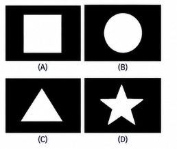

You want to extract features that capture the **overall shape and contour information** of the objects, being invariant to their position in the image.

Which descriptor is the most appropriate for this task?

- a) Color histogram
- b) LBP
- c) Moments (e.g., Hu Moments)
- d) Texture descriptors (e.g., Gabor)
- e) Raw pixel intensities (flattened image)

---

<details>
<summary><strong>▶ Show answer</strong></summary>
<div>
<p><strong>Correct answer: c) Moments (Hu Moments)</strong></p>
<p>Hu moments summarize global object geometry and are designed to provide invariance to translation, scale, and rotation under their standard formulation.</p>
<p>Color and texture descriptors do not directly represent binary silhouette geometry; flattened pixels are strongly position dependent. Therefore **alternative c** is the most appropriate for global shape/contour information.</p>
</div>
</details>

## Question 08

The following images show two types of textures:

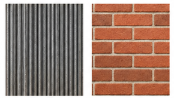

Which feature descriptor is most suitable to distinguish these two texture classes?

- a) Object moments
- b) HOG
- c) Gabor filters (with multiple orientations)
- d) Vertical and horizontal projections
- e) Color histogram

---

<details>
<summary><strong>▶ Show answer</strong></summary>
<div>
<p><strong>Correct answer: c) Gabor filters</strong></p>
<p>Gabor filters provide localized frequency- and orientation-selective responses, making them particularly suitable for distinguishing **oriented textures**.</p>
<p>Moments represent global shape; projections describe coarse spatial occupancy; a color histogram is irrelevant when the discriminative cue is texture. HOG captures gradients but Gabor is the more direct match to multi-orientation texture analysis here. Thus **c**.</p>
</div>
</details>

## Question 09

The figure below shows the distribution of samples from two classes in different feature spaces obtained using different descriptors.

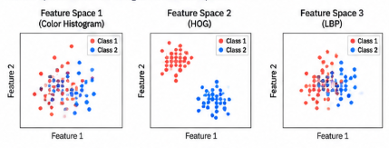

Which feature space is more discriminative for a classification task, and why?

- a) Feature Space 1, because the samples are more spread out.
- b) Feature Space 2, because the classes are well separated.
- c) Feature Space 3, because it uses texture information.
- d) Feature Space 1, because color histograms are always better.
- e) Feature Spaces 2 and 3 are equivalent.

---

<details>
<summary><strong>▶ Show answer</strong></summary>
<div>
<p><strong>Correct answer: b) Feature Space 2</strong></p>
<p>The most discriminative representation is the one in which samples from different classes are **well separated** while samples from the same class remain comparatively coherent. The figure shows this behavior in **Feature Space 2**.</p>
<p>Greater spread alone is not desirable, and descriptor type does not guarantee performance independently of the resulting class distribution. Therefore **alternative b** is correct.</p>
</div>
</details>

## Question 10

You want to design a system to recognize handwritten digits (0–9). The following preprocessing and segmentation steps have already been applied, resulting in isolated and normalized binary images of digits:


Which combination of features is most appropriate to represent these digits for classification using classical machine learning methods (e.g., SVM or k-NN)?

- a) Only width and height of the bounding box
- b) Color histogram of the binary image
- c) Vertical and horizontal projections of the binary image
- d) LBP (Local Binary Patterns) computed on the RGB image
- e) Gabor filters with multiple scales and orientations (without normalization)

<details>
<summary><strong>▶ Show answer</strong></summary>
<div>
<p><strong>Correct answer: c) Vertical and horizontal projections</strong></p>
<p>For isolated, normalized binary digits, horizontal and vertical projections encode how foreground strokes are distributed along the two axes and provide a compact classical representation.</p>
<p>Width/height alone are too weak; a color histogram carries essentially no useful color information in a binary image; computing LBP on RGB is inconsistent with the stated binary representation; unnormalized Gabor responses are unnecessarily complex for the proposed choices. Therefore **c** is the best answer.</p>
</div>
</details>

## Question 11

Consider the grayscale image shown in the figure. A **4 × 4 region** of the image is magnified, resulting in the following pixel intensity values:

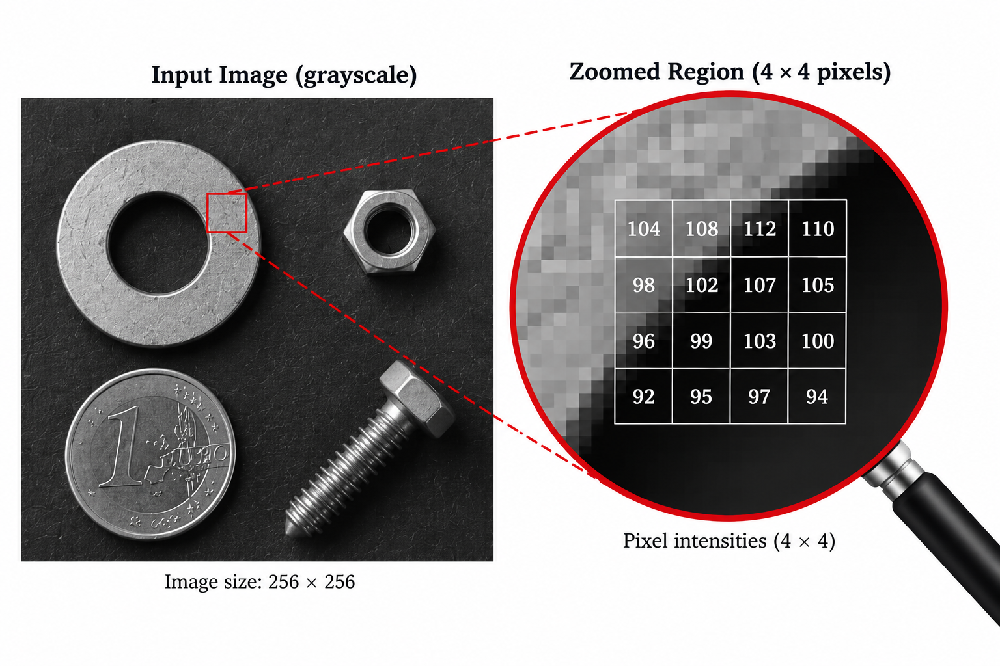

```text
104   108   112   110
 98   102   107   105
 96    99   103   100
 92    95    97    94
```

Apply the **Local Binary Pattern (LBP)** operator using the following **3 × 3 kernel**:

```text
  1    2    4
128    C    8
 64   32   16
```

For each neighbor, assign:

- **1** if `neighbor >= C`
- **0** if `neighbor < C`

The LBP value is obtained by summing the weights corresponding to the neighbors assigned **1**.

Apply the LBP operator to all valid pixels. Since the kernel cannot be centered on the border pixels, assume that the output value for the borders is **0**.

Which of the following matrices represents the correct LBP result?

### a)

```text
0    0    0    0
0   15    7    0
0   14    3    0
0    0    0    0
```

### b)

```text
0    0    0    0
0   31    7    0
0   14    6    0
0    0    0    0
```

### c)

```text
0    0    0    0
0   31   14    0
0    7    6    0
0    0    0    0
```

### d)

```text
0     0     0    0
0   103   105    0
0    99   100    0
0     0     0    0
```

### e)

```text
0    0    0    0
0   62   14    0
0   28   12    0
0    0    0    0
```

<details>
<summary><strong>▶ Show answer</strong></summary>
<div>
<p><strong>Correct answer: b)</strong></p>
<p>For the four valid center locations, compare every neighbor with its center `C` and sum the weights whose condition `neighbor >= C` is true.</p>
<p>The resulting matrix is:</p>
<p>0    0    0    0</p>
<p>0   31    7    0</p>
<p>0   14    6    0</p>
<p>0    0    0    0</p><p>This is **alternative b**. The other matrices contain incorrect weighted sums or, in option d, simply reproduce center intensities instead of LBP codes.</p>
</div>
</details>

## Question

Consider the figure below, where **(a)** represents the original grayscale image and **(b)–(e)** show the results obtained by applying different feature extraction methods.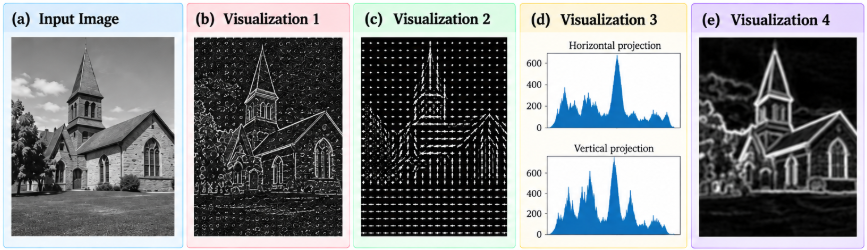

Consider the following pseudocode implementations:

### I

```text
for each pixel (x, y):
    C = I(x, y)
    P = 0

    for each neighbor n:
        if I(n) >= C:
            P = P + weight(n)

    output(x, y) = P
```

### II

```text
Gx, Gy = computeGradient(I)

magnitude, orientation = computeMagOri(Gx, Gy)

divide image into cells

for each cell:
    accumulate histogram of orientations
    weighted by gradient magnitude

normalize histograms
```

### III

```text
H = sum(I, axis=0)
V = sum(I, axis=1)
```

### IV

```text
Gx = convolve(I, Sobel_x)
Gy = convolve(I, Sobel_y)

output = sqrt(Gx² + Gy²)
```

Based on the visual characteristics of each result and the operations performed by each algorithm, which alternative correctly associates the visualizations **(b)–(e)** with their respective implementations?

- **a)** b → I, c → II, d → III, e → IV
- **b)** b → II, c → I, d → III, e → IV
- **c)** b → I, c → IV, d → II, e → III
- **d)** b → IV, c → II, d → I, e → III
- **e)** b → III, c → I, d → IV, e → II

<details>
<summary><strong>▶ Show answer</strong></summary>
<div>
<p><strong>Correct answer: a)</strong></p>
<p>The implementations correspond to the characteristic outputs as follows:</p>
<ul><li>**I → LBP:** local binary comparison pattern.</li><li>**II → HOG:** cell-wise histograms of gradient orientations.</li><li>**III → Projections:** row/column intensity sums.</li><li>**IV → Sobel/gradient magnitude:** edge-strength image.</li></ul>
<p>According to the visual arrangement in the figure, this gives **b → I, c → II, d → III, e → IV**, which corresponds to **alternative a**.</p>
</div>
</details>

# Pipelines

This section integrates the concepts presented throughout the previous lectures into **complete Computer Vision pipelines**. The questions assess your ability to **select, order, and analyze processing stages**, identify where errors or artifacts are introduced, and determine appropriate operations for **preprocessing, segmentation, component extraction, feature extraction, and classification**.

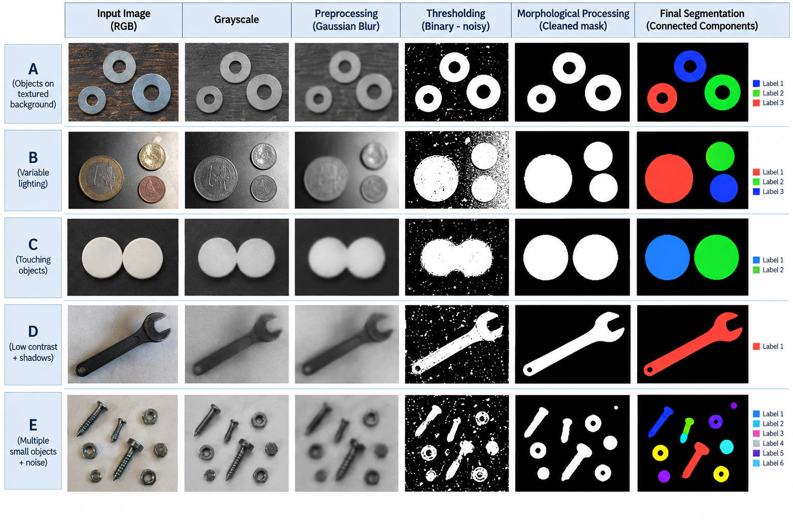

## Question 01

Consider **Pipeline A** in the figure.

After thresholding, the objects are correctly represented as foreground regions, but several small isolated white pixels are also present in the background. The desired objects are considerably larger than these artifacts.

Which code is the most appropriate immediately after thresholding?

### a)

```python
kernel = cv2.getStructuringElement(cv2.MORPH_RECT, (3, 3))
binary = cv2.dilate(binary, kernel, iterations=2)
```

### b)

```python
kernel = cv2.getStructuringElement(cv2.MORPH_RECT, (3, 3))
binary = cv2.morphologyEx(binary, cv2.MORPH_OPEN, kernel)
```

### c)

```python
kernel = cv2.getStructuringElement(cv2.MORPH_RECT, (3, 3))
binary = cv2.morphologyEx(binary, cv2.MORPH_CLOSE, kernel)
```

### d)

```python
binary = cv2.Canny(binary, 100, 200)
```

### e)

```python
binary = cv2.bitwise_not(binary)
```

---

<details>
<summary><strong>▶ Show answer</strong></summary>
<div>
<p><strong>Correct answer: b)</strong></p>
<p>The noise consists of small isolated **foreground** pixels. Morphological **opening** removes structures smaller than the structuring element while approximately restoring larger surviving objects.</p>
<p>Dilation enlarges the artifacts; closing is intended mainly for small holes/gaps; Canny changes the representation to edges; inversion merely swaps foreground/background. Therefore **b** is correct.</p>
</div>
</details>

## Question 02 — Diagnosing a Segmentation Failure

Consider **Pipeline B**, where the input image contains objects under variable illumination.

Suppose that a single global threshold produces:

- correctly segmented pixels in some regions;
- missing foreground pixels in darker regions;
- excessive foreground pixels in brighter regions.

Which modification should be investigated first?

### a)

Increase the number of connected-component labels.

### b)

Apply a stronger dilation after thresholding regardless of the illumination.

### c)

Improve the preprocessing/thresholding strategy to compensate for illumination variation before connected-component extraction.

### d)

Replace connected components with HOG.

### e)

Extract Hu Moments directly from the original RGB image.

---

<details>
<summary><strong>▶ Show answer</strong></summary>
<div>
<p><strong>Correct answer: c)</strong></p>
<p>The failure is caused by **spatially varying illumination**, so the first correction should occur in preprocessing/segmentation—for example illumination normalization or an adaptive/local thresholding strategy.</p>
<p>Changing the number of CCL labels does not repair a bad binary mask; unconditional dilation can amplify segmentation errors; HOG and Hu moments belong to feature extraction, after segmentation. Thus **c**.</p>
</div>
</details>

## Question 03 — Connected Components and Touching Objects

Consider **Pipeline C**.

The input contains **two physical objects**, but after thresholding they form a single connected foreground region.

Analyze the following statements:

**01.** Applying `cv2.connectedComponents()` directly to this binary image may return the two touching objects as a single component.

**02.** Connected Component Labeling alone does not necessarily separate foreground objects that are already connected in the binary mask.

**04.** Increasing from 4-connectivity to 8-connectivity guarantees that the objects will become separated.

**08.** The problem should be addressed before or during the segmentation stage if two separate object instances are required.

**16.** Applying dilation to the touching region is generally expected to increase the separation between the objects.

**32.** A segmentation method capable of separating touching objects may be required before feature extraction.

**The sum of the CORRECT statements is:**

- a) **11**
- b) **35**
- c) **41**
- d) **43**
- e) **59**

---

<details>
<summary><strong>▶ Show answer</strong></summary>
<div>
<p><strong>Correct answer: d) 43</strong></p>
<p>Correct statements: **01, 02, 08, and 32**, giving `1 + 2 + 8 + 32 = 43`.</p>
<ul><li>**01 — Correct:** touching foreground pixels may be labeled as one component.</li><li>**02 — Correct:** CCL labels connectivity; it does not intrinsically split an already connected region.</li><li>**04 — Incorrect:** 8-connectivity increases possible connections and cannot guarantee separation.</li><li>**08 — Correct:** instance separation must be addressed in or before segmentation.</li><li>**16 — Incorrect:** dilation normally expands foreground and tends to reinforce contact.</li><li>**32 — Correct:** a method such as watershed or another instance-separation strategy may be required.</li></ul>
<p>Therefore, **alternative d** is correct.</p>
</div>
</details>

## Question 04 — Selecting the Correct OpenCV Pipeline

Consider **Pipeline D**, containing a dark object, low contrast, shadows, and background variation.

Which pipeline is the most conceptually appropriate?

### a)

```python
img = cv2.imread("image.jpg")

gray = cv2.cvtColor(img, cv2.COLOR_BGR2GRAY)

blur = cv2.GaussianBlur(gray, (5, 5), 0)

_, binary = cv2.threshold(
    blur, 0, 255,
    cv2.THRESH_BINARY_INV + cv2.THRESH_OTSU
)

kernel = cv2.getStructuringElement(cv2.MORPH_ELLIPSE, (3, 3))
binary = cv2.morphologyEx(binary, cv2.MORPH_OPEN, kernel)

num_labels, labels = cv2.connectedComponents(binary, connectivity=8)
```

### b)

```python
img = cv2.imread("image.jpg")

num_labels, labels = cv2.connectedComponents(img)
```

### c)

```python
img = cv2.imread("image.jpg")

gray = cv2.cvtColor(img, cv2.COLOR_BGR2GRAY)

num_labels, labels = cv2.connectedComponents(gray)
```

### d)

```python
img = cv2.imread("image.jpg")

gray = cv2.cvtColor(img, cv2.COLOR_BGR2GRAY)

edges = cv2.Canny(gray, 100, 200)

num_labels, labels = cv2.connectedComponents(edges)
```

### e)

```python
img = cv2.imread("image.jpg")

blur = cv2.GaussianBlur(img, (31, 31), 0)

num_labels, labels = cv2.connectedComponents(blur)
```

---

<details>
<summary><strong>▶ Show answer</strong></summary>
<div>
<p><strong>Correct answer: a)</strong></p>
<p>Pipeline **a** is the only complete and coherent segmentation sequence among the alternatives:</p>
<p>`grayscale → Gaussian smoothing → inverse Otsu threshold → morphological cleanup → CCL`.</p>
<p>The inverse threshold is appropriate for a dark foreground, Otsu provides data-driven global threshold selection, and opening removes small foreground artifacts. The other alternatives feed RGB/grayscale/blurred non-binary data directly to CCL or label an edge map instead of a proper object mask.</p>
</div>
</details>

## Question 05 — Filtering Components

Consider **Pipeline E**.

After morphological processing, the image contains the desired objects plus a few remaining small foreground components.

The following statistics are obtained:

| Label | Area | Width | Height |
| -----:| ----:| -----:| ------:|
| 1     | 24   | 5     | 6      |
| 2     | 812  | 31    | 35     |
| 3     | 695  | 27    | 34     |
| 4     | 18   | 4     | 5      |
| 5     | 904  | 36    | 32     |
| 6     | 771  | 29    | 37     |
| 7     | 15   | 3     | 5      |

Suppose that valid objects are expected to have:

```text
Area >= 600
Width >= 25
Height >= 25
```

Which components should be retained?

- a) 1, 2, 3, 4, 5, 6, 7
- b) 2, 3, 5, 6
- c) 2 and 5 only
- d) 1, 4 and 7
- e) 3 and 6 only

---

<details>
<summary><strong>▶ Show answer</strong></summary>
<div>
<p><strong>Correct answer: b) 2, 3, 5, 6</strong></p>
<p>Apply all three constraints: `Area ≥ 600`, `Width ≥ 25`, and `Height ≥ 25`.</p>
<p>Labels **2, 3, 5, and 6** satisfy every requirement. Labels **1, 4, and 7** are small artifacts and fail all size constraints. Therefore **alternative b** is correct.</p>
</div>
</details>

## Question 06 — Complete Segmentation Pipeline

Consider the following code:

```python
img = cv2.imread("objects.jpg")

gray = cv2.cvtColor(img, cv2.COLOR_BGR2GRAY)

blur = cv2.GaussianBlur(gray, (5, 5), 0)

_, binary = cv2.threshold(
    blur, 120, 255,
    cv2.THRESH_BINARY
)

kernel = cv2.getStructuringElement(
    cv2.MORPH_ELLIPSE, (3, 3)
)

clean = cv2.morphologyEx(
    binary,
    cv2.MORPH_OPEN,
    kernel
)

num_labels, labels, stats, centroids = \
    cv2.connectedComponentsWithStats(
        clean,
        connectivity=8
    )
```

Which statement best describes the pipeline?

### a)

Gaussian filtering performs segmentation, thresholding extracts features, and connected components remove noise.

### b)

Grayscale conversion reduces the image representation to intensity, Gaussian filtering reduces local noise, thresholding creates the foreground/background representation, opening removes small foreground artifacts, and connected components identify individual connected regions.

### c)

Thresholding detects object contours, while morphological opening assigns a unique label to each object.

### d)

Connected components automatically classify each detected object into its semantic class.

### e)

The output of `connectedComponentsWithStats()` is already a discriminative feature vector suitable for any classification problem.

---

<details>
<summary><strong>▶ Show answer</strong></summary>
<div>
<p><strong>Correct answer: b)</strong></p>
<p>The operations form a standard object-extraction pipeline:</p>
<ul><li>grayscale reduces color to intensity;</li><li>Gaussian filtering suppresses local noise;</li><li>thresholding creates a binary foreground/background mask;</li><li>opening removes small foreground artifacts;</li><li>`connectedComponentsWithStats()` identifies connected regions and provides geometric statistics.</li></ul>
<p>This is exactly **alternative b**. CCL does not perform semantic classification, and its statistics are not automatically sufficient descriptors for every classification problem.</p>
</div>
</details>

## Question 07 — From Segmentation to Feature Extraction

Suppose that **Pipeline E** successfully produces isolated objects. The next objective is to classify each segmented object according to its shape.

Which implementation represents the most appropriate continuation of the pipeline?

### a)

```python
features = []

for label in range(1, num_labels):
    x, y, w, h, area = stats[label]

    features.append([
        x,
        y
    ])
```

### b)

```python
features = []

for label in range(1, num_labels):
    component = np.uint8(labels == label) * 255

    moments = cv2.moments(component)
    hu = cv2.HuMoments(moments).flatten()

    features.append(hu)
```

### c)

```python
features = []

for label in range(1, num_labels):
    features.append([
        num_labels
    ])
```

### d)

```python
features = []

for label in range(1, num_labels):
    features.append([
        img.shape[0],
        img.shape[1]
    ])
```

### e)

```python
features = []

for label in range(1, num_labels):
    component = labels == label
    features.append([
        component[0, 0]
    ])
```

---

<details>
<summary><strong>▶ Show answer</strong></summary>
<div>
<p><strong>Correct answer: b)</strong></p>
<p>The task is to classify isolated components according to **shape**. Option **b** creates each component mask, computes its image moments, converts them to **Hu moments**, and appends those shape descriptors to the feature set.</p>
<p>Coordinates `(x,y)` mainly encode position; `num_labels` is global metadata; image dimensions are identical for all objects; one Boolean pixel carries essentially no shape information. Thus **b** is the appropriate continuation.</p>
</div>
</details>

## Question 08 — Analytical Pipeline Diagnosis

Consider the following sequence:

```text
Input
  ↓
Grayscale
  ↓
Gaussian Blur
  ↓
Threshold
  ↓
Morphology
  ↓
Connected Components
  ↓
Component Filtering
  ↓
Feature Extraction
  ↓
Classification
```

A system produces poor classification accuracy.

During inspection, the following observations are made:

- The objects are clearly visible in the grayscale image.
- The thresholded image correctly separates objects from the background.
- Morphological processing preserves the objects.
- Connected Components correctly identifies each physical object.
- Small artifacts are successfully removed.
- The feature vectors from different classes strongly overlap in the feature space.

Which conclusion is the most appropriate?

### a)

The main problem is necessarily the grayscale conversion.

### b)

The segmentation threshold must be changed because classification accuracy is low.

### c)

The connected-component algorithm should use more labels.

### d)

The current feature representation is likely insufficiently discriminative, and alternative or additional descriptors should be investigated.

### e)

Morphological processing should be repeated until the feature-space classes become separated.

---

<details>
<summary><strong>▶ Show answer</strong></summary>
<div>
<p><strong>Correct answer: d)</strong></p>
<p>All stages through component filtering are reported as correct, while the feature vectors of different classes strongly overlap. The evidence therefore localizes the problem to **feature representation/discriminability**.</p>
<p>Changing grayscale, thresholding, CCL, or morphology would modify stages that are already functioning correctly. Alternative or complementary descriptors should be investigated. Hence **alternative d**.</p>
</div>
</details>

## Question 09 — Where Did the Pipeline Fail?

For one expected object, the following observations are obtained:

| Pipeline Stage       | Observation                                      |
| -------------------- | ------------------------------------------------ |
| Original image       | Object visible                                   |
| Grayscale            | Object visible                                   |
| Gaussian Blur        | Object visible                                   |
| Threshold            | Object visible but contains small internal holes |
| Morphology           | Object disappears almost completely              |
| Connected Components | No corresponding component                       |
| Feature Extraction   | No feature vector generated                      |

Which statement is correct?

### a)

The classifier should be retrained.

### b)

The feature descriptor is responsible for removing the object.

### c)

The morphological operation or its kernel configuration should be investigated.

### d)

Connected Components should reconstruct the object automatically.

### e)

The feature vector should be normalized before segmentation.

---

## 

<details>
<summary><strong>▶ Show answer</strong></summary>
<div>
<p><strong>Correct answer: c)</strong></p>
<p>The object is still present after thresholding but disappears almost completely **immediately after morphology**. This is the earliest stage at which the failure appears.</p>
<p>The morphological operation, structuring-element shape/size, or number of iterations should therefore be investigated. Later CCL and feature extraction cannot reconstruct an object already removed from the binary mask. Thus **alternative c** is correct.</p>
</div>
</details>
