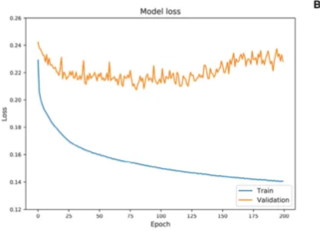
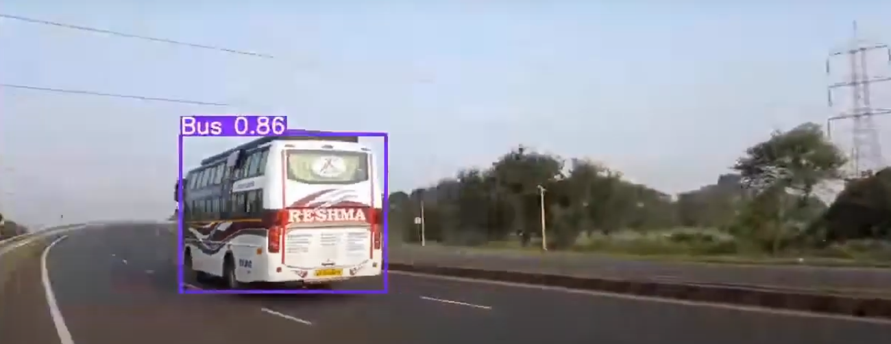

# Simulado de Prova de Visão Computacional

Este simulado orienta os estudos sobre os temas que podem ser cobrados na prova. As questões podem ser apresentadas em formatos como: discursiva, múltipla escolha, verdadeiro ou falso, validação de algoritmos, entre outros.

## Deep Learning em Imagens - Conceitos Gerais

1. **O que significa "aprendizado de características" em redes neurais e por que ele é importante em Deep Learning para visão computacional?**  
   Explique como redes neurais profundas conseguem aprender características (features) relevantes de uma imagem em diferentes níveis de abstração e por que isso é vantajoso em comparação com abordagens tradicionais de extração de características.

2. **Explique o conceito de convolução e sua aplicação em redes neurais para processamento de imagens.**  
   Defina convolução e descreva como essa operação é aplicada para extrair características espaciais de uma imagem em redes neurais convolucionais (CNNs), incluindo um exemplo prático de como o filtro (ou kernel) age sobre a imagem.

3. **Compare redes neurais "shallow" (rasas) e "deep" (profundas) no contexto de aprendizado de máquina.**  
   Discuta as principais diferenças entre redes neurais com poucas camadas (shallow) e redes profundas (deep), considerando aspectos como capacidade de aprendizado, complexidade computacional e adequação para tarefas de visão computacional.

4. **O que é uma "camada convolucional" e como ela difere de uma camada densa (fully connected)?**  
   Explique a estrutura e o papel de uma camada convolucional em uma CNN e como ela contrasta com uma camada densa, considerando aspectos como compartilhamento de pesos e influência na redução da complexidade do modelo.

5. **Como a profundidade de uma rede neural afeta sua capacidade de aprender padrões complexos em dados visuais?**  
   Discuta o impacto do aumento do número de camadas em uma rede neural profunda, incluindo as vantagens e os desafios associados ao aprendizado de padrões complexos em imagens, bem como os problemas comuns, como o desaparecimento de gradiente e como técnicas como normalização podem mitigar esses desafios.

## Redes Neurais Convolucionais (Convolutional Neural Network - CNN)

1. **Explique a arquitetura de uma rede neural convolucional (CNN)**  
   Descreva os principais componentes de uma CNN, incluindo camadas convolucionais, pooling e fully connected, e explique o papel de cada uma dessas camadas no processo de extração e classificação de características em imagens. Esboçe uma arquitetura

2. **Qual é a função de uma camada de pooling em redes neurais convolucionais?**  
   Discuta como as camadas de pooling (por exemplo, max pooling) ajudam a reduzir a dimensionalidade e a controlar o overfitting em uma rede neural convolucional, além de destacar os efeitos no tempo de processamento e nas características da imagem.

3. **O que é transferência de aprendizado e como ela pode ser útil no contexto de classificação de imagens?**  
   Explique o conceito de transferência de aprendizado e como modelos pré-treinados em grandes bases de dados de imagens, como o ImageNet, podem ser adaptados para resolver problemas específicos de classificação de imagens com conjuntos de dados menores.

4. **Qual é o papel da função de ativação em uma rede neural profunda? Cite exemplos comuns e explique sua utilidade em redes neurais para imagens.**  
   Defina o conceito de função de ativação, exemplifique com funções como ReLU, Sigmoid e Tanh, e discuta como essas funções influenciam a capacidade da rede de aprender e representar dados complexos em redes profundas.

5. **Descreva técnicas para minimizar o overffiting em redes neurais convolucionais**  
   Explique as técnicas de transfer-learning, data augmentation e dropout, e como elas ajudam a melhorar a generalização de modelos de deep learning em conjuntos de dados de imagens. Também discuta se elas devem ser utilizadas separadamente ou em conjunto.

6. Cite algumas restrições do uso de data augmentation. 
    Discuta se é possível usar irrestritamente em qualquer cenário. Cite cenários e técnicas nos quais você sugere o uso de aumento de dados e cenários nos quais pode ser prejudicial.

6. **Implemente uma rede para classificar carros: HATCH, SEDAN e SUV**  
   Elabore um pseudo-código utilizando funções da tensorflow para definir uma arquitetura, data augmentation, treino e teste. Ilustre também o uso de dropout. 

7. **Aplique a técnica de transfer-learning ilustrando um pseudo-código**  
   Elabore uma abordagem de transfer-learning a partir da rede MobileNet. Insira uma camada de data augmentation e dropout. Discuta quando e porque deve-se utilizar essas técnicas.


## Detecção e Segmentação de Objetos

1. **Descreva as tarefas de classificação, detecção e segmentação em visão computacional**
    Discuta a lógica básica das tarefas, outputs, arquitetura de redes e métricas de acurácia e perda (loss). Também discuta como é a entrada dessas redes, principalmente no que tange a sua anotação de dados. Aepnas a imagem deve ser fornecida?

2. **Ilustre e discuta a diferenças das Redes RCNN, Fast-RCNN e Faster R-CNN**
    Apresente a evolução da rede RCNN ao longo de suas três propostas. Como o dado e as arquiteturas determinam os bounding-boxes? Que tarefa de visão ela resolve?

3. **Acerca da Rede YoLo, determine como ela funciona e que tarefa ela resolve**
   Apresente o fluxo dessa rede. Como o dado é apresentado para rede? e como a arquitetura determina o bounding-box? Que tarefa de visão ela resolve? Qual a função do regressor desta rede? Ela tem base convolucional ou não? 

4. **Como a tarefa de segmentação pode ser realizada?**
    Defina um pipeline de anotação
    Discorra acerca de uma arquitetura de rede (U-Net)

5. **Na rede U-NET, quais são seus dois principais blocos? Como o erro é cálculado?**
    Explique como a rede U-NET funciona, seus inputs, camadas de downsamples (enconder) e upsample(decoder), erro, etc
    Se preferir, use um pseudo-código para suportar sua discussão

6. **O que é uma máscara e qual a sua importância para tarefas de segmentação?**  
   Explique o conceito de máscara em visão computacional, descrevendo como ela é usada para representar a área ou objeto de interesse em tarefas de segmentação. Discuta a importância da máscara no contexto de segmentação semântica e segmentação por instâncias, e como ela permite que a rede diferencie diferentes regiões e objetos na imagem. Além disso, comente sobre como as máscaras são criadas e utilizadas no treinamento de redes, como a U-Net, para melhorar a precisão de segmentação.

7. **Determine ao menos duas aplicações da rede U-Net**  
   Cite e descreva ao menos duas aplicações reais da arquitetura U-Net em visão computacional. Para cada aplicação, discuta o motivo pelo qual a U-Net é uma escolha adequada, considerando suas características de encoder-decoder e sua capacidade de segmentar com alta precisão. Implemente um pseudo-código para suportar sua discussão


## Redes Generativas

1. **O que é um modelo generativo e o que ele tem por objetivo?**  
   Explique o objetivo dos modelos generativos em aprender a distribuição de dados do conjunto original. Discuta como essa distribuição permite que o modelo gere novas amostras semelhantes, abrangendo casos de dados complexos e variados.

2. **O que significa modelo discriminador e modelo gerador em redes generativas (DCGAN)?**  
   Descreva o papel do gerador em criar amostras artificiais e do discriminador em avaliar essas amostras, determinando se são reais ou geradas. Mostre como esses papéis opostos são essenciais para o treinamento da rede.

3. **Em uma DCGAN, os modelos discriminador e gerador são colaborativos ou competem entre si?**  
   Explique a relação competitiva entre o gerador e o discriminador. Detalhe como cada modelo tenta superar o outro: o gerador tenta enganar o discriminador, enquanto este melhora sua capacidade de identificar falsificações.

4. **Defina o que é treino adversarial. Como é o cálculo do erro?**  
   Defina o conceito de treino adversarial, onde o gerador e o discriminador se aperfeiçoam mutuamente através do erro. Explique como a função de perda mede o desempenho de cada modelo, ajustando-os para melhorar suas capacidades opostas.

5. **Existe camada de classificação em redes generativas do tipo DCGAN?**  
   Responda se uma DCGAN possui uma camada de classificação final. Explique que o foco da DCGAN está em gerar dados realistas e não em classificar, diferentemente de redes de classificação convencional.

7. Qual a diferença entre um DCGAN e uma rede PIX2PIX?
   Aborde as diferenças entre ambas as arquiteturas, pipeline de treino e dataset esperado.

8. **Cite algumas aplicações que poderiam se beneficiar destas técnicas generativas.**  
   Liste e discuta brevemente aplicações práticas, como aumento de dados para conjuntos limitados, criação de imagens para diagnósticos médicos e geração de ambientes virtuais, destacando como cada aplicação se beneficia da geração de dados realistas. 


## Questões de implementação: Pseudo-Código

1. O que está sendo realizado no código abaixo:
   ```python
   base_model = tf.keras.applications.ResNet50(weights='imagenet', include_top=False, input_shape=input_shape)

   # Congela as camadas do modelo base para preservar os pesos pré-treinados
   for layer in base_model.layers:
      layer.trainable = False

   # Adiciona novas camadas de classificação ao modelo
   x = base_model.output
   x = GlobalAveragePooling2D()(x)               # Camada de pooling global para reduzir a dimensão
   x = Dense(1024, activation='relu')(x)         # Camada totalmente conectada
   predictions = Dense(num_classes, activation='softmax')(x)  # Camada de saída para classificação

   # Define o modelo completo
   model = Model(inputs=base_model.input, outputs=predictions)
   ```

2. Implemente uma rede convolucional de 4 camadas convolucionais de filtros (16,32,64,128), e duas camada densa (fully-connected) de 512 e 128 neurônios respectivamente. Essa rede deve classificar maças, laranjas e peras. Assim, determine qual seu output (classes).

3. Reescreva o seguinte código para que reflita a implementação de uma rede neural convolucional
   ```python
      model = Sequential([
    
      RandomRotation(0.2),
      Conv2D(32, (3, 3), activation='relu'),
      Dense(num_classes, activation='softmax'),      
      MaxPooling2D((2, 2)),
      RandomFlip("horizontal", input_shape=input_shape),
      Conv2D(64, (3, 3), activation='relu'),
      MaxPooling2D((2, 2)),
      Rescaling(1./255),
      Conv2D(128, (3, 3), activation='relu'),    
      Dropout(0.25),
      Flatten(),
      MaxPooling2D((2, 2)),
      RandomZoom(0.2),
      Dense(128, activation='relu')
   ])
   ```

4. Ao treinar uma ResNet-50, em uma base própria e relativemente pequena, o ciêntista verificou o seguinte gráfico de loss:

   

   Você pode sugerir alguma melhoria ou está adequada? Implemente um pseudo-código que reflita o que foi implementado se suas sugestões de melhoria (se houverem).

## Aplicações em Visão Computacional

1. **Transformação de Desenhos Infantis em Imagens Realistas**  
   Uma escola deseja implementar uma solução que converta os desenhos de crianças em versões realistas, preservando o estilo e a criatividade do desenho original. O sistema deve transformar, por exemplo, um esboço de um animal em uma imagem visualmente próxima à realidade. O projeto requer orientação sobre o uso de modelos de aprendizado profundo adequados para mapear estilos de esboços em imagens realistas.

2. **Sistema de Reconhecimento Facial para Controle de Acesso em Condomínios e Academias**  
   Uma empresa busca desenvolver um sistema de reconhecimento facial para controlar o acesso de moradores e clientes em condomínios residenciais e academias. A solução precisa considerar variáveis como iluminação, diferentes ângulos, etc.

3. **Segmentação Específica de Espécies em Imagens Biológicas**  
   Um biólogo necessita de uma ferramenta que identifique todos os pixels de uma imagem que correspondam a uma espécie específica de animal selecionado. Por exemplo, em uma foto contendo diversos animais, o sistema deve ser capaz de detectar e destacar apenas os pixels que pertencem a um leão. 

4. **Detecção de Caminhões em Cenas Urbanas**  
   Uma empresa precisa de um sistema que identifique regiões em imagens que possivelmente contenham caminhões. O resultado deve ser uma imagem de saída que destaque as áreas onde os caminhões estão presentes, permitindo uma análise mais focada e decisões de tráfego e logística urbanas. Um exemplo da saída é dado abaixo:   




### Autoencoders

1. **O que é um Autoencoder e qual o seu objetivo?**
Explique o conceito de autoencoder como uma rede neural não supervisionada que aprende a representar os dados de entrada em um espaço de dimensão reduzida (codificação), buscando reconstruir a entrada original na saída. Discuta o papel dessa representação latente no aprendizado de características relevantes e na redução de ruído.

2. **Descreva a estrutura de um Autoencoder.**
Apresente as duas partes principais de um autoencoder: *encoder* (codificador) e *decoder* (decodificador). Explique como o encoder transforma os dados de entrada em uma representação comprimida e como o decoder tenta reconstruir os dados originais a partir dessa codificação.

3. **Qual é a função de perda em um Autoencoder e como ela é calculada?**
Defina a função de perda como a diferença entre a entrada original e a saída reconstruída (por exemplo, *Mean Squared Error*). Explique que o objetivo do treinamento é minimizar essa diferença, aprimorando a capacidade da rede de capturar as características mais representativas dos dados.

4. **Qual a diferença entre um Autoencoder e uma rede de classificação tradicional?**
Destaque que o autoencoder não requer rótulos (aprendizado não supervisionado) e busca reconstruir os dados, enquanto redes de classificação mapeiam entradas para categorias específicas.

5. **Explique a diferença entre um Autoencoder Clássico e um Convolutional Autoencoder (CAE).**
Discuta que, em um *Convolutional Autoencoder*, as camadas convolucionais substituem as densas, permitindo preservar a estrutura espacial das imagens e extrair padrões visuais mais robustos.

6. **Como o Autoencoder pode ser utilizado em tarefas de Visão Computacional?**
Cite aplicações como redução de dimensionalidade, remoção de ruído (denoising), compressão de imagens e pré-treinamento de redes profundas. Discuta também o uso em detecção de anomalias, onde o erro de reconstrução é usado para identificar padrões incomuns.

7. **O que é um Variational Autoencoder (VAE) e como ele difere de um Autoencoder tradicional?**
Explique que o *VAE* introduz um componente probabilístico ao aprendizado, mapeando as entradas para distribuições latentes (geralmente Gaussianas) em vez de pontos fixos. Discuta como isso permite gerar novas amostras realistas e aproxima o VAE de modelos generativos.

8. **Implemente um pseudo-código para um Autoencoder convolucional.**
Apresente um pseudocódigo simples para ilustrar a estrutura e o treinamento de um *Convolutional Autoencoder* usando TensorFlow:

```python
# Definição de um Autoencoder Convolucional
import tensorflow as tf
from tensorflow.keras import layers, models

# Encoder
encoder = models.Sequential([
    layers.Input(shape=(128, 128, 3)),
    layers.Conv2D(32, (3, 3), activation='relu', padding='same'),
    layers.MaxPooling2D((2, 2), padding='same'),
    layers.Conv2D(16, (3, 3), activation='relu', padding='same'),
    layers.MaxPooling2D((2, 2), padding='same')
])

# Decoder
decoder = models.Sequential([
    layers.Conv2DTranspose(16, (3, 3), strides=2, activation='relu', padding='same'),
    layers.Conv2DTranspose(32, (3, 3), strides=2, activation='relu', padding='same'),
    layers.Conv2D(3, (3, 3), activation='sigmoid', padding='same')
])

# Autoencoder
autoencoder = models.Sequential([encoder, decoder])
autoencoder.compile(optimizer='adam', loss='mse')

# Treinamento
autoencoder.fit(x_train, x_train, epochs=50, batch_size=64, validation_split=0.2)
```

**Explique como avaliar o desempenho de um Autoencoder.**
Descreva métricas como *Mean Squared Error* ou *Structural Similarity Index (SSIM)* entre imagem original e reconstruída, e como o erro de reconstrução pode indicar qualidade do aprendizado ou presença de anomalias.


### **Aprendizado Não Supervisionado e Representações Latentes**

1. Explique o conceito de *representation learning*. Como a representação dos dados pode esconder ou revelar fatores explicativos de variação?
2. Qual é a principal limitação dos métodos supervisionados em visão computacional, e por que o aprendizado não supervisionado surge como alternativa?
3. O que é um *latent space*? Explique sua importância no contexto de aprendizado de representações.
4. Cite exemplos de representações aprendidas em visão computacional e processamento de linguagem natural.
5. Por que a generalização entre diferentes domínios é um desafio em modelos supervisionados?

### **Autoencoders e Aprendizado de Representações**

6. Descreva a arquitetura básica de um *Autoencoder* e explique seu objetivo principal.
7. O que diferencia um *Convolutional Autoencoder* de um *Autoencoder* tradicional?
8. Qual é a função de perda mais comum em autoencoders e o que ela mede?
9. Explique como o *encoder* e o *decoder* atuam na reconstrução dos dados de entrada.
10. Cite outras possíveis funções de perda que podem ser utilizadas em autoencoders além do MSE.

### **Aprendizado Semi-Supervisionado**

11. Descreva as etapas de um pipeline de *semi-supervised representation learning* envolvendo autoencoders.
12. Qual é a utilidade de “congelar” o *encoder* após o treinamento não supervisionado?
13. Após extrair os vetores latentes, quais tipos de classificadores podem ser utilizados na etapa supervisionada?
14. Explique como o uso de representações aprendidas pode reduzir a necessidade de dados anotados.
15. Compare as fases de aprendizado não supervisionado e supervisionado em um pipeline semi-supervisionado.

### **Questões de Análise e Aplicação**

16. Dê um exemplo prático de uso de autoencoders para redução de dimensionalidade em imagens.
17. Como o uso de *representation learning* pode ajudar na generalização de modelos entre diferentes datasets?
18. Qual seria o impacto de um erro elevado de reconstrução na qualidade da representação aprendida?
19. Explique como o treinamento de autoencoders pode ser útil como pré-treinamento para outras redes neurais.
20. Diferencie os conceitos de *feature extraction* e *representation learning* no contexto de redes neurais profundas.
