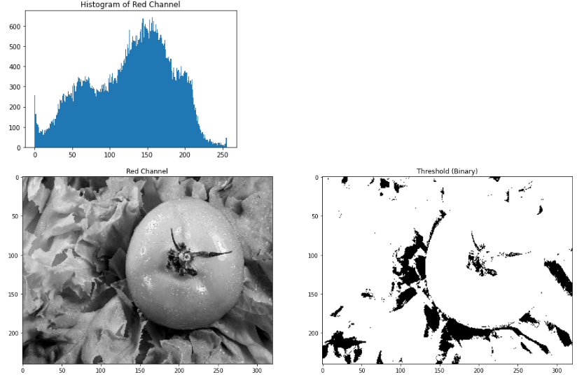
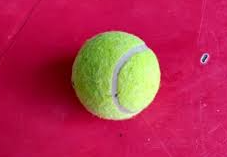
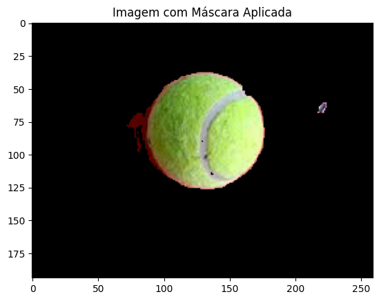
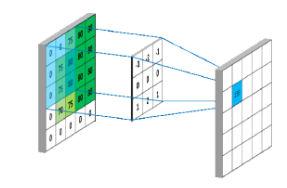
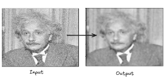
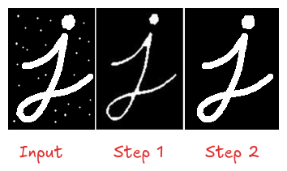
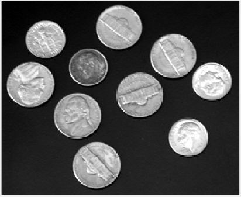

# Simulado de Prova de Visão Computacional

Este simulado orienta os estudos sobre os temas que podem ser cobrados na prova. As questões podem ser apresentadas em formatos como: discursiva, múltipla escolha, verdadeiro ou falso, validação de algoritmos, entre outros.

## Fundamentos de Imagens Digitais

1. O que é um pixel e o que ele representa?
2. Qual a relação entre resolução e tamanho da imagem?
3. Uma imagem maior é necessariamente uma imagem com mais resolução? Discuta essa questão.
4. Como a cor é representada na imagem digital?
5. Por que, ao isolar cada canal de cor, as imagens resultantes ficam em tons de cinza?
6. Qual a diferença básica entre os sistemas de cor RGB e HSV?
7. Cite uma aplicação do sistema de cor HSV no processamento de imagens.

## Processamento Básico de Imagens Digitais

1. O que é um histograma de imagem? Cite algumas situações em que ele pode ser aplicado.
2. O que é o processo de binarização (threshold)?
3. Dado o histograma abaixo, qual seria o valor de threshold indicado?

   
    
4. A imagem abaixo é resultado de um processo de binarização?

   

5. Por que o sistema de cor RGB não é tão eficiente para segmentação?
6. Imagine que você precise segmentar um objeto de cor vermelha (como um tomate). Discuta as limitações da solução utilizando RGB, considerando a separação dos canais e o histograma da cor vermelha, representados abaixo:

   
   

7. Abaixo é proposto um algoritmo de segmentação para bolas de tênis. Responda:
    1. Qual espaço de cor o algoritmo utiliza?
    2. Qual canal foi utilizado para a segmentação? Qual o motivo?
    3. Qual foi a análise realizada para definir o threshold em 160?

```python
import cv2
import matplotlib.pyplot as plt

!wget 'https://encrypted-tbn0.gstatic.com/images?q=tbn:ANd9GcRPNmu7yCR3QemtNCgfY0QOOnW_Vg0arczF38Dumv2Vayx9E7IMwQbMUqApXJW8nxz6pXc&usqp=CAU' -O 'tennis_ball.jpg'
# Carrega a imagem
img = cv2.imread('tennis_ball.jpg')

# Converte a imagem para o espaço de cores HSV
hsv_img = cv2.cvtColor(img, cv2.COLOR_BGR2HSV)

# Separa os canais HSV
h, s, v = cv2.split(hsv_img)

# Plota os canais HSV
plt.figure(figsize=(15, 5))
plt.subplot(1, 3, 1)
plt.imshow(h, cmap='gray')
plt.title('Canal H')
plt.subplot(1, 3, 2)
plt.imshow(s, cmap='gray')
plt.title('Canal S')
plt.subplot(1, 3, 3)
plt.imshow(v, cmap='gray')
plt.title('Canal V')
plt.show()
```




```python
import matplotlib.pyplot as plt
# Calcula o histograma do canal H
hist_h = cv2.calcHist([h], [0], None, [256], [0, 256])

# Plota o histograma do canal H
plt.plot(hist_h)
plt.title('Histograma do Canal H')
plt.xlabel('Intensidade de Pixel')
plt.ylabel('Frequência')
plt.show()

# Segmenta o canal H com threshold em 160
ret, thresh_h = cv2.threshold(h, 160, 255, cv2.THRESH_BINARY_INV)

# Mostra a imagem binarizada do canal H
plt.imshow(cv2.cvtColor(thresh_h, cv2.COLOR_GRAY2BGR))
plt.title('Canal H Binarizado')
plt.show()
```


```python
result = cv2.bitwise_and(img, img, mask=thresh_h)

# Mostra a imagem com a máscara aplicada
plt.imshow(cv2.cvtColor(result, cv2.COLOR_BGR2RGB))
plt.title('Imagem com Máscara Aplicada')
plt.show()
```



## Convoluções

1. O que é uma convolução?
2. Quais técnicas utilizam convolução? Cite ao menos três.
3. Qual a diferença entre um filtro de média e um de mediana, tanto em termos matemáticos quanto em termos de resultados finais (redução ou dispersão de ruído)?
4. Acerca das operações morfológicas em imagens:
   
    a. O que é uma operação de erosão (erode)?
   
    b. O que é uma operação de dilatação (dilate)?
   
    c. O que é uma operação de abertura (open)?
   
    d. O que é uma operação de fechamento (close)?
    
5. Que operações estão sendo realizadas nas imagens abaixo? 
    a. Exemplo 1
    
    
    
    b. Exemplo 2
    
    

6. A figura abaixo representa o quê? 
    
    
    
    a. Histograma  
    b. Convolução  
    c. Binarização  

7. Qual é a técnica representada abaixo? 
    
    
    
    a. Binarização  
    b. Filtro de Média ou Mediana  
    c. Conversão de Espaço de Cor  

8. O processo abaixo utiliza morfologia matemática. Defina a ordem das operações:

    

## Pipeline de Segmentação

1. Crie um pseudocódigo para o seguinte pipeline: 

    a. Encontrar bolas de tênis:

    
    
    b. Segmentar os componentes de texto:

    

## Descritores de Características

1. Dadas as imagens abaixo, que tipo de descritor de características você utilizaria? Assinale uma opção:

    

    a. Forma / Borda  
    b. Textura  
    c. Projeção de Histograma  

2. Dada a imagem abaixo, após realizar a segmentação, que tipo de descritor de características você utilizaria para diferenciar as moedas? Assinale uma opção:

    

    a. Forma / Borda  
    b. Textura  
    c. Projeção de Histograma  

3. Imagine um problema em que você precise classificar os dois tipos de objetos abaixo. Que tipo de descritor seria mais adequado? Considere os objetos já segmentados:

    

    a. Forma / Borda  
    b. Textura  
    c. Projeção de Histograma  

