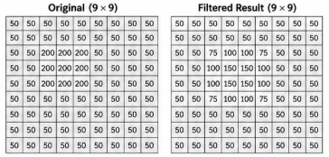
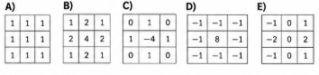

# Computer Vision Mock Exam

# Lecture 01 - Lecture 05

This mock exam is intended to **guide your studies on the topics that may be covered in the exam**. Questions may be presented in different formats, including **open-ended questions, multiple-choice questions, true/false statements, algorithm analysis and validation, and code interpretation**, among others.

**This mock exam should not be used as your only study resource.** Its primary purpose is to familiarize you with the **question formats and expected level of reasoning**, rather than to cover all topics and content that may be assessed in the exam.

## Basic Concepts (Lecture 01)

## Question 1

Regarding digital image representation, resolution, and resizing, analyze the statements below.
**01.** A digital grayscale image can be represented as a two-dimensional matrix, where each element corresponds to a pixel intensity.
**02.** In an 8-bit grayscale image, pixel values range from 0 to 255, with 0 representing black and 255 representing white.
**04.** Increasing the dimensions of an image through upscaling necessarily increases the amount of original visual information contained in the image.
**08.** Downscaling an image may cause loss of spatial information that cannot necessarily be recovered by resizing the image back to its original dimensions.
**16.** Interpolation can be used during image resizing to estimate pixel values at new spatial positions.
**The sum of the CORRECT statements is:**

- a) **19**
- b) **23**
- c) **25**
- d) **27**
- e) **31**

## Question 2

Regarding color spaces and image representation, analyze the statements below.
**01.** Both binary and grayscale images can be represented using a single channel, although their possible pixel values are different.
**02.** An RGB image is represented using three channels corresponding to the Red, Green, and Blue components.
**04.** When an RGB image is converted to grayscale, each different RGB color is guaranteed to produce a different grayscale intensity.
**08.** A grayscale image can be represented as a three-channel image by replicating its intensity values such that **R = G = B**.
**16.** Replicating a grayscale channel into R, G, and B restores the original color information that existed before an RGB-to-grayscale conversion.
**The sum of the CORRECT statements is:**

- a) **7**
- b) **11**
- c) **15**
- d) **27**
- e) **31**

## Question 3

Regarding image representation and conversions between **binary, grayscale, RGB, and HSV**, analyze the statements below.

**01.** Converting an RGB image to grayscale reduces the representation from three color channels to a single intensity channel, resulting in loss of color information.

**02.** A grayscale image can be converted into a binary image by applying a threshold, assigning pixels to two possible classes according to their intensity values.

**04.** Converting an RGB image to HSV produces a single-channel image because the RGB channels are combined into the Hue component.

**08.** In the HSV color space, **Hue** represents the dominant color, while **Saturation** and **Value** represent properties related to color intensity/purity and brightness, respectively.

**16.** An RGB image can be converted to grayscale and then converted back to RGB while preserving the original R, G, and B values of every pixel.

**The sum of the CORRECT statements is:**

- a) **7**
- b) **10**
- c) **11**
- d) **15**
- e) **27**

## Question 4

Consider the standard RGB-to-grayscale conversion presented in the lecture. Analyze the following statements:

**01.** RGB `(100, 100, 100)` → Gray `100`.

**02.** RGB `(100, 150, 200)` → Gray `150`.

**04.** RGB `(100, 150, 200)` → Gray `141`.

**08.** RGB `(200, 100, 50)` → Gray `200`.

**16.** RGB `(50, 100, 200)` → Gray `96`.

**The sum of the CORRECT statements is:**

- a) **5**
- b) **17**
- c) **20**
- d) **21**
- e) **29**
1. O que é um pixel e o que ele representa?
2. Qual a relação entre resolução e tamanho da imagem?
3. Uma imagem maior é necessariamente uma imagem com mais resolução? Discuta essa questão.
4. Como a cor é representada na imagem digital?
5. Por que, ao isolar cada canal de cor, as imagens resultantes ficam em tons de cinza?
6. Qual a diferença básica entre os sistemas de cor RGB e HSV?
7. Cite uma aplicação do sistema de cor HSV no processamento de imagens.

## Question 5

Regarding color-based image segmentation using RGB and HSV color spaces, analyze the following statements:

**01.** A light-red object can always be easily segmented using only high values from the **R channel**, since brighter shades of red remain predominantly represented by R.

**02.** A light-red or pink object may present high values in multiple RGB channels, making segmentation based only on the **R channel** less discriminative.

**04.** In HSV, **Hue** can help distinguish colors even when objects have different brightness levels.

**08.** Color segmentation in HSV can combine ranges of **Hue, Saturation, and Value** to define the desired pixels.

**16.** If two objects have similar values in the **R channel**, they cannot be distinguished using the G and B channels.

**The sum of the CORRECT statements is:**

- a) **6**
- b) **10**
- c) **12**
- d) **14**
- e) **30**

#### Question 6

Consider the image-processing pipeline illustrated in the figure. The objective is to isolate a predominantly **yellow object** from an image.


Which code correctly implements the illustrated pipeline using OpenCV?

### a)

```python
img = cv2.imread("image.jpg")
gray = cv2.cvtColor(img, cv2.COLOR_BGR2GRAY)
_, mask = cv2.threshold(gray, 100, 255, cv2.THRESH_BINARY)
result = cv2.bitwise_and(img, img, mask=mask)
```

### b)

```python
img = cv2.imread("image.jpg")
hsv = cv2.cvtColor(img, cv2.COLOR_BGR2HSV)
h = hsv[:, :, 0]
_, mask = cv2.threshold(h, 35, 255, cv2.THRESH_BINARY)
result = cv2.bitwise_and(img, img, mask=mask)
```

### c)

```python
img = cv2.imread("image.jpg")
hsv = cv2.cvtColor(img, cv2.COLOR_BGR2HSV)
s = hsv[:, :, 1]
_, mask = cv2.threshold(s, 100, 255, cv2.THRESH_BINARY)
result = cv2.bitwise_and(img, img, mask=mask)
```

### d)

```python
img = cv2.imread("image.jpg")
hsv = cv2.cvtColor(img, cv2.COLOR_BGR2HSV)
h = hsv[:, :, 0]
_, mask = cv2.threshold(h, 35, 255, cv2.THRESH_BINARY_INV)
result = cv2.bitwise_and(img, img, mask=mask)
```

### e)

```python
img = cv2.imread("image.jpg")
hsv = cv2.cvtColor(img, cv2.COLOR_BGR2HSV)
v = hsv[:, :, 2]
_, mask = cv2.threshold(v, 35, 255, cv2.THRESH_BINARY_INV)
result = cv2.bitwise_and(img, img, mask=mask)
```

## Image Processing (Lecture 02)

## Question 1

Analyze the following statements and classify each one as **True (T)** or **False (F)**.

**a)** Convolution applies a kernel over an image, computing new pixel values from the values in a local neighborhood.

**b)** Smooth and homogeneous image regions are predominantly associated with high spatial frequencies.

**c)** Edges, fine details, textures, and noise are generally associated with rapid intensity variations and high spatial frequencies.

**d)** A low-pass filter attenuates high-frequency components and can therefore produce a smoother image.

**e)** Increasing the size of a smoothing kernel generally reduces the smoothing effect because fewer neighboring pixels influence the output.

**f)** A mean filter replaces the center pixel with the average intensity of its neighborhood.

## Question 2

Analyze the following statements and classify each one as **True (T)** or **False (F)**.

**a)** The mean filter assigns equal contribution to the pixels in its neighborhood when computing the average.

**b)** The median filter replaces the center pixel with the median value of its neighborhood and can preserve more details than the mean filter.

**c)** A Gaussian filter computes a weighted mean, and its standard deviation influences the degree of smoothing.

**d)** A bilateral filter considers only the spatial distance between pixels and therefore behaves identically to a Gaussian filter.

**e)** Sharpening emphasizes high-frequency information, which is associated with edges and fine details.

**f)** Edge-detection filters are designed primarily to suppress significant intensity transitions and preserve homogeneous regions.

## Question 3

Consider the **original image** and its corresponding **filtered image** shown in the figure.


Which filter was most likely applied to obtain the filtered image?

- a) Mean Filter
- b) Gaussian Filter
- c) Median Filter
- d) Sobel Filter
- e) Laplacian Filter

## Question 4

Consider the **9 × 9 grayscale image** and the corresponding filtered result shown in the figure.



The image was processed using a **3 × 3 convolution kernel**. Which of the following kernels is most likely responsible for the resulting image?



## Question 5

Consider the noisy image shown in the figure.


The objective is to **reduce image noise while preserving object boundaries and fine structures as much as possible**.

Which filter is the most appropriate for this objective?

- a) Mean Filter
- b) Gaussian Filter
- c) Median Filter
- d) Bilateral Filter
- e) Laplacian Filter

---

## Question 6

Consider the **original image** and its corresponding **filtered image** shown in the figure.


The filtered image emphasizes regions containing significant spatial intensity variations while suppressing homogeneous regions.

Which filter was most likely applied?

- a) Mean Filter
- b) Gaussian Filter
- c) Median Filter
- d) Sobel Filter
- e) Bilateral Filter

## Question 7

You want to **reduce rapid intensity variations by replacing each pixel with the average value of its local neighborhood**.


Which pseudocode correctly implements this operation?

### a)

```text
for each pixel (x, y):
    neighborhood = getNeighborhood(image, x, y, 3x3)
    output[x,y] = mean(neighborhood)
```

### b)

```text
for each pixel (x, y):
    neighborhood = getNeighborhood(image, x, y, 3x3)
    output[x,y] = median(neighborhood)
```

### c)

```text
for each pixel (x, y):
    output[x,y] = image[x,y] * 9
```

### d)

```text
for each pixel (x, y):
    neighborhood = getNeighborhood(image, x, y, 3x3)
    output[x,y] = max(neighborhood)
```

### e)

```text
for each pixel (x, y):
    output[x,y] = image[x,y] - mean(image)
```

---

## Question 8

An image contains **isolated extreme pixel values (outliers)**. You want to reduce their influence while preserving more image details.


Which pseudocode is the most appropriate?

### a)

```text
for each pixel (x, y):
    neighborhood = getNeighborhood(image, x, y, 3x3)
    output[x,y] = sum(neighborhood)
```

### b)

```text
for each pixel (x, y):
    neighborhood = getNeighborhood(image, x, y, 3x3)
    output[x,y] = mean(neighborhood)
```

### c)

```text
for each pixel (x, y):
    neighborhood = getNeighborhood(image, x, y, 3x3)
    values = sort(neighborhood)
    output[x,y] = middleValue(values)
```

### d)

```text
for each pixel (x, y):
    output[x,y] = image[x,y]
```

### e)

```text
for each pixel (x, y):
    neighborhood = getNeighborhood(image, x, y, 3x3)
    output[x,y] = maximum(neighborhood)
```

---

## Question 9

You want to **smooth an image**, but neighboring pixels should not contribute equally. Pixels closer to the center of the neighborhood should have a larger contribution.

Which pseudocode best describes the desired operation?

### a)

```text
kernel = [
    [1, 1, 1],
    [1, 1, 1],
    [1, 1, 1]
] / 9

output = convolution(image, kernel)
```

### b)

```text
kernel = [
    [1, 2, 1],
    [2, 4, 2],
    [1, 2, 1]
] / 16

output = convolution(image, kernel)
```

### c)

```text
kernel = [
    [-1, 0, 1],
    [-2, 0, 2],
    [-1, 0, 1]
]

output = convolution(image, kernel)
```

### d)

```text
kernel = [
    [0, -1, 0],
    [-1, 5, -1],
    [0, -1, 0]
]

output = convolution(image, kernel)
```

### e)

```text
for each pixel (x, y):
    output[x,y] = median(neighborhood)
```

---

## Question 10

You want to **enhance local intensity variations and make edges and fine details more prominent**, while maintaining the general appearance of the original image.


Which pseudocode best represents this operation?

### a)

```text
blurred = GaussianFilter(image)

details = image - blurred

output = image + details
```

### b)

```text
blurred = GaussianFilter(image)

output = blurred
```

### c)

```text
blurred = GaussianFilter(image)

output = image - image
```

### d)

```text
output = MeanFilter(image)
output = MeanFilter(output)
```

### e)

```text
output = MedianFilter(image)
```

---

## Question 11

You want to produce an image that **emphasizes locations containing significant spatial intensity changes**, such as object boundaries.


Which pseudocode is the most appropriate?

### a)

```text
kernel = [
    [1, 1, 1],
    [1, 1, 1],
    [1, 1, 1]
] / 9

output = convolution(image, kernel)
```

### b)

```text
kernel = [
    [-1, 0, 1],
    [-2, 0, 2],
    [-1, 0, 1]
]

output = convolution(image, kernel)
```

### c)

```text
for each pixel:
    output[x,y] = mean(neighborhood)
```

### d)

```text
for each pixel:
    output[x,y] = median(neighborhood)
```

### e)

```text
output = GaussianFilter(image)
```

## Question 12

Consider a grayscale image `img`. You want to generate a binary image in which pixels with intensity **greater than 120 become white (255)** and the remaining pixels become **black (0)**.


Which OpenCV code correctly implements this operation?

### a)

```python
_, binary = cv2.threshold(
    img, 120, 255, cv2.THRESH_BINARY
)
```

### b)

```python
_, binary = cv2.threshold(
    img, 120, 255, cv2.THRESH_BINARY_INV
)
```

### c)

```python
_, binary = cv2.threshold(
    img, 255, 120, cv2.THRESH_BINARY
)
```

### d)

```python
binary = cv2.GaussianBlur(
    img, (120, 120), 255
)
```

### e)

```python
_, binary = cv2.threshold(
    img, 120, 255, cv2.THRESH_OTSU
)
```

---

## Question 13

Regarding image binarization and thresholding methods, analyze the following statements:

**01.** `cv2.THRESH_BINARY` assigns the maximum value to pixels above the defined threshold and zero to the remaining pixels.

**02.** `cv2.THRESH_BINARY_INV` produces the inverse assignment compared with `cv2.THRESH_BINARY`.

**04.** Otsu's method automatically estimates a threshold from the image intensity distribution.

**08.** Otsu's method requires the user to manually define the optimal threshold before applying the algorithm.

**16.** A global binary threshold applies the same threshold value to all pixels in the image.

**The sum of the CORRECT statements is:**

- a) **7**
- b) **19**
- c) **21**
- d) **23**
- e) **31**

---

## Question 14

Consider the grayscale intensity histogram shown below:


The objective is to separate the two predominant groups of pixels using a **single global threshold**.

Which threshold is the most appropriate?

- a) **T = 40**
- b) **T = 60**
- c) **T = 120**
- d) **T = 190**
- e) **T = 230**

---

## Morphology (Lecture 03)

## Question 01 — Morphological Erosion

Consider the following binary image, where `1` represents the **foreground** and `0` represents the **background**:

```text
0 0 0 0 0 0 0
0 0 0 1 0 0 0
0 0 1 1 1 0 0
0 1 1 1 1 1 0
0 0 1 1 1 0 0
0 0 0 1 0 0 0
0 0 0 0 0 0 0
```

Consider the following structuring element, with its origin at the center:

```text
0 1 0
1 1 1
0 1 0
```

What is the result after applying **one iteration of erosion**?

### a)

```text
0 0 0 0 0 0 0
0 0 0 0 0 0 0
0 0 0 0 0 0 0
0 0 0 1 0 0 0
0 0 0 0 0 0 0
0 0 0 0 0 0 0
0 0 0 0 0 0 0
```

### b)

```text
0 0 0 0 0 0 0
0 0 0 0 0 0 0
0 0 0 1 0 0 0
0 0 1 1 1 0 0
0 0 0 1 0 0 0
0 0 0 0 0 0 0
0 0 0 0 0 0 0
```

### c)

```text
0 0 0 0 0 0 0
0 0 0 1 0 0 0
0 0 1 1 1 0 0
0 1 1 1 1 1 0
0 0 1 1 1 0 0
0 0 0 1 0 0 0
0 0 0 0 0 0 0
```

### d)

```text
0 0 0 0 0 0 0
0 0 1 1 1 0 0
0 1 1 1 1 1 0
1 1 1 1 1 1 1
0 1 1 1 1 1 0
0 0 1 1 1 0 0
0 0 0 1 0 0 0
```

### e)

```text
0 0 0 0 0 0 0
0 0 0 0 0 0 0
0 0 1 0 1 0 0
0 0 0 1 0 0 0
0 0 1 0 1 0 0
0 0 0 0 0 0 0
0 0 0 0 0 0 0
```

---

## Question 02

A binary segmentation contains a **large foreground object** surrounded by several **small isolated foreground pixels**.


The objective is to remove these small objects while preserving the shape and size of the main object as much as possible.

Which morphological operation is the most appropriate?

- a) Dilation
- b) Erosion
- c) Opening
- d) Closing
- e) Morphological Gradient

---

## Question 03

Consider a binary image containing foreground objects with **small holes inside them**.


The objective is to fill these small holes while approximately preserving the original size and shape of the objects.

Which OpenCV code is the most appropriate?

### a)

```python
kernel = np.ones((5, 5), np.uint8)

result = cv2.morphologyEx(
    binary,
    cv2.MORPH_OPEN,
    kernel
)
```

### b)

```python
kernel = np.ones((5, 5), np.uint8)

result = cv2.morphologyEx(
    binary,
    cv2.MORPH_CLOSE,
    kernel
)
```

### c)

```python
kernel = np.ones((5, 5), np.uint8)

result = cv2.erode(
    binary,
    kernel,
    iterations=2
)
```

### d)

```python
kernel = np.ones((5, 5), np.uint8)

result = cv2.dilate(
    binary,
    kernel,
    iterations=2
)
```

### e)

```python
kernel = np.ones((5, 5), np.uint8)

result = cv2.morphologyEx(
    binary,
    cv2.MORPH_GRADIENT,
    kernel
)
```

---

## Question 04

Consider an original binary image and its processed result.


After processing:

- foreground objects become smaller;
- external boundaries move inward;
- thin foreground structures may disappear;
- small foreground regions may be completely removed.

Which morphological operation was most likely applied?

- a) Dilation
- b) Erosion
- c) Opening
- d) Closing
- e) Morphological Gradient

---

## Question 05 — Morphological Operations

Regarding mathematical morphology, analyze the following statements:

**01.** Erosion generally reduces the size of foreground objects.

**02.** Dilation can increase foreground regions and connect nearby contours.

**04.** Opening consists of **dilation followed by erosion**.

**08.** Closing consists of **dilation followed by erosion** and can fill small holes.

**16.** The morphological gradient can be obtained from the difference between dilation and erosion.

**32.** The structuring element defines the shape of the neighborhood considered by the morphological operation.

**The sum of the CORRECT statements is:**

- a) **27**
- b) **43**
- c) **51**
- d) **57**
- e) **59**

## Connected Component Labeling (Lecture 04)

## Question 01

Regarding Connected Component Labeling (CCL), analyze the following statements:

**01.** Connected Component Labeling analyzes foreground pixels and assigns labels to spatially connected regions.

**02.** Under **4-connectivity**, diagonal pixels are considered directly connected.

**04.** Under **8-connectivity**, horizontal, vertical, and diagonal neighbors may belong to the same component.

**08.** Two disconnected foreground regions must always receive the same final label if they have the same area.

**16.** The number of detected components may change depending on whether 4-connectivity or 8-connectivity is used.

**32.** Connected Component Labeling requires all foreground pixels to receive different labels.

**The sum of the CORRECT statements is:**

- a) **5**
- b) **17**
- c) **21**
- d) **23**
- e) **53**

---

## Question 02

Consider the following binary image:

```text
0 0 0 0 0
0 1 0 1 0
0 0 1 0 0
0 1 0 1 0
0 0 0 0 0
```

Assume that `1` represents foreground pixels.

How many connected foreground components are present using **4-connectivity** and **8-connectivity**, respectively?

- a) **1 and 1**
- b) **5 and 1**
- c) **5 and 5**
- d) **4 and 2**
- e) **1 and 5**

---

## Question 03

Consider the following binary image:

```text
0 1 1 0 1 0
0 1 0 0 1 0
0 1 1 1 1 0
0 0 0 0 0 0
1 1 0 1 1 0
1 1 0 1 1 0
```

Apply the **row-by-row Connected Component Labeling algorithm** using **4-connectivity**.

During the first pass:

- assign a new label when no previously processed connected neighbor has a label;
- otherwise, use the label of a connected neighbor;
- when different labels are found to be connected, record their equivalence;
- resolve equivalent labels in the second pass.

Which matrix represents the **final labeled image after resolving label equivalences**?

### a)

```text
0 1 1 0 2 0
0 1 0 0 2 0
0 1 1 1 1 0
0 0 0 0 0 0
3 3 0 4 4 0
3 3 0 4 4 0
```

### b)

```text
0 1 1 0 1 0
0 1 0 0 1 0
0 1 1 1 1 0
0 0 0 0 0 0
2 2 0 3 3 0
2 2 0 3 3 0
```

### c)

```text
0 1 1 0 2 0
0 1 0 0 2 0
0 1 1 1 2 0
0 0 0 0 0 0
3 3 0 3 3 0
3 3 0 3 3 0
```

### d)

```text
0 1 1 0 2 0
0 1 0 0 2 0
0 1 1 1 2 0
0 0 0 0 0 0
1 1 0 2 2 0
1 1 0 2 2 0
```

### e)

```text
0 1 1 0 2 0
0 1 0 0 2 0
0 1 1 1 2 0
0 0 0 0 0 0
3 3 0 4 4 0
3 3 0 4 4 0
```

---

## Question 04

During the **first pass** of a row-by-row Connected Component Labeling algorithm, a foreground pixel is reached and two previously processed connected neighbors contain different labels:

```text
Previous labels:

      2
      |
  1 - X
```

`X` represents the current foreground pixel.

What should the algorithm do?

- a) Assign a completely new label to `X` because the neighboring labels are different.
- b) Change `X` to background because its neighbors have conflicting labels.
- c) Assign one of the neighboring labels to `X` and record that labels **1 and 2 are equivalent**.
- d) Immediately relabel every pixel in the image as label `1`.
- e) Keep both labels simultaneously in `X` without recording any relationship between them.

---

## Question 05

Consider the following binary image stored in `binary`. The objective is to identify each connected foreground region with a different integer label.

Which OpenCV code correctly performs this operation?

### a)

```python
num_labels, labels = cv2.connectedComponents(
    binary,
    connectivity=8
)
```

### b)

```python
num_labels, labels = cv2.threshold(
    binary,
    127,
    255,
    cv2.THRESH_BINARY
)
```

### c)

```python
labels = cv2.morphologyEx(
    binary,
    cv2.MORPH_OPEN,
    np.ones((3, 3), np.uint8)
)
```

### d)

```python
labels = cv2.erode(
    binary,
    np.ones((3, 3), np.uint8)
)
```

### e)

```python
num_labels, labels = cv2.findContours(
    binary,
    cv2.RETR_EXTERNAL,
    cv2.CHAIN_APPROX_SIMPLE
)
```

---

## Question 06

Consider the following pipeline designed to extract objects from an RGB image:


```python
img = cv2.imread("objects.jpg")

gray = cv2.cvtColor(img, cv2.COLOR_BGR2GRAY)

blur = cv2.GaussianBlur(gray, (5, 5), 0)

_, binary = cv2.threshold(
    blur, 120, 255, cv2.THRESH_BINARY
)

num_labels, labels = cv2.connectedComponents(
    binary,
    connectivity=8
)
```

Which statement best describes the role of each stage?

- a) `cvtColor()` segments the objects, `GaussianBlur()` labels them, `threshold()` removes components, and `connectedComponents()` restores their colors.
- b) `cvtColor()` reduces the image representation to intensity, `GaussianBlur()` reduces local variations/noise, `threshold()` separates foreground from background, and `connectedComponents()` assigns labels to connected foreground regions.
- c) `GaussianBlur()` converts the image to binary, while `threshold()` identifies connected regions.
- d) `threshold()` detects the objects independently of their connectivity, making `connectedComponents()` unnecessary.
- e) `connectedComponents()` performs the grayscale conversion, binarization, and component extraction simultaneously.

---

## Question 07

Consider the following processing sequence:

`RGB → Grayscale → Threshold → Connected Components`

After thresholding, one physical object appears as **several disconnected white regions**. Consequently, `connectedComponents()` returns several labels for what should be a single object.Which modification is the most appropriate **before component labeling**?

- a) Apply erosion to increase the size of each fragmented region.
- b) Apply closing to connect small gaps between foreground regions.
- c) Apply opening to increase the connectivity between separated regions.
- d) Convert the binary image back to RGB before labeling.
- e) Increase the number of labels returned by `connectedComponents()`.

---

## Question 08

Consider the following segmentation pipeline:

```python
gray = cv2.cvtColor(img, cv2.COLOR_BGR2GRAY)

_, binary = cv2.threshold(
    gray, 130, 255, cv2.THRESH_BINARY
)

num_labels, labels = cv2.connectedComponents(
    binary,
    connectivity=8
)
```

The binary image contains the desired objects, but also **many small isolated white pixels**. As a result, a large number of very small connected components are detected.


Which pipeline is more appropriate?

### a)

```text
RGB
 ↓
Grayscale
 ↓
Threshold
 ↓
Opening
 ↓
Connected Components
```

### b)

```text
RGB
 ↓
Grayscale
 ↓
Threshold
 ↓
Dilation
 ↓
Connected Components
```

### c)

```text
RGB
 ↓
Connected Components
 ↓
Grayscale
 ↓
Threshold
```

### d)

```text
RGB
 ↓
Erosion
 ↓
Grayscale
 ↓
Connected Components
```

### e)

```text
RGB
 ↓
Connected Components
 ↓
Opening
 ↓
Threshold
```

---

## Question 09

Suppose the previous stages produce the following connected components:


| Label | Area (px) | Width | Height |
| -----:| ---------:|:-----:| ------:|
| 1     | 18        | 3     | 6      |
| 2     | 940       | 31    | 32     |
| 3     | 870       | 29    | 30     |
| 4     | 12        | 4     | 3      |
| 5     | 1020      | 34    | 31     |
| 6     | 21        | 3     | 7      |

The expected objects have approximately **800–1100 foreground pixels**.

Which labels should be retained?

- a) `1, 4, 6`
- b) `2, 3, 5`
- c) `1, 2, 3, 5`
- d) `2, 4, 5`
- e) All components, because Connected Component Labeling already removes irrelevant regions.

---

## Question 10

A system is designed to segment dark characters from a license plate.

The following pipeline is used:

```text
Input Image
    ↓
Grayscale
    ↓
Gaussian Blur
    ↓
Threshold
    ↓
Morphological Processing
    ↓
Connected Components
    ↓
Filter Components
```

The final system fails to detect the character **"1"**.


Which conclusion is best supported by these observations?

- a) The grayscale conversion is responsible for the failure.
- b) The threshold value necessarily needs to be changed.
- c) The connected-component algorithm incorrectly removed the character.
- d) The morphological stage should be investigated because the character is lost at this stage.
- e) The original RGB image does not contain sufficient information to identify the character.

 

## Descritores de Características (Lecture 05)

## Question 01

Regarding feature extraction, analyze the following statements:

**01.** A feature descriptor transforms information from the input into a feature representation.

**02.** Two visually different classes can become difficult to distinguish if their feature vectors occupy overlapping regions in the feature space.

**04.** A larger feature vector is necessarily more discriminative than a smaller feature vector.

**08.** Width and height alone may be insufficient to distinguish objects with similar dimensions but different shapes.

**16.** Feature engineering aims to obtain characteristics that better represent relevant differences among classes.

**32.** A good feature representation should force samples from different classes to have identical feature vectors.

**The sum of the CORRECT statements is:**

- a) **11**
- b) **19**
- c) **25**
- d) **27**
- e) **59**

---

## Question 02

Consider the feature spaces shown in the figure:


- In **A**, samples from different classes strongly overlap.
- In **B**, samples form compact and well-separated groups.
- In **C**, samples form dispersed and partially overlapping groups.

Assuming that the objective is to distinguish the classes using a subsequent classifier, which statement is correct?

- a) Feature Space A is preferable because samples from different classes occupy similar regions.
- b) Feature Space B provides a more discriminative representation of the classes.
- c) Feature Space C is necessarily better because its samples occupy a larger area.
- d) All feature spaces are equivalent because they contain the same number of samples.
- e) Feature extraction cannot influence the separability of the classes.

---

## Question 03

Consider the following binary image:

```text
0 0 1 1 0
0 0 1 1 0
0 0 1 1 0
0 1 1 1 0
0 1 0 1 0
```

Assume that foreground pixels have value `1`.

The **horizontal projection** is obtained by summing the foreground pixels of each row, while the **vertical projection** is obtained by summing the foreground pixels of each column.

Which pair correctly represents the projections?

### a)

```text
Horizontal = [2, 2, 2, 3, 2]
Vertical   = [0, 2, 4, 5, 0]
```

### b)

```text
Horizontal = [0, 2, 4, 5, 0]
Vertical   = [2, 2, 2, 3, 2]
```

### c)

```text
Horizontal = [2, 2, 2, 3, 2]
Vertical   = [0, 1, 5, 5, 0]
```

### d)

```text
Horizontal = [2, 2, 2, 2, 2]
Vertical   = [0, 2, 4, 4, 0]
```

### e)

```text
Horizontal = [1, 1, 1, 1, 1]
Vertical   = [1, 1, 1, 1, 1]
```

---

## Question 04

Suppose that four recognition problems present different visual characteristics:

**I.** Objects mainly differ in their **overall silhouette and spatial distribution**.

**II.** Objects mainly differ in their **local gradient orientations and edge structures**.

**III.** Surfaces mainly differ in their **oriented texture patterns at different frequencies**.

**IV.** Surfaces mainly differ in their **local intensity patterns around neighboring pixels**.

Which association is the most appropriate?

- a) I → Projections; II → HOG; III → Gabor; IV → LBP
- b) I → LBP; II → Projections; III → HOG; IV → Gabor
- c) I → Gabor; II → LBP; III → Projections; IV → HOG
- d) I → HOG; II → Gabor; III → LBP; IV → Projections
- e) I → Projections; II → LBP; III → Gabor; IV → HOG

---

## Question 05

Consider the following recognition pipeline:

```text
Input Image
     ↓
Preprocessing
     ↓
Segmentation
     ↓
Feature Extraction
     ↓
Feature Vector
     ↓
Classifier
     ↓
Predicted Class
```

A system correctly segments two object classes, but the selected feature vector contains only:

```python
features = [width, height]
```

Analysis of the feature space shows that samples from both classes strongly overlap.

Which modification is the most appropriate?

- a) Increase the threshold used during segmentation even though segmentation is already correct.
- b) Apply Connected Component Labeling repeatedly until the classes become separated.
- c) Add descriptors that represent other relevant characteristics, such as shape, edges, projections, or texture.
- d) Increase the RGB image resolution without modifying the feature representation.
- e) Replace all feature vectors with `[1, 1]` to normalize the feature space.

---


## Question 06

You are designing a feature extraction step for a classification system. Consider the following image samples from two classes:


Which feature descriptor is most appropriate to distinguish these two classes?

- a) Color histogram
- b) HOG (Histogram of Oriented Gradients)
- c) LBP (Local Binary Patterns)
- d) Vertical and horizontal projections
- e) Gabor filters

---

## Question 07

Consider the following binary images of four shapes:


You want to extract features that capture the **overall shape and contour information** of the objects, being invariant to their position in the image.

Which descriptor is the most appropriate for this task?

- a) Color histogram
- b) LBP
- c) Moments (e.g., Hu Moments)
- d) Texture descriptors (e.g., Gabor)
- e) Raw pixel intensities (flattened image)

---

## Question 08

The following images show two types of textures:


Which feature descriptor is most suitable to distinguish these two texture classes?

- a) Object moments
- b) HOG
- c) Gabor filters (with multiple orientations)
- d) Vertical and horizontal projections
- e) Color histogram

---

## Question 09

The figure below shows the distribution of samples from two classes in different feature spaces obtained using different descriptors.


Which feature space is more discriminative for a classification task, and why?

- a) Feature Space 1, because the samples are more spread out.
- b) Feature Space 2, because the classes are well separated.
- c) Feature Space 3, because it uses texture information.
- d) Feature Space 1, because color histograms are always better.
- e) Feature Spaces 2 and 3 are equivalent.

---

## Question 10

You want to design a system to recognize handwritten digits (0–9). The following preprocessing and segmentation steps have already been applied, resulting in isolated and normalized binary images of digits:


Which combination of features is most appropriate to represent these digits for classification using classical machine learning methods (e.g., SVM or k-NN)?

- a) Only width and height of the bounding box
- b) Color histogram of the binary image
- c) Vertical and horizontal projections of the binary image
- d) LBP (Local Binary Patterns) computed on the RGB image
- e) Gabor filters with multiple scales and orientations (without normalization)

---


## Question 06 — Pipeline Analysis: Removing Noise

Consider **Pipeline A** in the figure.

After thresholding, the objects are correctly represented as foreground regions, but several small isolated white pixels are also present in the background. The desired objects are considerably larger than these artifacts.

Which code is the most appropriate immediately after thresholding?

### a)

```python
kernel = cv2.getStructuringElement(cv2.MORPH_RECT, (3, 3))
binary = cv2.dilate(binary, kernel, iterations=2)
```

### b)

```python
kernel = cv2.getStructuringElement(cv2.MORPH_RECT, (3, 3))
binary = cv2.morphologyEx(binary, cv2.MORPH_OPEN, kernel)
```

### c)

```python
kernel = cv2.getStructuringElement(cv2.MORPH_RECT, (3, 3))
binary = cv2.morphologyEx(binary, cv2.MORPH_CLOSE, kernel)
```

### d)

```python
binary = cv2.Canny(binary, 100, 200)
```

### e)

```python
binary = cv2.bitwise_not(binary)
```

---

## Question 07 — Diagnosing a Segmentation Failure

Consider **Pipeline B**, where the input image contains objects under variable illumination.

Suppose that a single global threshold produces:

- correctly segmented pixels in some regions;
- missing foreground pixels in darker regions;
- excessive foreground pixels in brighter regions.

Which modification should be investigated first?

### a)

Increase the number of connected-component labels.

### b)

Apply a stronger dilation after thresholding regardless of the illumination.

### c)

Improve the preprocessing/thresholding strategy to compensate for illumination variation before connected-component extraction.

### d)

Replace connected components with HOG.

### e)

Extract Hu Moments directly from the original RGB image.

---

## Question 08 — Connected Components and Touching Objects

Consider **Pipeline C**.

The input contains **two physical objects**, but after thresholding they form a single connected foreground region.

Analyze the following statements:

**01.** Applying `cv2.connectedComponents()` directly to this binary image may return the two touching objects as a single component.

**02.** Connected Component Labeling alone does not necessarily separate foreground objects that are already connected in the binary mask.

**04.** Increasing from 4-connectivity to 8-connectivity guarantees that the objects will become separated.

**08.** The problem should be addressed before or during the segmentation stage if two separate object instances are required.

**16.** Applying dilation to the touching region is generally expected to increase the separation between the objects.

**32.** A segmentation method capable of separating touching objects may be required before feature extraction.

**The sum of the CORRECT statements is:**

- a) **11**
- b) **35**
- c) **41**
- d) **43**
- e) **59**

---

## Question 09 — Selecting the Correct OpenCV Pipeline

Consider **Pipeline D**, containing a dark object, low contrast, shadows, and background variation.

Which pipeline is the most conceptually appropriate?

### a)

```python
img = cv2.imread("image.jpg")

gray = cv2.cvtColor(img, cv2.COLOR_BGR2GRAY)

blur = cv2.GaussianBlur(gray, (5, 5), 0)

_, binary = cv2.threshold(
    blur, 0, 255,
    cv2.THRESH_BINARY_INV + cv2.THRESH_OTSU
)

kernel = cv2.getStructuringElement(cv2.MORPH_ELLIPSE, (3, 3))
binary = cv2.morphologyEx(binary, cv2.MORPH_OPEN, kernel)

num_labels, labels = cv2.connectedComponents(binary, connectivity=8)
```

### b)

```python
img = cv2.imread("image.jpg")

num_labels, labels = cv2.connectedComponents(img)
```

### c)

```python
img = cv2.imread("image.jpg")

gray = cv2.cvtColor(img, cv2.COLOR_BGR2GRAY)

num_labels, labels = cv2.connectedComponents(gray)
```

### d)

```python
img = cv2.imread("image.jpg")

gray = cv2.cvtColor(img, cv2.COLOR_BGR2GRAY)

edges = cv2.Canny(gray, 100, 200)

num_labels, labels = cv2.connectedComponents(edges)
```

### e)

```python
img = cv2.imread("image.jpg")

blur = cv2.GaussianBlur(img, (31, 31), 0)

num_labels, labels = cv2.connectedComponents(blur)
```

---

## Question 10 — Filtering Components

Consider **Pipeline E**.

After morphological processing, the image contains the desired objects plus a few remaining small foreground components.

The following statistics are obtained:

| Label | Area | Width | Height |
| -----:| ----:| -----:| ------:|
| 1     | 24   | 5     | 6      |
| 2     | 812  | 31    | 35     |
| 3     | 695  | 27    | 34     |
| 4     | 18   | 4     | 5      |
| 5     | 904  | 36    | 32     |
| 6     | 771  | 29    | 37     |
| 7     | 15   | 3     | 5      |

Suppose that valid objects are expected to have:

```text
Area >= 600
Width >= 25
Height >= 25
```

Which components should be retained?

- a) 1, 2, 3, 4, 5, 6, 7
- b) 2, 3, 5, 6
- c) 2 and 5 only
- d) 1, 4 and 7
- e) 3 and 6 only

---

## Question 11 — Complete Segmentation Pipeline

Consider the following code:

```python
img = cv2.imread("objects.jpg")

gray = cv2.cvtColor(img, cv2.COLOR_BGR2GRAY)

blur = cv2.GaussianBlur(gray, (5, 5), 0)

_, binary = cv2.threshold(
    blur, 120, 255,
    cv2.THRESH_BINARY
)

kernel = cv2.getStructuringElement(
    cv2.MORPH_ELLIPSE, (3, 3)
)

clean = cv2.morphologyEx(
    binary,
    cv2.MORPH_OPEN,
    kernel
)

num_labels, labels, stats, centroids = \
    cv2.connectedComponentsWithStats(
        clean,
        connectivity=8
    )
```

Which statement best describes the pipeline?

### a)

Gaussian filtering performs segmentation, thresholding extracts features, and connected components remove noise.

### b)

Grayscale conversion reduces the image representation to intensity, Gaussian filtering reduces local noise, thresholding creates the foreground/background representation, opening removes small foreground artifacts, and connected components identify individual connected regions.

### c)

Thresholding detects object contours, while morphological opening assigns a unique label to each object.

### d)

Connected components automatically classify each detected object into its semantic class.

### e)

The output of `connectedComponentsWithStats()` is already a discriminative feature vector suitable for any classification problem.

---

## Question 12 — From Segmentation to Feature Extraction

Suppose that **Pipeline E** successfully produces isolated objects. The next objective is to classify each segmented object according to its shape.

Which implementation represents the most appropriate continuation of the pipeline?

### a)

```python
features = []

for label in range(1, num_labels):
    x, y, w, h, area = stats[label]

    features.append([
        x,
        y
    ])
```

### b)

```python
features = []

for label in range(1, num_labels):
    component = np.uint8(labels == label) * 255

    moments = cv2.moments(component)
    hu = cv2.HuMoments(moments).flatten()

    features.append(hu)
```

### c)

```python
features = []

for label in range(1, num_labels):
    features.append([
        num_labels
    ])
```

### d)

```python
features = []

for label in range(1, num_labels):
    features.append([
        img.shape[0],
        img.shape[1]
    ])
```

### e)

```python
features = []

for label in range(1, num_labels):
    component = labels == label
    features.append([
        component[0, 0]
    ])
```

---

## Question 13 — Analytical Pipeline Diagnosis

Consider the following sequence:

```text
Input
  ↓
Grayscale
  ↓
Gaussian Blur
  ↓
Threshold
  ↓
Morphology
  ↓
Connected Components
  ↓
Component Filtering
  ↓
Feature Extraction
  ↓
Classification
```

A system produces poor classification accuracy.

During inspection, the following observations are made:

- The objects are clearly visible in the grayscale image.
- The thresholded image correctly separates objects from the background.
- Morphological processing preserves the objects.
- Connected Components correctly identifies each physical object.
- Small artifacts are successfully removed.
- The feature vectors from different classes strongly overlap in the feature space.

Which conclusion is the most appropriate?

### a)

The main problem is necessarily the grayscale conversion.

### b)

The segmentation threshold must be changed because classification accuracy is low.

### c)

The connected-component algorithm should use more labels.

### d)

The current feature representation is likely insufficiently discriminative, and alternative or additional descriptors should be investigated.

### e)

Morphological processing should be repeated until the feature-space classes become separated.

---

## Question 14 — Where Did the Pipeline Fail?

For one expected object, the following observations are obtained:

| Pipeline Stage       | Observation                                      |
| -------------------- | ------------------------------------------------ |
| Original image       | Object visible                                   |
| Grayscale            | Object visible                                   |
| Gaussian Blur        | Object visible                                   |
| Threshold            | Object visible but contains small internal holes |
| Morphology           | Object disappears almost completely              |
| Connected Components | No corresponding component                       |
| Feature Extraction   | No feature vector generated                      |

Which statement is correct?

### a)

The classifier should be retrained.

### b)

The feature descriptor is responsible for removing the object.

### c)

The morphological operation or its kernel configuration should be investigated.

### d)

Connected Components should reconstruct the object automatically.

### e)

The feature vector should be normalized before segmentation.

---

## 
